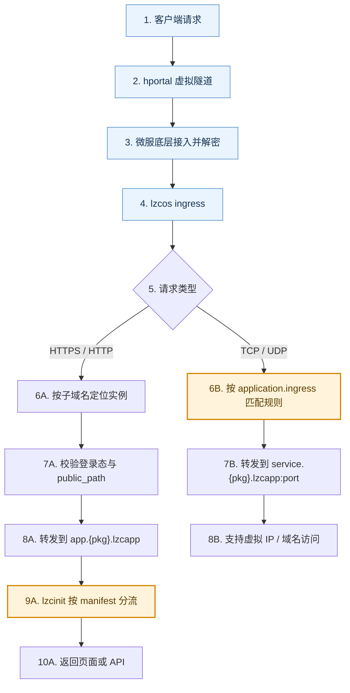
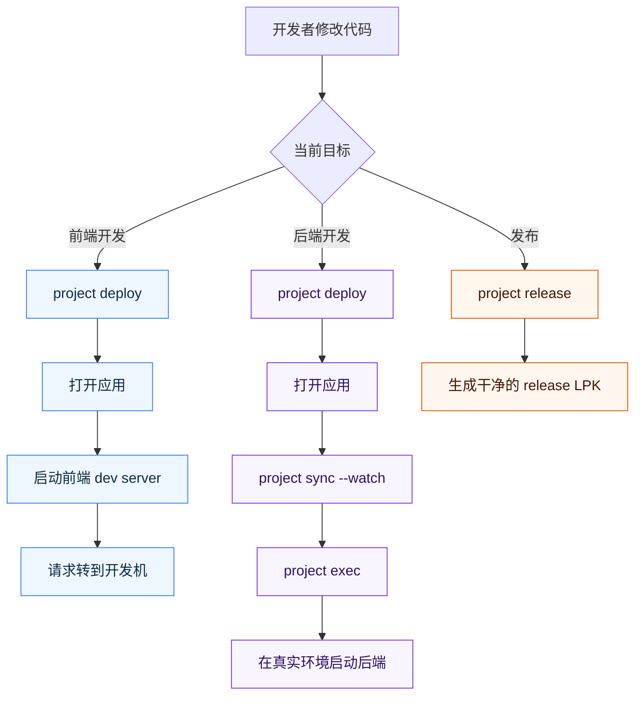
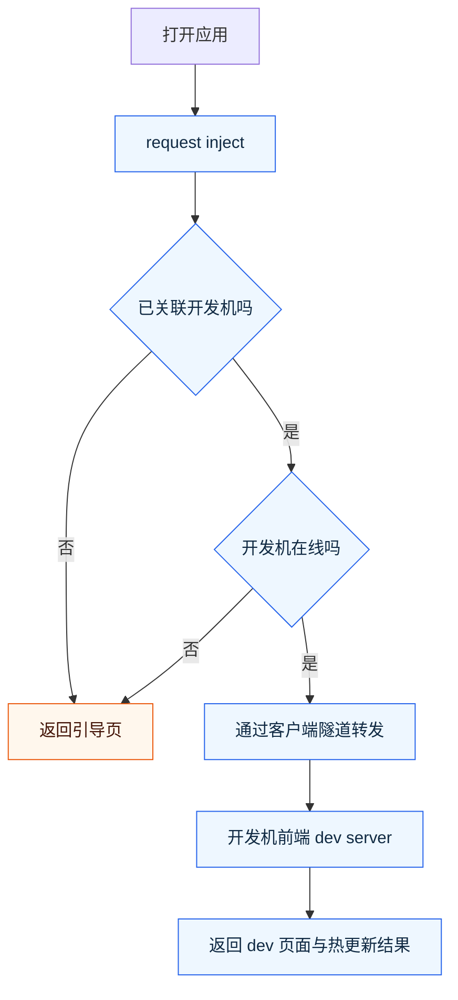
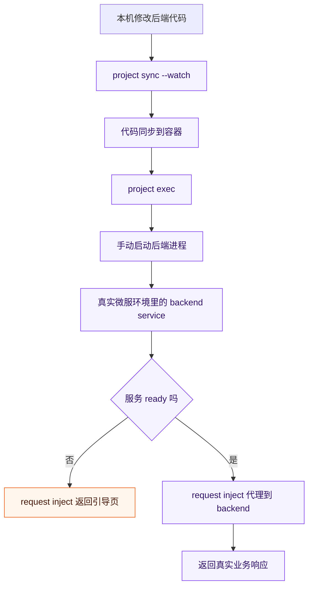

# 5 分钟完成 Hello World 并多端验证 {#hello-world-fast}

## 目标 {#goal}

完成本篇后，你可以明确区分并验证这 3 件事：

1. 你创建并部署的应用，用户侧看到的主要是一个通过 HTTPS 访问的 Web App。
2. LPK 是应用最终交付和安装的包格式：代码与运行声明会被打成一个 `.lpk`，再安装到目标微服运行。
3. 同一份 `.lpk` 部署后，可在 Android、iOS、macOS、Windows、Web（浏览器）等多端一致访问，体现懒猫微服的跨平台能力。

## 前置条件 {#prerequisites}

1. 你已完成 [开发者环境搭建](./env-setup.md)。
2. `lzc-cli box default` 已指向目标微服。

## 步骤 {#steps}

### 1. 创建项目 {#step-create-project}

在你自己的工作目录执行：

```bash
lzc-cli project create hello-lpk -t hello-vue
```

然后在应用 ID 提示里按回车使用默认值，或输入你自己的命名。

```bash
cd hello-lpk
```

模板默认会生成：

1. `lzc-build.yml`：默认构建配置，也是发布配置。
2. `lzc-build.dev.yml`：开发态覆盖配置，默认包含独立的 dev 包名覆盖（例如 `package_override.package: cloud.lazycat.app.helloworld.dev`）、空 `contentdir` 覆盖，以及 `DEV_MODE=1`。

这意味着 `project deploy`、`project info`、`project exec` 等 `project` 命令默认都会落到独立的 dev 包名，不会覆盖正式发布包。
命令输出里会打印一行 `Build config`，就是在告诉你“这次实际用了哪个构建配置文件”；如需操作发布配置，请显式加上 `--release`。

### 2. 先部署并确认访问入口 {#step-first-deploy}

```bash
lzc-cli project deploy
lzc-cli project info
```

说明：

1. 首次部署如果出现授权提示，按 CLI 输出打开浏览器完成授权即可。
2. `project` 命令默认会优先使用 `lzc-build.dev.yml`。
3. 每个命令都会打印 `Build config` 这一行。
4. `project deploy` 会按 `buildscript` 自动安装依赖并构建前端，不需要额外先执行 `npm install`。
5. `project info` 在应用已运行时会输出 `Target URL`。

### 3. 先打开应用，再看页面提示 {#step-open-app-first}

1. Android/iOS：打开懒猫微服客户端，在启动器中点击应用图标。
2. macOS/Windows：打开桌面客户端，在启动器中点击应用图标。
3. Web：复制 `project info` 输出里的 `Target URL`，在浏览器直接访问。

对于 `hello-vue` 模板，第一次打开应用时通常会先看到一个前端开发引导页。这是开发流程中的正常行为，表示：

1. 当前入口已经进入请求分流脚本（`request inject`）控制。
2. 页面会告诉你这个分流脚本正在等待的本地端口。
3. 如果 dev server 还没启动，页面会直接告诉你下一步该做什么。

### 4. 启动前端 dev server {#step-start-dev-server}

看到页面提示后，再执行：

```bash
npm run dev
```

然后刷新应用页面。

此时入口流量会继续通过应用域名进入，再由请求分流脚本代理到你开发机上的前端 dev server。

### 5. 修改源码并立即验证 {#step-modify-source}

打开 `src/App.vue`，把标题改成你自己的文案，例如把：

```text
Welcome to Lazycat Microserver
```

改为：

```text
Hello from my first LPK
```

保存后直接刷新页面，或等待前端 dev server 自动热更新。

排查问题可用：

```bash
lzc-cli project log -f
```

### 6. 查看 lpk 交付包（可选但推荐） {#step-inspect-lpk}

```bash
lzc-cli project release -o hello.lpk
lzc-cli lpk info hello.lpk
```

你会看到 `format`、`package`、`version` 等信息。
这一步用于确认：`.lpk` 就是这个应用最终交付和安装时使用的包。

## 验证 {#verification}

满足以下条件即通过：

1. `lzc-cli project info` 显示 `Current version deployed: yes`。
2. `lzc-cli project info` 显示 `Project app is running.`。
3. 首次打开应用时，你能看到默认页面或前端开发引导页。
4. 启动 `npm run dev` 后，浏览器与客户端都能进入前端页面。
5. 修改 `src/App.vue` 后，刷新页面或等待热更新即可看到新文案。

## 常见错误与排查 {#troubleshooting}

### 1. `Project app is not running. Run "lzc-cli project start" first.` {#error-app-not-running}

处理：

```bash
lzc-cli project start
```

### 2. `Target URL` 未显示 {#error-target-url-missing}

原因：应用尚未运行，或 `app` 容器未就绪。

处理：

```bash
lzc-cli project start
lzc-cli project info
```

### 3. 页面提示前端 dev server 未就绪 {#error-frontend-not-ready}

处理顺序：

1. 先确认当前页面显示的端口。
2. 在项目目录执行 `npm run dev`。
3. 刷新应用页面。
4. 如仍失败，确认是从执行过 `lzc-cli project deploy` 的那台开发机上启动的 dev server。

## 下一步 {#next}

继续阅读：[开发流程总览](./dev-workflow.md)

---

---
url: /advanced-api-auth-token.md
---
# API Auth Token

API Auth Token 用于在脚本或命令行里访问系统 API 时进行鉴权，避免依赖浏览器登录态。适合自动化、运维脚本、CI 等场景。

需要 lzcos v1.4.3+。

## 生成与管理

```bash
hc api_auth_token gen
hc api_auth_token gen --uid admin
hc api_auth_token list
hc api_auth_token show <token>
hc api_auth_token rm <token>
```

* `gen` 会创建一个 UUID 形式的 token
* `--uid` 可指定绑定的用户，未指定时会自动使用管理员用户

## 调用示例

```bash
curl -k -H "Lzc-Api-Auth-Token: <token>" "https://<box-domain>/sys/whoami"
```

## 行为说明

* Header 名称固定为 `Lzc-Api-Auth-Token`
* 该 Header 只用于系统鉴权，转发到应用时会被移除
* token 权限等同于绑定用户，请妥善保存并避免泄露
* 因为部分lpk会使用鉴权信息内的客户端信息进行反向访问。此功能在API TOKEN下无法被支持
* 此模式下系统不会自动注入`X-HC-Device-PeerID`和`X-HC-Device-ID`
* 此模式下的`X-HC-Login-Time`为`Token`的创建时间

---

---
url: /advanced-compose-override.md
---
# compose override

lzcos v1.3.0+ 后，针对一些 lpk 规范目前无法覆盖到的运行权限需求，
可以通过 [compose override](https://docs.docker.com/reference/compose-file/merge/) 机制来间接实现。

override 属于过渡阶段机制，针对一些可控的权限会逐步在 lpk 规范中进行支持，并在安装应用时由管理员进行决策。
override 机制的兼容性不受支持，特别是 volumes 挂载系统内部文件路径。

::: warning

如果有使用到此机制请在开发者群进行说明或通过 [联系我们](https://lazycat.cloud/about?navtype=AfterSalesService) 找到客服联系开发者服务，官方会记录，以便在可能破坏兼容性前与开发者进行沟通，否则提交应用商店审核可能会被拒绝。

:::

# 使用方式

在lzc-build.yml文件中添加 `compose_override` 字段。

比如

```yml
pkgout: ./
icon: ./lazycat.png
contentdir: ./dist/

compose_override:
  services:
    # 指定服务名称
    some_container:
      # 指定需要 drop 的 cap
      cap_drop:
        - SETCAP
        - MKNOD
      # 指定需要挂载的文件
      volumes:
        - /data/playground:/lzcapp/run/playground:ro
```

::: tip 文件挂载

1. 挂载宿主系统的文件时，尽量不要挂载/lzcsys/相关的文件，这里的布局属于lzcos内部细节后续版本很可能会变动。
2. docker-compose里挂载文件的关键字是`volumes`，注意不要写成lzc-manifest.yml中的`binds`。(binds的语义和volumes有很大区别，所以故意不使用一致的名字)

:::

# 调试

1. 确认最终生成的lpk中存在名为`compose.override.yml`的文件，内容应该为一个合法的`compose merge`文件
2. ssh进入`/data/system/pkgm/run/$appid`后确认有`override.yml`文件
3. 使用`lzc-docker-compose config`查看最终合并后的文件是您预期的

---

---
url: /deploy-params.md
---
# deploy-params

`lzc-deploy-params.yml` 是开发者定义安装时参数的配置文件。 本文档将详细描述其结构和各字段的含义。

# DeployParams

| 字段名 | 类型 | 描述 |
| ---- | ---- | ---- |
| `params` | `[]DeployParam` | 开发者定义的部署参数列表|
| `locales` | `map` | 国际化相关 |

***

# DeployParam

| 字段名 | 类型 | 描述 |
| ---- | ---- | ---- |
| `id` | `string` | 应用内的唯一ID，供国际化和manifest.yml中引用|
| `type` | `string` | 字段类型，目前支持`bool`、`lzc_uid`、`string`、`secret` |
| `name` | `string`| 字段渲染时的名称，支持国际化|
| `description` | `string`| 字段渲染时详细介绍，支持国际化|
| `optional` | `bool` | 此字段是否可选。若可选则不会强制要求用户填写，若所有字段均为可选则会直接跳过部署界面|
| `default_value`| `string`| 开发者提供的默认值，支持 `$random(len=5)` 生成随机串（lzcos 1.5.0+） |
| `hidden` | `bool` | 字段依旧生效，但不在界面中渲染 |

---

---
url: /spec/deploy-params.md
---
# deploy-params

`lzc-deploy-params.yml` 是开发者定义安装时参数的配置文件。 本文档将详细描述其结构和各字段的含义。

# DeployParams

| 字段名 | 类型 | 描述 |
| ---- | ---- | ---- |
| `params` | `[]DeployParam` | 开发者定义的部署参数列表|
| `locales` | `map` | 国际化相关 |

***

# DeployParam

| 字段名 | 类型 | 描述 |
| ---- | ---- | ---- |
| `id` | `string` | 应用内的唯一ID，供国际化和manifest.yml中引用|
| `type` | `string` | 字段类型，目前支持`bool`、`lzc_uid`、`string`、`secret` |
| `name` | `string`| 字段渲染时的名称，支持国际化|
| `description` | `string`| 字段渲染时详细介绍，支持国际化|
| `optional` | `bool` | 此字段是否可选。若可选则不会强制要求用户填写，若所有字段均为可选则会直接跳过部署界面|
| `default_value`| `string`| 开发者提供的默认值，支持 `$random(len=5)` 生成随机串（lzcos 1.5.0+） |
| `hidden` | `bool` | 字段依旧生效，但不在界面中渲染 |

---

---
url: /network-diagnostic/dnsbypass.md
---

# DNS

* 在代理配置中，添加规则绕过"\*.heiyu.space"。

* Configure your proxy to bypass "\*.heiyu.space".

Clash:

```
dns:
  fake-ip-filter:
    - "*.heiyu.space"
```

---

---
url: /network-diagnostic/dns.md
---

# DNS 解析异常

您当前的网络 DNS 解析异常，微服连接可能会被干扰。您需要将`heiyu.space` 这个域名的 DNS 解析设置为直连解析。由于不同系统和软件的设置方法不同，您可以参考以下链接进行更详细的设置:

[配置指南](https://github.com/wlabbyflower/peppapigconfigurationguide)

---

---
url: /dockerd-support.md
---
# Dockerd 开发模式

部分开发者希望微服能提供完整的 docker 套件功能, 针对于这一类用户, 微服系统 提供了一个独立的 Docker 守护进程以供开发者使用。

## 获取并安装Dockge应用

虽然非开发者用户可以使用独立 docker 套件，但具有`privileged`属性或赋予`CAP_SYS_ADMIN`等权限的容器可以读写并访问懒猫微服中的所有文件数据，甚至对系统造成无法修复的错误。因此请在启用独立 docker 套件后，仔细阅读本文的剩余内容。

\<button :class="$style.button" @click="downloadFile">下载Dockge应用LPK

* 点击上方按钮，下载`Dockge`应用lpk。
* 将lpk上传至`懒猫网盘`，并右键安装。
* 安装完成后重启懒猫微服，系统将自动激活独立 Docker 守护进程。
* (可选)若需要重启后自动启动dockerd，请在应用列表中将dockage设置为后台运行

## 使用说明

开发者可以通过以下两种方式运行自己的容器

### Dockge

该应用可以在应用列表中访问到, 通过 `dockge` 应用, 用户可以自己编写docker-compose 文件, 部署并且测试


### pg-docker

ssh 登录到微服之后, 用户可以直接使用 `pg-docker` 命令执行docker相关的命令, 通过pg-docker暴露的端口, 能够直接在内网中访问

### 关于docker存储位置

在独立 docker 套件中创建的容器将默认使用机械硬盘作为存储空间，容器在重启后内容将持久化存储。

### 将用户数据文件映射至容器内

docker容器默认状况下将与系统隔离，可以使用下面的compose表达式将用户磁盘数据绑定至容器内。

```yaml
service:
  example:
    volumes:
      - /data/document/{用户名}:/容器/内/路径
```

### 映射容器内端口

使用下面的compose表达式即可将容器内`2222`端口转发到外部的`3333`端口。如须访问，可通过懒猫微服`局域网ip:端口号`进行访问。

```yaml
service:
  example:
    ports:
      - 3333:2222
```

### 带有权限的容器

为容器添加`privileged`权限或某些[特权](https://man.archlinux.org/man/core/man-pages/capabilities.7.en)（例如`CAP_SYS_ADMIN`）会赋予该容器极高的系统权限。这样一来，容器可能会对懒猫微服的系统资源产生很大影响，甚至可能造成严重的安全风险。特别是在将容器的高风险端口暴露给外部网络时，容器可能成为攻击的目标。

如果容器内运行恶意程序，这些程序可能会影响系统的正常运行，甚至导致数据丢失或损坏。因此，在使用别人提供的Compose文件时，需要特别留意文件中是否会授予容器过多的权限，避免潜在的安全隐患。

```yaml
service:
  example:
    privileged: true
    cap_add:
      - SYS_ADMIN
      - NET_ADMIN # 开放所有网络相关权限
```

### 安装Dockge后无法创建容器

在安装Dockge后，如果您发现创建容器失败，且右下角有此提示弹出时。请确保第一次安装后已经重启微服。在不安装Dockge应用的情况下系统为保证安全将不会启用独立 docker 守护进程。


### pg-docker配置文件

目前 `pg-docker` 的 `daemon.json` 文件位于 `/lzcsys/var/playground/daemon.json` 目录下，该配置修改后不会回滚，不过下面的配置项会被系统强行配置：

* `bridge` 懒猫微服网络环境相关
* `cgroup-parent` 懒猫微服进程调度相关

---

---
url: /advanced-gpu.md
---
# GPU 加速

当我们开发多媒体应用时， GPU 加速就非常关键， 为应用开启 GPU 加速很简单， 只需要在 `lzc-manifest.yml` 文件中的 `application` 字段下加一个 `gpu_accel: true` 子字段即可， 举例：

```yml
application:
  gpu_accel: true
```

---

---
url: /hello-world.md
---
# Hello World

下面用最短路径完成第一个可部署应用。

## 1. 创建项目

```bash
lzc-cli project create helloworld
```

在交互提示中：

1. 模板选择 `hello-vue (Vue基础模板)`。
2. 应用 ID 可使用默认值 `helloworld`。

创建完成后，会看到类似提示：

```bash
✨ 初始化项目 helloworld
✨ 初始化懒猫云应用
✨ 懒猫微服应用已创建成功 !
✨ First deploy and open the app once
   cd helloworld
   lzc-cli project deploy
   lzc-cli project info
```

进入项目后，你会看到这几类核心文件：

1. `lzc-manifest.yml`：应用运行结构与路由。
2. `package.yml`：静态包元数据，例如 `package`、`version`、`name`、`description`、`locales`、`author`、`license`。
3. `lzc-build.yml`：默认构建配置，也是 release 配置。
4. `lzc-build.dev.yml`：开发态覆盖配置，默认包含独立的 dev 包名覆盖（例如 `package_override.package: cloud.lazycat.app.helloworld.dev`）、空 `contentdir` 覆盖，与构建期变量 `envs`。

这样日常开发时，`project deploy`、`project info`、`project exec` 等 `project` 命令默认都会优先使用 `lzc-build.dev.yml`，从而落到独立的 dev 包名，不会影响 release 版本。
每个命令都会打印实际使用的 `Build config`；如果你要操作 `lzc-build.yml`，请显式加上 `--release`。

## 2. 先部署，再打开应用

```bash
cd helloworld
lzc-cli project deploy
lzc-cli project info
```

说明：

1. 首次部署若提示授权，按 CLI 提示打开浏览器完成授权即可。
2. `project` 命令默认会优先读取 `lzc-build.dev.yml`；命令输出里会打印实际使用的 `Build config`。
3. `project deploy` 会按 `buildscript` 自动安装依赖并构建前端，不需要额外先执行 `npm install`。
4. `project info` 运行中会输出 `Target URL`。
5. 如果你要查看或操作 release 配置，请显式使用 `--release`。
6. 如果应用尚未运行，可再执行：

```bash
lzc-cli project start
lzc-cli project info
```

然后直接打开应用：

1. 在微服客户端启动器点击应用图标。
2. 或在浏览器访问 `Target URL`。

对于 `hello-vue` 模板，应用页面会先进入 dev 模式入口：

1. 如果本地前端 dev server 还没启动，页面会直接提示下一步操作。
2. 页面会显示 inject 脚本实际等待的本地端口。
3. 你不需要先猜命令或先改 manifest。

## 3. 按页面提示启动前端开发

看到应用页面后，再执行：

```bash
npm run dev
```

然后刷新应用页面。

这样后续改动 `src/App.vue` 等前端文件时，LPK 会继续通过 request inject 把流量转到你本机的 dev server。

排查问题可用：

```bash
lzc-cli project log -f
```

## 4. 产出发布包

```bash
lzc-cli project release -o helloworld.lpk
```

安装发布包：

```bash
lzc-cli lpk install helloworld.lpk
```

`project release` 始终使用 `lzc-build.yml`，不会带上开发态的包名后缀和 dev-only `#@build` 分支。

---

---
url: /http-request-headers.md
---
# http headers

所有从客户端发起的https/http的流量会先进入`lzc-ingress`这个组件进行分流。

lzc-ingress主要处理以下任务

* 对http请求进行鉴权，若未登录则跳转到登录页面
* 根据请求的域名分流到不同的lzcapp后端

在鉴权成功转发给具体的lzcapp前，`lzc-ingress`会设置以下额外的http headers

* `X-HC-User-ID`        登录的UID(用户名)
* `X-HC-Device-ID`      客户端位于本微服内的唯一ID， 应用程序可以使用这个作为设备标识符
* `X-HC-Device-PeerID`  客户端的peerid， 仅内部使用。
* `X-HC-Device-Version` 客户端的内核版本号
* `X-HC-Login-Time` 微服客户端最后一次的登录时间， 格式为unix时间戳(一个int32的整数)
* `X-HC-User-Role`  普通用户为:"NORMAL"， 管理员用户为: "ADMIN"
* `X-HC-SOURCE` 请求来源语义。当前可能取值为 `client`、`app:self`、`app:<pkg_id>`、`system`
* `X-Forwarded-Proto` 固定为"https"，以便少量强制https的应用可以正常工作
* `X-Forwarded-By`  固定为"lzc-ingress"
* `X-HC-User-Ticket`  用户票据。当前版本中，系统可能在已登录请求上下文中默认提供；未来版本将改为只能通过显式权限申请获得。应用不应假设该 header 会永久默认存在。

`lzc-ingress`是通过`HC-Auth-Token`这个cookie来进行鉴权的(客户端内是通过其他内部方式完成鉴权)。

当`lzc-ingress`遇到此cookie值无效或为空时，且目标地址不是`public_path`，则会跳转到登录页面。

当目标地址为`public_path`时， `lzc-ingress`依旧会进行一次鉴权，但不会跳转到登录页面。

* 如果鉴权失败，则会清空上述`X-HC-XX`的header，避免一些安全风险
* 如果鉴权成功，则会带上上述`X-HC-XX`的header。

也就是lzcapp开发者在编写后端代码时，不用考虑是否为`public_path`， 直接信任`X-HC-User-ID`即可。

## `X-HC-User-Ticket`

`X-HC-User-Ticket` 用于表达“应用以某个真实用户身份继续访问自身或其他 lzcapp 服务”的用户票据语义。

约束：

1. 当前能力最低要求 `lzcos v1.5.2`。
2. 当前版本中，`X-HC-User-Ticket` 可能由系统在已登录请求上下文中默认提供。
3. 当前默认提供方式只是临时行为，不做兼容性保障。
4. 预计在 `lzcos v1.7.x`，系统会改为只有用户明确授权后，应用才能获取该票据。
5. 应用不应把“当前版本默认存在”视为长期兼容承诺。
6. 应用间访问场景请同时参考 [应用间访问](./advanced-app-interconnect.md)。
7. 新能力设计应统一以 `X-HC-User-Ticket` 为最终字段名，不再使用 `X-HC-User-Delegation`。

## `X-HC-SOURCE`

`X-HC-SOURCE` 用于表达当前请求的业务来源语义。

当前可能取值：

1. `client`
2. `app:self`
3. `app:<pkg_id>`
4. `system`

说明：

1. `client` 表示真实客户端访问。
2. `app:self` 表示应用代表当前真实用户访问自己。
3. `app:<pkg_id>` 表示其他应用代表当前真实用户访问当前应用。
4. 该 header 由系统生成，应用不应信任客户端自行传入的值。

---

---
url: /advanced-inject-request-dev-cookbook.md
---
# inject request 开发态 Cookbook

本文不重复解释 inject 的基础语法，而是直接给出当前 `lzc-cli` 开发流程里最常用的 request inject 写法。

适用目标：

1. 前端开发时，把 LPK 入口代理到开发机的 dev server。
2. 后端开发时，服务未 ready 就返回静态引导页；ready 后再转发到真实后端。
3. 所有这些行为都只在 dev 模式下生效，不污染 release。

相关基础文档：

1. [开发流程总览](./getting-started/dev-workflow.md)
2. [inject.ctx 规范](./spec/inject-ctx.md)
3. [脚本注入（injects）](./advanced-injects.md)

## 1. 只在 dev 模式下启用 {#dev-only}

推荐把 dev 专属行为放进 `lzc-manifest.yml` 的 build 预处理块里，而不是在脚本内部自己判断一堆环境变量。

示例：

```yml
application:
  routes:
    - /=file:///lzcapp/pkg/content/dist
#@build if env.DEV_MODE=1
  injects:
    - id: frontend-dev-proxy
      on: request
      auth_required: false
      when:
        - "/*"
      do:
        - src: |
            // dev only request inject here
#@build end
```

这样 release 渲染结果里根本不会带这段 inject。

## 2. 前端开发：代理到开发机 dev server {#frontend-dev}

适用场景：

1. `vite`
2. `webpack dev server`
3. 任何跑在开发机本地端口上的前端服务

说明：`lzc-cli project deploy` 会把当前开发机的 `dev.id` 同步到应用实例；inject 脚本再通过 `ctx.dev.id` 与 `ctx.net.via.client(...)` 把流量转到对应开发机。

示例：

```yml
application:
  routes:
    - /=file:///lzcapp/pkg/content/dist
#@build if env.DEV_MODE=1
  injects:
    - id: frontend-dev-proxy
      on: request
      auth_required: false
      when:
        - "/*"
      do:
        - src: |
            const devPort = 3000;
            const contentType = "text/html; charset=utf-8";

            function renderDevPage(title, subtitle, steps) {
              const items = steps.map(function (step) {
                return "<li>" + step + "</li>";
              }).join("");
              return [
                "<!doctype html>",
                "<html lang=\"en\"><head><meta charset=\"UTF-8\"><meta name=\"viewport\" content=\"width=device-width,initial-scale=1\"><title>Frontend Dev</title></head>",
                "<body><h1>", title, "</h1><p>", subtitle, "</p><div>Expected local port: ", String(devPort), "</div><ol>", items, "</ol></body></html>",
              ].join("");
            }

            if (!ctx.dev.id) {
              ctx.response.send(200, renderDevPage(
                "Dev machine is not linked yet",
                "This app is waiting for a frontend dev server from the machine that runs lzc-cli project deploy.",
                [
                  "Run <code>lzc-cli project deploy</code> on your dev machine.",
                  "Start your local dev server with <code>npm run dev</code>.",
                  "Refresh this page after port <code>" + String(devPort) + "</code> is ready.",
                ]
              ), { content_type: contentType });
              return;
            }

            const via = ctx.net.via.client(ctx.dev.id);
            if (!ctx.dev.online()) {
              ctx.response.send(200, renderDevPage(
                "Dev machine is offline",
                "The linked dev machine is not reachable right now.",
                [
                  "Bring the dev machine online.",
                  "Start your local dev server with <code>npm run dev</code>.",
                  "Refresh this page after port <code>" + String(devPort) + "</code> is ready.",
                ]
              ), { content_type: contentType });
              return;
            }

            if (!ctx.net.reachable("tcp", "127.0.0.1", devPort, via)) {
              ctx.response.send(200, renderDevPage(
                "Frontend dev server is not ready",
                "This app is running in dev mode and will proxy requests to your linked dev machine.",
                [
                  "Start your local dev server with <code>npm run dev</code>.",
                  "Make sure the dev server listens on port <code>" + String(devPort) + "</code>.",
                  "Refresh this page after the server is ready.",
                ]
              ), { content_type: contentType });
              return;
            }

            ctx.proxy.to("http://127.0.0.1:" + String(devPort), {
              via: via,
              use_target_host: true,
            });
#@build end
```

关键点：

1. 先判断 `ctx.dev.id`，避免实例没有同步到开发机时直接报错。
2. 再看 `ctx.dev.online()`，避免无意义地实时拨测已离线的开发机。
3. 用 `ctx.net.reachable(...)` 做最终端口探测。
4. 用 `ctx.proxy.to(..., { via })` 把流量送到开发机。

## 3. 后端开发：未就绪返回引导页 {#backend-dev}

适用场景：

1. Go / Java 这类更适合手动构建、手动重启的服务
2. 任何必须依赖真实 LPK 容器环境的服务

示例：

```yml
application:
#@build if env.DEV_MODE!=1
  routes:
    - /=exec://3000,/app/run.sh
#@build end
#@build if env.DEV_MODE=1
  injects:
    - id: backend-dev-proxy
      on: request
      auth_required: false
      when:
        - "/*"
      do:
        - src: |
            const backendPort = 3000;
            const backendURL = "http://127.0.0.1:" + String(backendPort);
            const contentType = "text/html; charset=utf-8";

            function renderDevPage(steps) {
              const items = steps.map(function (step) {
                return "<li>" + step + "</li>";
              }).join("");
              return [
                "<!doctype html>",
                "<html lang=\"en\"><head><meta charset=\"UTF-8\"><title>Backend Dev</title></head>",
                "<body><h1>Backend dev service is not ready</h1><ol>", items, "</ol></body></html>",
              ].join("");
            }

            if (!ctx.net.reachable("tcp", "127.0.0.1", backendPort)) {
              ctx.response.send(200, renderDevPage([
                "Sync your latest code into the container with <code>lzc-cli project sync --watch</code> or copy it with <code>lzc-cli project cp</code>.",
                "Open a shell with <code>lzc-cli project exec /bin/sh</code> and start or restart the backend process with <code>/app/run.sh</code>.",
                "Refresh this page after port <code>" + String(backendPort) + "</code> is ready.",
              ]), { content_type: contentType });
              return;
            }

            ctx.proxy.to(backendURL, {
              use_target_host: true,
            });
#@build end
```

关键点：

1. dev 模式下不写 `routes`，避免自动启动把策略绕过去。
2. 服务不在线时直接给出静态引导，不默认 fallback。
3. 服务 ready 后再切到真实后端。

## 4. 访问 lzcos host network 或指定客户端 {#via-network}

`ctx.proxy.to(...)` 和 `ctx.net.reachable(...)` 都支持 `via`。

访问 lzcos host network：

```js
ctx.proxy.to("http://127.0.0.1:8080", {
  via: ctx.net.via.host(),
  use_target_host: true,
});
```

访问指定客户端节点：

```js
if (ctx.dev.id) {
  ctx.proxy.to("http://127.0.0.1:3000", {
    via: ctx.net.via.client(ctx.dev.id),
    use_target_host: true,
  });
}
```

## 5. 什么时候直接返回静态页面 {#when-send-page}

推荐直接 `ctx.response.send(...)` 的场景：

1. 开发机未绑定
2. 开发机离线
3. dev server / backend service 未启动
4. 你希望给出明确的下一步引导，而不是给用户一个模糊的 502

不建议默认 fallback 到 release 路由，因为这会掩盖开发态状态，让开发者误以为当前流量已经进入 dev 逻辑。

## 6. 调试顺序建议 {#debug-order}

建议按这个顺序排查：

1. inject 是否真的在当前路径命中
2. `ctx.dev.id` 是否为空
3. `ctx.dev.online()` 是否为 `true`
4. `ctx.net.reachable(...)` 是否为 `true`
5. `ctx.proxy.to(...)` 的 `via` 是否指向了正确网络

必要时可以临时加 header 辅助确认：

```js
ctx.headers.set("X-Debug-Dev-ID", ctx.dev.id || "");
ctx.headers.set("X-Debug-Dev-Online", String(ctx.dev.online()));
```

## 7. 推荐组合 {#recommended-combos}

推荐把下面这几个能力组合使用：

1. `#@build if env.DEV_MODE=1`
   * 在打包阶段裁剪 dev-only inject
2. `ctx.dev`
   * 判断是否已绑定开发机、开发机是否在线
3. `ctx.net.reachable`
   * 判断目标服务是否真实 ready
4. `ctx.net.via.*`
   * 把流量送到容器外的目标网络
5. `ctx.response.send`
   * 未 ready 时返回明确引导页
6. `ctx.proxy.to`
   * ready 后切到真实目标

## 下一步 {#next}

1. 如果你要看 API 规范：继续阅读 [inject.ctx 规范](./spec/inject-ctx.md)
2. 如果你要看总体开发流：继续阅读 [开发流程总览](./getting-started/dev-workflow.md)
3. 如果你要看内置脚本与匹配机制：继续阅读 [脚本注入（injects）](./advanced-injects.md)

---

---
url: /spec/inject-ctx.md
---
# inject.ctx

`inject.ctx` 定义了 inject 脚本运行时可访问的上下文字段和 helper API。

本文档只描述接口规范，不讨论设计动机和实践策略。

## 适用阶段

* `browser`：脚本在浏览器环境执行。
* `request`：脚本在请求转发到 upstream 前执行。
* `response`：脚本在收到 upstream 响应后执行。

## 通用字段（所有阶段）

| 字段 | 类型 | 说明 |
| ---- | ---- | ---- |
| `ctx.id` | `string` | 当前 inject 的 `id` |
| `ctx.src` | `string` | 当前脚本来源（`src`） |
| `ctx.phase` | `string` | 当前阶段：`browser`/`request`/`response` |
| `ctx.params` | `object` | 当前脚本参数（已完成 `$persist` 解析） |
| `ctx.safe_uid` | `string` | 当前请求对应的平台用户 ID（`SAFE_UID`） |
| `ctx.request.host` | `string` | 请求 host |
| `ctx.request.path` | `string` | 请求 path |
| `ctx.request.raw_query` | `string` | 原始 query（不带 `?`） |

补充说明：

* 当 `auth_required=false` 且请求没有合法登录态时，`ctx.safe_uid` 可能为空字符串。

## `ctx.params` 解析规则

`ctx.params` 的源是 `inject.do[].params`，解析结果始终为对象。

静态值：

* 未使用 `$persist` 标记的值，按清单原值透传。

动态值（`$persist`）：

* 标记格式：`{ $persist: "<key>" }` 或 `{ $persist: "<key>", default: <any> }`
* 仅当参数值显式使用 `$persist` 标记时触发动态解析。
* 命中持久值时返回持久值。
* 未命中且配置 `default` 时返回 `default`。
* 未命中且未配置 `default` 时返回 `null`。

阶段解析时机：

* `browser`：页面加载/路由变化再次触发脚本时，按当时请求上下文重新解析。
* `request/response`：每次命中并执行脚本前，按当次请求上下文重新解析。

额外约束：

* 解析后若结果不是对象，`ctx.params` 按空对象 `{}` 处理。

## `ctx.request` 字段语义

通用字段（所有阶段）：

| 字段 | 类型 | 说明 |
| ---- | ---- | ---- |
| `ctx.request.host` | `string` | host（不含协议） |
| `ctx.request.path` | `string` | path（以 `/` 开头） |
| `ctx.request.raw_query` | `string` | 原始 query（不带 `?`） |

阶段扩展：

| 字段 | 阶段 | 类型 | 说明 |
| ---- | ---- | ---- | ---- |
| `ctx.request.hash` | `browser` | `string` | URL hash（不带 `#`） |
| `ctx.request.method` | `request/response` | `string` | 请求方法（大写） |

## `ctx.runtime` 字段语义（browser）

| 字段 | 类型 | 说明 |
| ---- | ---- | ---- |
| `ctx.runtime.executedBefore` | `bool` | 当前页面生命周期内是否执行过 |
| `ctx.runtime.executionCount` | `int` | 当前页面生命周期内执行次数（从 `1` 开始） |
| `ctx.runtime.trigger` | `string` | 本次触发来源（例如 `load`、`hashchange`） |

## `ctx.status` 字段语义

| 字段 | 阶段 | 类型 | 说明 |
| ---- | ---- | ---- | ---- |
| `ctx.status` | `response` | `int` | 当前响应状态码 |

## helper 概览

| helper | browser | request | response |
| ---- | ---- | ---- | ---- |
| `ctx.base64` | 是 | 是 | 是 |
| `ctx.persist` | 是 | 是 | 是 |
| `ctx.headers` | 否 | 是 | 是 |
| `ctx.body` | 否 | 是 | 是 |
| `ctx.flow` | 否 | 是 | 是 |
| `ctx.fs` | 否 | 是 | 是 |
| `ctx.client` | 否 | 是 | 是 |
| `ctx.dev` | 否 | 是 | 是 |
| `ctx.net` | 否 | 是 | 是 |
| `ctx.dump` | 否 | 是 | 是 |
| `ctx.response` | 否 | 是 | 是 |
| `ctx.proxy` | 否 | 是 | 是 |

## `ctx.base64`

用于 Base64 编码/解码。

* `ctx.base64.encode(text) -> string`
* `ctx.base64.decode(text) -> string`

## `ctx.persist`

用于跨请求持久化数据，按 `SAFE_UID` 隔离。

## request/response

* `ctx.persist.get(key) -> any`
* `ctx.persist.set(key, value) -> void`
* `ctx.persist.del(key) -> void`
* `ctx.persist.list(prefix?) -> Array<{key: string, value: any}>`

## browser（异步）

* `ctx.persist.get(key) -> Promise<any | undefined>`
* `ctx.persist.set(key, value) -> Promise<void>`
* `ctx.persist.del(key) -> Promise<void>`
* `ctx.persist.list(prefix?) -> Promise<Array<{key: string, value: any}>>`

约束：

* `list` 返回全量结果，按 key 字典序升序。
* 不提供额外应用层加密能力（依赖系统已有加密隧道 + HTTPS）。

## `ctx.headers`（request/response）

用于读取与改写 HTTP 头。

* `ctx.headers.get(name) -> string`
* `ctx.headers.getValues(name) -> string[]`
* `ctx.headers.getAll() -> Record<string, string[]>`
* `ctx.headers.set(name, value) -> void`
* `ctx.headers.add(name, value) -> void`
* `ctx.headers.del(name) -> void`

## `ctx.body`（request/response）

用于读取与改写请求/响应 body。

* `ctx.body.getText(opts?) -> string`
* `ctx.body.getJSON(opts?) -> any`
* `ctx.body.getForm(opts?) -> Record<string, string | string[]>`
* `ctx.body.set(body, opts?) -> void`

`opts`：

| 字段 | 类型 | 默认值 | 说明 |
| ---- | ---- | ---- | ---- |
| `max_bytes` | `int` | `1048576` | `get*` 读取 body 的最大字节数 |
| `content_type` | `string` | 空 | `set` 时覆盖 `Content-Type` |

补充：

* `ctx.body.set(...)` 会同步更新 `Content-Length`，并清理 `Content-Encoding` 与 `ETag`。

## `ctx.flow`（request/response）

用于同一请求内的 request -> response 临时共享状态。

* `ctx.flow.get(key) -> any`
* `ctx.flow.set(key, value) -> void`
* `ctx.flow.del(key) -> void`
* `ctx.flow.list(prefix?) -> Array<{key: string, value: any}>`

## `ctx.fs`（request/response）

用于读取容器文件系统状态。

* `ctx.fs.exists(path) -> bool`
* `ctx.fs.readText(path, opts?) -> string`
* `ctx.fs.readJSON(path, opts?) -> any`
* `ctx.fs.stat(path) -> object`
* `ctx.fs.list(path) -> string[]`

## `ctx.client`（request/response）

用于读取当前访问客户端上下文。

* `ctx.client.id -> string`
* `ctx.client.id` 来源于 Ingress 注入的当前客户端标识；请求不带客户端上下文时可能为空字符串。

## `ctx.dev`（request/response）

用于读取开发机标识与 lzcinit 维护的缓存在线状态。

* `ctx.dev.id -> string`
* `ctx.dev.online() -> bool`

补充：

* `ctx.dev.id` 当前从 `/lzcapp/var/_lzc_ext/dev.id` 读取。
* `ctx.dev.online()` 只读取缓存状态；缓存由 lzcinit 按当前请求 UID 在后台刷新。

## `ctx.net`（request/response）

用于拼接网络地址、描述网络路径与实时探测 TCP 可达性。

* `ctx.net.joinHost(host, port) -> string`
* `ctx.net.via.host() -> object`
* `ctx.net.via.client(id) -> object`
* `ctx.net.reachable(protocol, host, port, via?) -> bool`

补充：

* `protocol` 当前支持 `tcp`、`tcp4`、`tcp6`。
* `ctx.net.via.host()` 表示通过 remotesocket 访问 lzcos host network。
* `ctx.net.via.client(id)` 表示通过 remotesocket 访问指定客户端节点 network。
* `reachable(...)` 为实时网络探测，默认超时约 `1200ms`。
* `via` 可省略；省略时沿用当前容器内默认网络拨号。

## `ctx.dump`（request/response）

用于输出当前请求/响应内容（调试与排障）。

* `ctx.dump.request(opts?) -> string`
* `ctx.dump.response(opts?) -> string`

`opts`：

| 字段 | 类型 | 默认值 | 说明 |
| ---- | ---- | ---- | ---- |
| `include_body` | `bool` | `false` | 是否包含 body |
| `max_body_bytes` | `int` | `4096` | body dump 的最大字节数 |

## `ctx.response`（request/response）

用于直接构造/覆盖响应（短路返回）。

* `ctx.response.send(status, body?, opts?) -> void`

`opts`：

| 字段 | 类型 | 说明 |
| ---- | ---- | ---- |
| `headers` | `object` | 附加响应头 |
| `content_type` | `string` | 设置 `Content-Type` |
| `location` | `string` | 重定向地址（`301/302/303/307/308` 必须提供） |

## `ctx.proxy`（request/response）

用于按请求级别改写反代目标。

* `ctx.proxy.to(url, opts?) -> void`

`opts`：

| 字段 | 类型 | 说明 |
| ---- | ---- | ---- |
| `use_target_host` | `bool` | 是否把 `Host` 改为目标 host |
| `timeout_ms` | `int` | 本次代理超时 |
| `path` | `string` | 可选重写 path |
| `query` | `string` | 可选重写 query（不带 `?`） |
| `via` | `object` | 可选网络路径对象，通常来自 `ctx.net.via.host()` 或 `ctx.net.via.client(id)` |
| `on_fail` | `string` | 失败策略：`keep_original` 或 `error` |

## 执行模型约束

* `request/response` 阶段为同步执行模型，不支持 `Promise` / `async`。
* `browser` 阶段允许异步（例如 `ctx.persist` Promise 调用）。

---

---
url: /network-diagnostic/ipv4routingbypass.md
---

# IPv4 Routing

### Android

* 请在代理软件的绕过代理应用配置中添加懒猫微服APP,
* Add microserver app to excluded packages in Per-app Proxy configuration.

---

---
url: /network-diagnostic/ipv4-routing.md
---

# IPv4 网络异常

您当前的IPv4网络环境启用了TUN或者TPROXY模式代理，微服连接可能会被干扰。您需要将`6.6.6.6/32`以及`2000::6666/128`这两个 ip 添加至TUN旁路由规则中

由于不同系统和软件的设置方法不同，您可以参考以下链接进行更详细的设置:

[配置指南](https://github.com/wlabbyflower/peppapigconfigurationguide)

::: tip 6.6.6.6

6.6.6.6以及2000::6666这两个IP并非官方服务器，也不会实际向这两个IP发起任何网络请求。

这两个IP仅仅是普通的公网IP，微服客户端会利用`UDP Dial 6.6.6.6`的形式去检测本地网络出口，以最低成本来判断当前是否有局域网。

在存在第三方代理软件时，此IP还可以作为桥梁，来让用户有针对性的进行规则配置，以便让微服客户端能正确获取局域网出口IP等，否则会导致所有打洞逻辑全部失效。

:::

---

---
url: /network-diagnostic/ipv6-connectivity.md
---

# IPv6 Connectivity

参考 https://test-ipv6.com

您的运营商可能不支持IPv6网络。

---

---
url: /network-diagnostic/ipv6routingbypass.md
---

# IPv6 Routing

### Android

* 请在代理软件的绕过代理应用配置中添加懒猫微服APP,
* Add microserver app to excluded packages in Per-app Proxy configuration.

---

---
url: /network-diagnostic/ipv6-routing.md
---

# IPv6 网络异常

您当前的IPv6网络环境启用了TUN或者TPROXY模式代理，微服连接可能会被干扰。您需要将`6.6.6.6/32`以及`2000::6666/128`这两个 ip 添加至TUN旁路由规则中

由于不同系统和软件的设置方法不同，您可以参考以下链接进行更详细的设置:

[配置指南](https://github.com/wlabbyflower/peppapigconfigurationguide)

::: tip 6.6.6.6

6.6.6.6以及2000::6666这两个IP并非官方服务器，也不会实际向这两个IP发起任何网络请求。

这两个IP仅仅是普通的公网IP，微服客户端会利用`UDP Dial 6.6.6.6`的形式去检测本地网络出口，以最低成本来判断当前是否有局域网。

在存在第三方代理软件时，此IP还可以作为桥梁，来让用户有针对性的进行规则配置，以便让微服客户端能正确获取局域网出口IP等，否则会导致所有打洞逻辑全部失效。

:::

---

---
url: /kvm.md
---
# KVM 模式

## KVM 虚拟机的优势

前面几章讲的都是基于 lzcapp 模式下的应用开发细节和技巧。

其实在日常的学习研究中， 我们大部分时间并不是在开发应用， 而是在做技术实验。

这时候， KVM 模式就要比 lzcapp 模式更加灵活方便：

1. 折腾简单： KVM 并不像 lzcapp 有那么多限制， 折腾起来更像公有云服务器
2. 网络穿透： KVM 直接可以利用懒猫微服的网络穿透能力， 在 KVM 起一些实验的服务， 外网马上可以访问到
3. 云端虚拟化： 可以虚拟化 ArchLinux、 Windows 等不同的系统， 可以在云端跑迅雷、 QQ 等 Windows 软件， 不管作为云电脑办公还是环境测试， 都是很方便的

从使用体感来说， KVM 模式更像公有云服务器的操作手感， 唯一不一样的是， 懒猫微服的硬件计算资源和网络资源是独占的， 不受公有云高峰期的资源限制。

## 虚拟机和开发库安装

使用方法举例， 我们以 ArchLinux 为例：

1. 首先要安装 ArchLinux 虚拟机， 请参考[攻略](https://lazycat.cloud/playground/guideline/423)
2. 在虚拟机中用包管理器安装对应的开发库， 可使用 pacman 或 aur
3. 编写后台服务脚本并启动, 后台服务可以依托于微服的网络穿透， 对外网提供服务

## 对外访问端口

目前虚拟机已支持动态端口转发，除部分端口被用于`vnc`等服务外，其他端口都已正常开放。如果您发现部分端口无法访问，请检查
虚拟机内防护墙设置，如果端口未被拦截，则可能是该端口已被占用或暂不支持进行转发，可以参考[使用`SSH`转发虚拟机内端口](#使用ssh转发虚拟机内端口)章节，利用SSH进行转发。

### 暂不支持的端口

| Protocol |       |       |       |       |       |
| :---:    | :---: | :---: | :---: | :---: | :---: |
|   TCP    | 49199 | 49200 |  445  | 8006  | 5700  |
|   UDP    | 49199 |   -   |   -   |   -   |   -   |

### 使用`SSH`转发虚拟机内端口

如果所需端口被占用或无法转发，还可以尝试在虚拟机中使用`SSH forward`将需要的端口转发至本地，或将本地端口转发至虚拟机中。
相关教程可参考[ArchWiki-OpenSSH](https://wiki.archlinux.org/title/OpenSSH#Forwarding_other_ports)，Windows用户也可利用
[Putty](https://apps.microsoft.com/detail/xpfnzksklbp7rj?hl=en-US\&gl=US)等GUI工具使用SSH转发。

示例(在Ubuntu虚拟机中开启SSH转发):

* 如果没有安装`openssh-server`，可以使用`apt install openssh-server`安装`OpenSSH`服务
* 使用指令`sudo useradd -M -U -s /bin/false forward`创建一个用于转发的用户
* 使用指令`sudo passwd forward`设置该用户的密码
* 在`/etc/ssh/sshd_config.d/`中创建文件`30-forward.conf`并填写下面的配置:

```bash
Match User forward
   AllowTcpForwarding yes # 开启TCP转发
   PermitTTY no # 禁用ptty
   X11Forwarding no # 禁用X11转发
   ForceCommand echo 'This account is restricted to port forwarding only.' # 提示
   PasswordAuthentication yes # 允许使用密码登陆
```

* 使用`sudo systemctl restart sshd`重启`sshd`服务
* 在本地计算机上执行`ssh -N -L <端口>:localhost:<端口> forward@ubuntu.<微服名称>.heiyu.space`即可将虚拟机中端口转发到本地计算机上。

## 外网服务连接方式

ArchLinux 应用的子域名是 archlinux， 假设您的设备名为 devicename, 对外的 TCP 端口为 10086， 您就可以通过访问 archlinux.devicename.heiyu.space:10086 来访问对外提供的 TCP 服务啦。

---

---
url: /advanced-lightos.md
---
# LightOS 场景（占位）

本文为占位文档，后续会补充：

1. 什么场景更适合使用 LightOS，而不是 LPK。
2. LightOS 与 LPK 的职责边界。
3. 从 LPK 开发流程迁移到 LightOS 的建议路径。

当前建议：

1. LPK 适合封装独立应用能力（前端、后端、路由、应用级数据）。
2. 如果你需要长期管理更系统化的运行环境，请优先考虑 LightOS。

---

---
url: /lpk-format.md
---
# LPK 包格式规范文档

`LPK` 规范文档已合并，请访问：

* [LPK 格式规范（spec）](./spec/lpk-format.md)

---

---
url: /getting-started/lpk-how-it-works.md
---
# LPK 如何工作：精简机制与最小规范 {#lpk-how-it-works}

## 为什么需要 LPK {#why-lpk}

先看传统 Docker/Compose 交付链路：

1. Docker Compose 已经解决了“多容器怎么一起跑”的一部分问题，明显优于手写零散命令。
2. 但在最终交付阶段，IT 维护职责仍常常落到用户侧：用户仍要处理环境变量、升级回滚、数据目录、日志排障等运维细节。
3. 这会导致角色重叠：本该由开发/平台承担的 IT 维护工作，被转移给了最终用户。
4. 对普通用户来说，这类操作通常繁琐且高风险；当技术能力或安全意识不足时，问题会进一步放大。

在懒猫微服里，LPK 进一步把这条链路做完整，重点是把 IT 维护职责前移到“开发者 + 平台机制”侧：

1. 开发者把应用身份、版本、入口路由、安全暴露边界、部署形态、数据目录语义等运行规则一起封装进 LPK。
2. 微服平台负责标准化安装、启动、运行与隔离机制，减少“每次部署都重新手工决策”的不确定性。
3. 用户拿到的是可复制的一键部署载体，重点是“使用应用”，而不是承担 IT 维护角色。

## 目标 {#goal}

完成本篇后，你可以明确区分并验证这 5 件事：

1. LPK 本质是一个打包文件（`tar` 或 `zip`）；你可以改后缀并直接查看内部内容。
2. `lzc-build.yml` 只在构建阶段生效；生成 LPK 后进入安装/运行流程时，系统不再读取你本地的构建配置文件。
3. 不依赖 `lzc-cli`，你同样可以按 LPK 规范手工产出一个可安装包。
4. Docker Compose 解决了部分编排问题，但 LPK 在微服场景下进一步解决了交付与 IT 维护职责下沉的问题。
5. 理解应用在微服中的两条流量路径：默认 HTTPS/HTTP 路径与 TCP/UDP 4 层转发路径。技术上它对应运行中的 lzcapp。

## 前置条件 {#prerequisites}

1. 你已完成 [有后端时如何通过 HTTP 路由对接](./http-route-backend.md)。
2. 你已经至少执行过一次 `lzc-cli project deploy`。

## 应用流量总路线图（技术上对应 lzcapp） {#lzcapp-traffic-map}



图例：

1. 蓝色节点（`1~4`）：微服平台通用安全防护机制，与具体应用无关。
2. 橙色节点（`6B`、`9A`）：应用开发者主要需要关注的位置，技术上对应 `application.ingress` 和 `manifest.yml`。

### 代码里对应的关键动作（精简版） {#code-level-mapping}

1. ingress 先按 `Host` 提取子域名，再找对应应用实例（支持多实例映射）。
2. HTTPS/HTTP 路径会做登录态检查；未登录且不在 `public_path` 的请求会被重定向到登录页。
3. 通过检查后，请求会转发到目标应用；应用内的 `lzcinit` 再按 `manifest.yml` 的 `routes/upstreams` 做最终分流。
4. TCP/UDP 路径使用 `application.ingress` 规则做 4 层匹配与转发，不做域名和 HTTP 语义解析。
5. 配置了 4 层入口时，系统会为该应用分配并维护独立虚拟 IP 映射规则；域名访问本质上是把域名解析到该虚拟 IP。

重要区别：

1. 两条路径在到达 ingress 之前完全一致。
2. HTTPS/HTTP 路径会做“实例定位 + 访问控制 + manifest 路由分流”。
3. TCP/UDP 路径只做 4 层转发，不解析 HTTP 语义。

延伸阅读：

1. [TCP/UDP 4层转发](../advanced-l4forward.md)

## 1. 开发与发布流程（按场景） {#dev-and-release-flow}

### 场景 A：日常开发（开发者自己反复验证） {#scenario-a-daily-development}

目标是“改完马上部署到目标微服验证”，推荐使用 `project deploy`：

```bash
lzc-cli project deploy
lzc-cli project info
```

默认约定：

1. 项目根目录默认会有 `lzc-manifest.yml`、`package.yml`、`lzc-build.yml`。
2. 如果存在 `lzc-build.dev.yml`，`project deploy`、`project info`、`project exec` 等 `project` 命令默认都会在开发态使用它。
3. 每个 `project` 命令都会打印 `Build config` 这一行。
4. `package.yml` 用来维护静态包元数据，不再建议把这些字段写回应用运行说明文件（manifest）顶层。
5. 如果要显式操作发布配置，请加上 `--release`。
6. `lzc-build.dev.yml` 只建议写开发态差异，例如通过 `package_override.package: org.example.todo.dev` 写独立的 dev 包名，以及用空 `contentdir:` 覆盖 release 里的静态目录配置。

### 场景 B：CI 发布（产出可分发包） {#scenario-b-ci-release}

目标是“只产出发布物，不直接安装到某台微服”，推荐使用 `project release`：

```bash
lzc-cli project release -o release.lpk
lzc-cli lpk info release.lpk
```

说明：

1. `project release` 默认使用 `lzc-build.yml`。
2. 正式发布包应以 `lzc-build.yml` 作为权威配置。

### LPK 分发与离线安装 {#lpk-distribution}

`release.lpk` 可以有两种常见使用方式：

1. 通过应用商店分发。
2. 通过任意方式分享给朋友（聊天工具、文件传输等），对方把 `.lpk` 放到懒猫网盘后可直接点击安装。

## 2. LPK 本质是可打开的归档文件 {#lpk-as-archive}

先生成一个包：

```bash
lzc-cli project release -o release.lpk
lzc-cli lpk info release.lpk
```

你通常会看到这几类内容：

1. `manifest.yml`：应用运行说明文件。
2. `content.tar` 或 `content.tar.gz`：应用静态内容。
3. `images/`：可选，内嵌镜像 OCI layout。
4. `images.lock`：可选，记录镜像层来自 `embed` 或 `upstream`。

说明：

1. 如果你想直接打开 `.lpk` 查看内部文件，可用任意归档工具。
2. 重要提示：归档工具通常不会直接识别 `.lpk` 后缀，先复制一份并改成 `.tar` 或 `.zip` 后缀（以后者输出的 `format` 为准）再打开。

## 3. 构建配置文件只属于构建阶段 {#build-yml-build-stage-only}

构建配置文件的职责是告诉构建器“怎么产包”，例如：

1. 执行哪个 `buildscript`。
2. 从哪个 `contentdir` 收集内容。
3. 如何构建 `images`（embed image）。
4. 是否通过 `package_override.package` 产出独立的 dev 包名。

安装/运行流程读取的是 LPK 内部的产物（`manifest.yml`、`content.tar`、`images.lock` 等），不是你工作目录里的构建配置文件。

可以这样理解：

1. `lzc-build.yml` 像“默认构建配方”。
2. `lzc-build.dev.yml` 像“开发态覆盖层”。
3. `.lpk` 像“配方执行后的成品”。
4. 成品进入安装/运行流程后，不会回看本地构建配置文件本身。

一个典型例子：

```yml
# lzc-build.dev.yml
package_override:
  package: org.example.todo.dev
contentdir:
```

它的作用只是让开发态部署产出独立 package id，例如：

1. dev 部署：`org.example.todo.dev`
2. release 发布：`org.example.todo`

这两个包名不同，因此开发态部署不会覆盖正式发布版本。

## 4. 不通过 `lzc-cli` 也能生成 LPK {#build-lpk-without-cli}

`lzc-cli` 是推荐工具，但 LPK 格式本身是开放可描述的。只要你按规范组织文件，就可以手工打包。

下面是一个最小示例（`tar` 形态）：

```bash
mkdir -p manual-lpk/web

cat > manual-lpk/package.yml <<'YAML'
package: org.example.hello.manual
version: 0.0.1
name: hello-manual
YAML

cat > manual-lpk/manifest.yml <<'YAML'
application:
  subdomain: hello-manual
  routes:
    - /=file:///lzcapp/pkg/content/web
YAML

cat > manual-lpk/web/index.html <<'HTML'
<html><body><h1>Hello Manual LPK</h1></body></html>
HTML

tar -C manual-lpk -cf manual-lpk/content.tar web
tar -C manual-lpk -cf hello-manual.lpk manifest.yml package.yml content.tar
```

这个包已经是合法 LPK 结构。\
结论是：`lzc-cli` 解决的是“工程化效率”，不是“格式唯一入口”。

安装这个手工打出的 LPK：

```bash
lzc-cli lpk install hello-manual.lpk
```

## 5. 出问题时优先看哪里 {#where-to-check-first}

1. 构建失败：先看构建配置文件与构建日志。
2. 安装成功但打不开：先看 `lzc-manifest.yml` 的 `application.routes`，也就是“请求该转到哪里”的规则。
3. 版本未更新：看 `lzc-cli project info` 的 `Current version deployed`。
4. 服务报错：看 `lzc-cli project log -f`。

## 验证 {#verification}

执行以下命令并检查输出：

```bash
lzc-cli project release -o release.lpk
lzc-cli lpk info release.lpk
lzc-cli project info
```

你应能回答这 4 个问题：

1. 当前这个 `release.lpk` 是 `tar` 还是 `zip`，并且可通过归档工具直接查看内部文件。
2. 为什么说构建配置文件属于构建阶段文件，而不是安装/运行阶段输入。
3. 如果不用 `lzc-cli`，你最少需要准备哪些文件来组织一个合法 LPK。
4. 为什么说 LPK 在微服场景里，把原本落在用户侧的 IT 维护职责前移到了开发者与平台机制。

## 常见错误与排查 {#troubleshooting}

### 1. `Build config file not found` {#error-build-config-not-found}

处理：确认你在项目根目录，并检查 `lzc-build.yml` 或 `lzc-build.dev.yml` 是否存在；命令输出里的 `Build config` 可帮助你确认当前实际命中的文件。

### 2. 修改了 `manifest` 但行为没变 {#error-manifest-changed-no-effect}

处理：重新执行 `project deploy`，不要只执行 `project info`。

### 3. `embed:<alias>` 报别名不存在 {#error-embed-alias-not-found}

处理：检查 `lzc-build.yml.images` 里是否定义了同名 alias。

### 4. 归档工具无法直接打开 `release.lpk` {#error-cannot-open-lpk-directly}

处理：

1. 先执行 `lzc-cli lpk info release.lpk`，确认 `format` 是 `tar` 还是 `zip`。
2. 复制一份并改成对应后缀后再打开（例如 `release.tar` 或 `release.zip`）。

## 下一步 {#next}

继续阅读：[高级实战：内嵌镜像与上游定制](./advanced-vnc-embed-image.md)

延伸阅读：

1. [lzc-build.yml 规范](../spec/build.md)
2. [lzc-manifest.yml 规范](../spec/manifest.md)
3. [lpk format 规范](../spec/lpk-format.md)

---

---
url: /spec/lpk-format.md
---
# LPK 格式说明

本文描述当前 LPK v1 / v2 的文件组织、字段边界与兼容规则。

说明：

1. 本文中的 `LPK v2` 规则以 `lzcos v1.5.0+` 为前提。
2. 如需构建 `LPK v2`，请配合 `lzc-cli v2.0.0+`。

## 1. 顶层文件组织

典型 LPK 顶层结构：

```text
.
├── manifest.yml
├── package.yml
├── content.tar | content.tar.gz
├── images/
├── images.lock
└── META/
```

说明：

1. `manifest.yml`
   * 应用运行结构定义。
2. `package.yml`
   * 静态包元数据。
3. `content.tar` / `content.tar.gz`
   * 可选的内容归档；如果未配置 `contentdir`，可以不存在。
4. `images/` 与 `images.lock`
   * LPK v2 的 embed image 数据。
5. `META/`
   * 归档元信息。

## 2. `manifest.yml`

`manifest.yml` 只描述运行结构，例如：

* `usage`
* `application`
* `services`
* `ext_config`

约束：

1. 构建阶段允许经过 `#@build` 预处理。
2. 打进最终 LPK 的必须是预处理后的 `manifest.yml`。
3. 部署阶段 render 只负责 `.U` / `.S` 等部署时参数。
4. 对于 LPK v2，以下静态字段不应再放在 `manifest.yml` 中：
   * `package`
   * `version`
   * `name`
   * `description`
   * `locales`
   * `author`
   * `license`
   * `homepage`
   * `min_os_version`
   * `unsupported_platforms`

## 3. `package.yml`

`package.yml` 承载静态包元数据。

字段定义与约束见 [package.yml 规范](./package.md)。

当前字段如下：

```yml
package: cloud.lazycat.app.demo
version: 0.0.1
name: Demo
description: Demo app
locales:
  en:
    name: Demo
    description: Demo app
author: demo
license: MIT
homepage: https://example.com
min_os_version: 1.0.0
unsupported_platforms:
  - ios
```

规则：

1. LPK v2（tar 格式）必须包含 `package.yml`。
2. LPK v1（zip 格式）仍兼容旧布局，允许这些静态字段继续留在 `manifest.yml`。
3. 新项目应统一把静态字段放在 `package.yml`。
4. `locales` 语义不变，只是从 `manifest.yml` 迁移到 `package.yml`。

## 4. `content.tar` / `content.tar.gz`

规则：

1. 只有配置了非空 `contentdir`，或构建 hook 实际写入内容时，才会生成内容归档。
2. 如果 release 是 image-only 包，可以完全不带 `content.tar*`。
3. tar-based LPK v2 若同时存在 `images/`，内容归档可能被压缩为 `content.tar.gz`。

## 5. `images/` 与 `images.lock`

这部分用于 LPK v2 的 embed image 分发。

规则：

1. `images/` 保存 OCI layout。
2. `images.lock` 记录 alias、最终 digest 以及 upstream 信息。
3. `manifest.yml` 中的 `embed:<alias>@sha256:<digest>` 必须与 `images.lock` 对应记录一致。

## 6. 兼容性

1. zip / v1：继续兼容旧布局，允许静态字段仍位于 `manifest.yml`。
2. tar / v2：要求 `package.yml`，并按当前 v2 规则处理 `images/` 与 `images.lock`。
3. `lzc-os/pkgm` 安装 V1/V2 后，运行目录 `/lzcsys/data/system/pkgm/run/<deploy_id>/pkg/` 会统一按 V2 结构落盘：
   * `manifest.yml` 只保留运行结构
   * `package.yml` 保存静态元数据

---

---
url: /build.md
---
# lzc-build.yml 规范文档

## 一、概述

构建配置只分为两个层次：

1. `lzc-build.yml`：默认构建配置，也是 release 配置。
2. `lzc-build.dev.yml`：可选的开发态覆盖配置，只放 dev 相对默认配置的差异项。

推荐项目仅保留这两个文件。

`package_override` 的语义如下：

1. 只覆盖最终产物里的 `package.yml`。
2. 同名字段按顶层整体覆盖，不做递归 merge。
3. 顶层写空值表示清空对应字段。
4. 若 `lzc-build.dev.yml` 里也定义了 `package_override`，它会整体覆盖 `lzc-build.yml` 里的 `package_override`。

默认命令约定：

1. `lzc-cli project deploy`：优先读取 `lzc-build.dev.yml`，不存在时读取 `lzc-build.yml`。
2. `lzc-cli project info/start/exec/cp/log/sync`：默认也遵循同样规则，优先读取 `lzc-build.dev.yml`。
3. `lzc-cli project release`：读取 `lzc-build.yml`。
4. `lzc-cli project build`：默认读取 `lzc-build.yml`，也可通过 `-f` 显式指定其他文件。
5. 所有 `project` 命令都会打印实际使用的 `Build config`；如果要显式操作正式配置，可加 `--release`。

## 二、顶层数据结构 `BuildConfig`

### 2.1 基本信息 {#basic-config}

| 字段名 | 类型 | 描述 |
| ---- | ---- | ---- |
| `buildscript` | `string` | 可以为构建脚本的路径地址或者 sh 的命令 |
| `manifest` | `string` | 指定 lpk 包的 `lzc-manifest.yml` 文件路径 |
| `contentdir` | `string` | 可选；指定打包的内容目录。未配置或显式写空值时不会生成 `content.tar` / `content.tar.gz` |
| `pkgout` | `string` | 指定 lpk 包的输出路径 |
| `icon` | `string` | 指定 lpk 包 icon 的路径，如果不指定将会警告，目前仅允许 png 后缀的文件 |
| `package_override` | `map[string]any` | 可选；按顶层字段整体覆盖最终 `package.yml`，不做递归 merge；顶层写空值表示清空对应字段；其中 `package_override.package` 会参与最终 LPK 文件名与包名校验 |
| `envs` | `[]string` | 可选；构建期变量列表，支持 `KEY=VALUE` 字符串数组 |
| `images` | `map[string]ImageBuildConfig` | Dockerfile 镜像构建配置，用于产出 `embed:<alias>` 镜像引用 |
| `compose_override` | `ComposeOverrideConfig` | 高级 compose override 配置，**需要更新 lzc-os 版本 >= v1.3.0** |

### 2.2 文件组织约定 {#file-layout}

推荐项目结构：

```text
.
├── lzc-build.yml
├── lzc-build.dev.yml
├── lzc-manifest.yml
└── package.yml
```

约定如下：

1. `lzc-build.yml` 保存默认构建配置，也就是正式发布时使用的配置。
2. `lzc-build.dev.yml` 只保存开发态差异，例如：
   * `package_override.package: cloud.lazycat.app.demo-app.dev`
   * 若 release 配置了 `contentdir`，dev 可显式写 `contentdir:` 空值覆盖
   * 开发态专用 `buildscript`
   * 开发态专用 `envs`
3. image-only release 场景可以完全省略 `contentdir`；此时最终 LPK 不会生成 `content.tar` / `content.tar.gz`。
4. 不要把完整配置重复拷贝到 `lzc-build.dev.yml`；该文件应尽量只保留差异项。

## 三、构建期变量 `envs` {#envs}

`envs` 是一组只在构建阶段生效的变量。

行为如下：

1. `envs` 必须是 `KEY=VALUE` 字符串数组。
2. `KEY` 必须符合环境变量命名规则：`^[A-Za-z_][A-Za-z0-9_]*$`。
3. 不允许重复 key。
4. 这些变量会注入 `buildscript` 进程环境。
5. 这些变量也会参与 manifest build 预处理。
6. 它们不会写入最终 LPK，也不会参与部署阶段 manifest render。

示例：

```yml
# lzc-build.dev.yml
package_override:
  package: cloud.lazycat.app.demo-app.dev
contentdir:
envs:
  - DEV_MODE=1
  - FRONTEND_PORT=3000
```

## 四、manifest build 预处理 {#manifest-build}

`lzc-manifest.yml` 在打包前会先经过一层轻量的 build 预处理。

指令都必须写在 YAML 注释里，格式固定为 `#@build <directive>`。

当前支持五条指令：

1. `#@build if profile=dev`
2. `#@build if env.DEV_MODE=1`
3. `#@build else`
4. `#@build end`
5. `#@build include ./relative/path.yml`

求值规则：

1. `if` 会开启一个条件块，直到遇到同层的 `else` 或 `end`。
2. `else` 是可选分支；未命中 `if` 时才会保留 `else` 后面的文本。
3. `end` 用于结束当前条件块。
4. `profile=dev` / `profile=release` 用于按当前构建配置来源判断。
5. `env.KEY=VALUE` 使用 `build.yml:envs` 里的构建期变量做精确字符串比较；未定义视为不匹配。
6. build 预处理发生在打包前，因此它只决定哪些文本进入最终 `manifest.yml`。
7. 后续部署阶段的 manifest render 仍然只处理 `.U` / `.S`，不会再处理 `#@build`。

约束：

1. `include` 只支持纯文本片段。
2. 被 include 的文件里不允许再出现 `#@build` 指令。
3. `include` 路径相对主 `lzc-manifest.yml` 所在目录解析。
4. build 预处理只决定哪些文本进入最终 `manifest.yml`；部署阶段 render 仍只负责 `.U` / `.S` 取值。
5. `#@build` 适合做开发态/发布态文本裁剪，不适合承载部署期动态逻辑。

示例：

```yml
#@build if env.DEV_MODE=1
application:
  injects:
    - id: frontend-dev-proxy
      on: request
      when:
        - "/*"
      do:
        - src: |
            if (ctx.dev.id) {
              ctx.proxy.to("http://127.0.0.1:3000", {
                via: ctx.net.via.client(ctx.dev.id),
                use_target_host: true,
              });
            }
#@build else
application:
  routes:
    - /=file:///lzcapp/pkg/content/dist
#@build end
```

`include` 示例：

```yml
application:
  routes:
    - /=file:///lzcapp/pkg/content/dist
#@build if profile=dev
#@build include ./manifest.dev.inject.yml
#@build end
```

## 五、镜像构建 `ImageBuildConfig` {#images}

`images` 用于在打包阶段通过 Dockerfile 构建镜像，并生成 LPK v2 所需的 `images/` 与 `images.lock`。

`images` 的 key 是镜像别名（alias），可在 `lzc-manifest.yml` 中通过 `embed:<alias>` 引用。

| 字段名 | 类型 | 描述 |
| ---- | ---- | ---- |
| `dockerfile` | `string` | 可选，Dockerfile 文件路径，与 `dockerfile-content` 二选一 |
| `dockerfile-content` | `string` | 可选，Dockerfile 内容，与 `dockerfile` 二选一 |
| `context` | `string` | 可选，构建上下文目录；`dockerfile` 模式默认 `dockerfile` 所在目录，`dockerfile-content` 模式默认项目根目录 |
| `upstream-match` | `string` | 可选，按前缀匹配上游镜像，默认 `registry.lazycat.cloud` |

说明：

1. `dockerfile` 与 `dockerfile-content` 必须二选一，不能同时设置。
2. 构建器会沿父镜像链查找 `upstream-match` 指定前缀的镜像作为上游。
3. 若找到上游，则生成混合分发（部分层走 upstream、部分层内嵌）。
4. 若未找到上游，则该镜像自动转为全量内嵌。

## 六、高级 compose override 配置 `ComposeOverrideConfig` {#compose-override}

1. compose override 是 lzc-cli@1.2.61 及以上版本支持的特性，用于在构建时指定 compose override 的配置。
2. compose override 属于 lzcos v1.3.0+ 后，针对一些 lpk 规范目前无法覆盖到的运行权限需求的配置。

详情见 [compose override](./advanced-compose-override.md)

---

---
url: /spec/build.md
---
# lzc-build.yml 规范文档

## 一、概述

构建配置只分为两个层次：

1. `lzc-build.yml`：默认构建配置，也是 release 配置。
2. `lzc-build.dev.yml`：可选的开发态覆盖配置，只放 dev 相对默认配置的差异项。

推荐项目仅保留这两个文件。

`package_override` 的语义如下：

1. 只覆盖最终产物里的 `package.yml`。
2. 同名字段按顶层整体覆盖，不做递归 merge。
3. 顶层写空值表示清空对应字段。
4. 若 `lzc-build.dev.yml` 里也定义了 `package_override`，它会整体覆盖 `lzc-build.yml` 里的 `package_override`。

默认命令约定：

1. `lzc-cli project deploy`：优先读取 `lzc-build.dev.yml`，不存在时读取 `lzc-build.yml`。
2. `lzc-cli project info/start/exec/cp/log/sync`：默认也遵循同样规则，优先读取 `lzc-build.dev.yml`。
3. `lzc-cli project release`：读取 `lzc-build.yml`。
4. `lzc-cli project build`：默认读取 `lzc-build.yml`，也可通过 `-f` 显式指定其他文件。
5. 所有 `project` 命令都会打印实际使用的 `Build config`；如果要显式操作正式配置，可加 `--release`。

## 二、顶层数据结构 `BuildConfig`

### 2.1 基本信息 {#basic-config}

| 字段名 | 类型 | 描述 |
| ---- | ---- | ---- |
| `buildscript` | `string` | 可以为构建脚本的路径地址或者 sh 的命令 |
| `manifest` | `string` | 指定 lpk 包的 `lzc-manifest.yml` 文件路径 |
| `contentdir` | `string` | 可选；指定打包的内容目录。未配置或显式写空值时不会生成 `content.tar` / `content.tar.gz` |
| `pkgout` | `string` | 指定 lpk 包的输出路径 |
| `icon` | `string` | 指定 lpk 包 icon 的路径，如果不指定将会警告，目前仅允许 png 后缀的文件 |
| `package_override` | `map[string]any` | 可选；按顶层字段整体覆盖最终 `package.yml`，不做递归 merge；顶层写空值表示清空对应字段；其中 `package_override.package` 会参与最终 LPK 文件名与包名校验 |
| `envs` | `[]string` | 可选；构建期变量列表，支持 `KEY=VALUE` 字符串数组 |
| `images` | `map[string]ImageBuildConfig` | Dockerfile 镜像构建配置，用于产出 `embed:<alias>` 镜像引用 |
| `compose_override` | `ComposeOverrideConfig` | 高级 compose override 配置，**需要更新 lzc-os 版本 >= v1.3.0** |

### 2.2 文件组织约定 {#file-layout}

推荐项目结构：

```text
.
├── lzc-build.yml
├── lzc-build.dev.yml
├── lzc-manifest.yml
└── package.yml
```

约定如下：

1. `lzc-build.yml` 保存默认构建配置，也就是正式发布时使用的配置。
2. `lzc-build.dev.yml` 只保存开发态差异，例如：
   * `package_override.package: cloud.lazycat.app.demo-app.dev`
   * 若 release 配置了 `contentdir`，dev 可显式写 `contentdir:` 空值覆盖
   * 开发态专用 `buildscript`
   * 开发态专用 `envs`
3. image-only release 场景可以完全省略 `contentdir`；此时最终 LPK 不会生成 `content.tar` / `content.tar.gz`。
4. 不要把完整配置重复拷贝到 `lzc-build.dev.yml`；该文件应尽量只保留差异项。

## 三、构建期变量 `envs` {#envs}

`envs` 是一组只在构建阶段生效的变量。

行为如下：

1. `envs` 必须是 `KEY=VALUE` 字符串数组。
2. `KEY` 必须符合环境变量命名规则：`^[A-Za-z_][A-Za-z0-9_]*$`。
3. 不允许重复 key。
4. 这些变量会注入 `buildscript` 进程环境。
5. 这些变量也会参与 manifest build 预处理。
6. 它们不会写入最终 LPK，也不会参与部署阶段 manifest render。

示例：

```yml
# lzc-build.dev.yml
package_override:
  package: cloud.lazycat.app.demo-app.dev
contentdir:
envs:
  - DEV_MODE=1
  - FRONTEND_PORT=3000
```

## 四、manifest build 预处理 {#manifest-build}

`lzc-manifest.yml` 在打包前会先经过一层轻量的 build 预处理。

指令都必须写在 YAML 注释里，格式固定为 `#@build <directive>`。

当前支持五条指令：

1. `#@build if profile=dev`
2. `#@build if env.DEV_MODE=1`
3. `#@build else`
4. `#@build end`
5. `#@build include ./relative/path.yml`

求值规则：

1. `if` 会开启一个条件块，直到遇到同层的 `else` 或 `end`。
2. `else` 是可选分支；未命中 `if` 时才会保留 `else` 后面的文本。
3. `end` 用于结束当前条件块。
4. `profile=dev` / `profile=release` 用于按当前构建配置来源判断。
5. `env.KEY=VALUE` 使用 `build.yml:envs` 里的构建期变量做精确字符串比较；未定义视为不匹配。
6. build 预处理发生在打包前，因此它只决定哪些文本进入最终 `manifest.yml`。
7. 后续部署阶段的 manifest render 仍然只处理 `.U` / `.S`，不会再处理 `#@build`。

约束：

1. `include` 只支持纯文本片段。
2. 被 include 的文件里不允许再出现 `#@build` 指令。
3. `include` 路径相对主 `lzc-manifest.yml` 所在目录解析。
4. build 预处理只决定哪些文本进入最终 `manifest.yml`；部署阶段 render 仍只负责 `.U` / `.S` 取值。
5. `#@build` 适合做开发态/发布态文本裁剪，不适合承载部署期动态逻辑。

示例：

```yml
#@build if env.DEV_MODE=1
application:
  injects:
    - id: frontend-dev-proxy
      on: request
      when:
        - "/*"
      do:
        - src: |
            if (ctx.dev.id) {
              ctx.proxy.to("http://127.0.0.1:3000", {
                via: ctx.net.via.client(ctx.dev.id),
                use_target_host: true,
              });
            }
#@build else
application:
  routes:
    - /=file:///lzcapp/pkg/content/dist
#@build end
```

`include` 示例：

```yml
application:
  routes:
    - /=file:///lzcapp/pkg/content/dist
#@build if profile=dev
#@build include ./manifest.dev.inject.yml
#@build end
```

## 五、镜像构建 `ImageBuildConfig` {#images}

`images` 用于在打包阶段通过 Dockerfile 构建镜像，并生成 LPK v2 所需的 `images/` 与 `images.lock`。

`images` 的 key 是镜像别名（alias），可在 `lzc-manifest.yml` 中通过 `embed:<alias>` 引用。

| 字段名 | 类型 | 描述 |
| ---- | ---- | ---- |
| `dockerfile` | `string` | 可选，Dockerfile 文件路径，与 `dockerfile-content` 二选一 |
| `dockerfile-content` | `string` | 可选，Dockerfile 内容，与 `dockerfile` 二选一 |
| `context` | `string` | 可选，构建上下文目录；`dockerfile` 模式默认 `dockerfile` 所在目录，`dockerfile-content` 模式默认项目根目录 |
| `upstream-match` | `string` | 可选，按前缀匹配上游镜像，默认 `registry.lazycat.cloud` |

说明：

1. `dockerfile` 与 `dockerfile-content` 必须二选一，不能同时设置。
2. 构建器会沿父镜像链查找 `upstream-match` 指定前缀的镜像作为上游。
3. 若找到上游，则生成混合分发（部分层走 upstream、部分层内嵌）。
4. 若未找到上游，则该镜像自动转为全量内嵌。

## 六、高级 compose override 配置 `ComposeOverrideConfig` {#compose-override}

1. compose override 是 lzc-cli@1.2.61 及以上版本支持的特性，用于在构建时指定 compose override 的配置。
2. compose override 属于 lzcos v1.3.0+ 后，针对一些 lpk 规范目前无法覆盖到的运行权限需求的配置。

详情见 [compose override](../advanced-compose-override.md)

---

---
url: /spec/manifest.md
---
# lzc-manifest.yml 规范文档

## 一、 概述

`lzc-manifest.yml` 是用于定义应用运行结构与部署相关配置的文件。 本文档将详细描述其结构和各字段的含义。

说明：自 LPK v2 起，静态包元数据统一放入 `package.yml`，包括 `package`、`version`、`name`、`description`、`locales`、`author`、`license`、`homepage`、`min_os_version` 与 `unsupported_platforms`。`lzc-manifest.yml` 只保留运行结构相关字段。

## 二、 顶层数据结构 `ManifestConfig`

### 2.1 基本信息 {#basic-config}

| 字段名 | 类型 | 描述 |
| ---- | ---- | ---- |
| `usage` | `string` | 应用的使用须知， 如果不为空， 则微服内每个用户第一次访问本应用时会自动渲染 |

### 2.2 其他配置

| 字段名 | 类型 | 描述 |
| ---- | ---- | ---- |
| `ext_config` | `ExtConfig` | 实验性属性， 暂不对外公开 |
| `application` | `ApplicationConfig` | lzcapp 核心服务配置 |
| `services` | `map[string]ServiceConfig` | 传统 docker container 相关服务配置 |

## 三、 `IngressConfig` 配置

### 3.1 网络配置

| 字段名 | 类型 | 描述 |
| ---- | ---- | ---- |
| `protocol` | `string` | 协议类型， 支持 `tcp` 或 `udp` |
| `port` | `int` | 目标端口号， 若为空， 则使用实际入站的端口 |
| `service` | `string` | 服务容器的名称， 若为空， 则为 `app` 这个特殊 service |
| `description` | `string` | 服务描述， 以便系统组件渲染应用服务给管理员查阅 |
| `publish_port` | `string` | 允许的入站端口号， 可以为具体的端口号或 `1000~50000` 这种端口范围 |
| `send_port_info` | `bool` | 以 little ending 发送 uint16 类型的实际入站端口给目标端口后再进行数据转发 |
| `yes_i_want_80_443`| `bool` | 为true则允许将80,443流量转发到应用，此时流量完全绕过系统，因此鉴权、唤醒等都不会生效|

## 四、 `ApplicationConfig` 配置

### 4.1 基础配置

| 字段名 | 类型 | 描述 |
| ---- | ---- | ---- |
| `image` | `string` | 应用镜像，支持合法镜像引用，也支持 `embed:<alias>`（alias 由 `lzc-build.yml.images` 定义）；若无特殊要求请留空使用系统默认镜像(alpine3.21) |
| `subdomain` | `string` | 本应用的入站子域名，应用打开默认使用此子域名 |
| `multi_instance` | `bool` | 是否以多实例形式部署 |
| `usb_accel` | `bool` | 挂载相关设备到所有服务容器内的 `/dev/bus/usb` |
| `gpu_accel` | `bool` | 挂载相关设备到所有服务容器内的 `/dev/dri` |
| `kvm_accel` | `bool` | 挂载相关设备到所有服务容器内的 `/dev/kvm` 和 `/dev/vhost-net` |
| `depends_on` | `[]string` | 依赖的其他容器服务， 仅支持本应用内的其他服务， 且强制检测类型为 `healthly`， 可选 |

### 4.2 功能配置

| 字段名 | 类型 | 描述 |
| ---- | ---- | ---- |
| `file_handler` | `FileHandlerConfig` | 声明本应用支持的扩展名， 以便其他应用在打开特定文件时可以调用本应用 |
| `entries` | `[]EntryConfig` | 应用入口声明，用于配置多个入口的名称和地址信息，详见 4.3 |
| `routes` | `[]string` | 简化版 http 相关路由规则 |
| `upstreams` | `[]UpstreamConfig` | 高级版本 http 相关路由规则，与routes共存 |
| `public_path` | `[]string` | 独立鉴权的 http 路径列表 |
| `injects` | `[]InjectConfig` | 脚本注入配置，用于在指定路径注入脚本（lzcinit） |
| `workdir` | `string` | `app` 容器启动时的工作目录 |
| `ingress` | `[]IngressConfig` | TCP/UDP 服务相关 |
| `environment` | `map[string]string \| []string` | `app` 容器的环境变量，支持 map 或 list 形式 |
| `health_check` | `AppHealthCheckExt` | `app` 容器的健康检测， 仅建议在开发调试阶段设置 `disable` 字段， 不建议进行替换， 否则系统默认注入的自动依赖检测逻辑会丢失 |
| `oidc_redirect_path` | `string` | 合法的 OIDC redirect path，完整域名会自动根据 subdomain 进行拼接 |

提示：`routes` 在转发时默认会去掉路径前缀。如需保留前缀，请使用 `upstreams` 并设置 `disable_trim_location: true`（lzcos v1.3.9+）。

### 4.3 多入口配置 {#entries}

`entries` 用于声明多个入口，系统可在启动器里展示多个入口。

| 字段名 | 类型 | 描述 |
| ---- | ---- | ---- |
| `id` | `string` | 入口的唯一 ID |
| `title` | `string` | 入口标题 |
| `path` | `string` | 入口路径，通常以 `/` 开头。支持传递query参数 |
| `prefix_domain` | `string` | 入口域名前缀，最终域名表现为 `<prefix>-<subdomain>.<rootdomain>` |

入口标题支持通过 `locales` 配置 `entries.<entry_id>.title` 进行多语言本地化。

### 4.4 脚本注入配置 {#injects}

#### InjectConfig

| 字段名 | 类型 | 描述 |
| ---- | ---- | ---- |
| `id` | `string` | 注入配置的唯一 ID |
| `on` | `string` | 阶段，支持 `browser`/`request`/`response`，默认 `browser` |
| `prefix_domain` | `string` | 域名前缀过滤，仅匹配 `<prefix>-<subdomain>...` |
| `auth_required` | `bool` | 是否要求请求带合法 `SAFE_UID`，默认 `true` |
| `when` | `[]string` | 命中条件（OR），至少 1 条 |
| `unless` | `[]string` | 排除条件（OR），可选 |
| `do` | `string \| []InjectScriptConfig` | 脚本定义，支持 short syntax 和 long syntax |

#### InjectScriptConfig

| 字段名 | 类型 | 描述 |
| ---- | ---- | ---- |
| `src` | `string` | 脚本来源，支持 `builtin://...`、`file:///...`、inline script |
| `params` | `map[string]any` | 传递给脚本的参数 |

更多说明（阶段执行环境、`ctx` helper、内置脚本、排查与实践）见：[脚本注入（injects）](../advanced-injects.md)。

## 五、 `HealthCheckConfig` 配置

### 5.1 AppHealthCheckExt

| 字段名 | 类型 | 描述 |
| ---- | ---- | ---- |
| `test_url` | `string` | 仅 application 字段下生效。 扩展的检测方式， 直接提供一个 http url 不依赖容器内部有 curl/wget 之类的命令行 |
| `disable` | `bool` | 禁用本容器的健康检测 |
| `start_period` | `string` | 启动等待阶段时间， 超出此时间范围后若还未进入 `healthly` 状态则会变为 `unhealthy` |
| `timeout` | `string` | 单次检测耗时超过`timeout`则认为检测失败 |

### 5.2 HealthCheckConfig

| 字段名 | 类型 | 描述 |
| ---- | ---- | ---- |
| `test` | `[]string` | 在对应容器内执行什么命令进行检测， 如：`["CMD", "curl", "-f", "http://localhost"]`
| `timeout` | `string` | 单次检测耗时超过`timeout`则认为本次检测失败 |
| `interval` | `string` | 每次检测间隔时间 |
| `retries` | `int` | 连续多少次检测失败后让整个容器进入unhealthy状态。默认值1 |
| `start_period` | `string` | 启动等待阶段时间， 超出此时间范围后若还未进入 `healthly` 状态则会变为 `unhealthy` |
| `start_interval` | `string` | 在start\_period时间内，每隔多久执行一次检测 |
| `disable` | `bool` | 禁用本容器的健康检测 |

## 六、 `ExtConfig` 配置 {#ext\_config}

| 字段名 | 类型 | 描述 |
| ---- | ---- | ---- |
| `enable_document_access` | `bool` | 如果为true则启用旧的用户文稿兼容路径`/lzcapp/run/mnt/home`（`v1.7.0` 起需管理员明确授权后才能访问） |
| `enable_media_access` | `bool` | 如果为true则将media目录挂载到/lzcapp/media |
| `enable_clientfs_access` | `bool` | 如果为true则将clientfs目录挂载到/lzcapp/clientfs |
| `disable_grpc_web_on_root` | `bool` | 如果为true则不再劫持应用的grpc-web流量。需要配合新版本lzc-sdk以便系统本身的grpc-web流量可以正常转发|
| `default_prefix_domain` | string | 会调整启动器中点击应用后打开的[最终域名](../advanced-secondary-domains)，可以写任何不含`.`的字符串 |
| `enable_bind_mime_globs` | `bool` | 如果为true则绑定系统的 mime globs 到容器内的 `/usr/share/mime/globs2` |

## 七、 `ServiceConfig` 配置

### 7.1 容器配置 {#container-config}

| 字段名 | 类型 | 描述 |
| ---- | ---- | ---- |
| `image` | `string` | 对应容器的 docker 镜像，支持合法镜像引用，也支持 `embed:<alias>`（alias 由 `lzc-build.yml.images` 定义） |
| `environment` | `map[string]string \| []string` | 对应容器的环境变量，支持 map 或 list 形式 |
| `entrypoint` | `*string` | 对应容器的 entrypoint， 可选 |
| `command` | `*string` | 对应容器的 command， 可选 |
| `tmpfs` | `[]string` | 挂载 tmpfs volume， 可选 |
| `depends_on` | `[]string` | 依赖的其他容器服务(app这个名字除外)， 仅支持本应用内的其他服务， 且强制检测类型为 `healthly` 可选 |
| `healthcheck` | `*HealthCheckConfig` | 容器的健康检测策略, 老版本`health_check`已被废弃 |
| `user` | `*string` | 容器运行的 UID 或 username， 可选 |
| `cpu_shares` | `int64` | CPU 份额 |
| `cpus` | `float32` | CPU 核心数 |
| `mem_limit`| `string\|int` | 容器的内存上限 |
| `shm_size`| `string\|int` | /dev/shm/大小 |
| `network_mode` | `string` | 网络模式， 目前只支持`host`或留空。 若为 `host` 则会容器的网络为宿主网络空间。 此模式下应用进行网络监听时务必注意鉴权， 非必要不要监听 `0.0.0.0` |
| `netadmin` | `bool` | 若为 `true`， 则容器具备 `NET_ADMIN` 权限， 可以操作网络相关系统调用， 如无必要请不要使用。 若使用此功能， 请务必小心不要扰乱 iptables 相关规则 |
|`setup_script` | `*string` | 配置脚本， 脚本内容会以 root 权限执行后， 再按照 OCI 的规范执行原始的 entrypoint 内容。 本字段和 entrypoint,command 字段冲突， 无法同时设置， 可选 |
| `binds` | `[]string` | lzcapp 容器的 rootfs 重启后会丢失， 仅 `/lzcapp/var`, `/lzcapp/cache` 路径下的数据会永久保留。 因此其他需要保留的目录需要 bind 到这两个目录之下。 此列表仅支持 `/lzcapp` 开头的路径 |
| `runtime` | `string` | 	指定OCI runtime。支持`runc`和`sysbox-runc`。sysbox-runc隔离程度更高，能跑完整的dockerd,systemd等。但不支持network\_mode=host之类namespace共享相关的功能更|

## 八、`FileHandlerConfig` 配置

### 8.1 文件处理配置

| 字段名 | 类型 | 描述 |
| ---- | ---- | ---- |
| `mime` | `[]string` | 支持的 MIME 类型列表 |
| `actions` | `map[string]string` | 动作映射 |

## 九、`HandlersConfig` 配置

### 9.1 处理程序配置

| 字段名 | 类型 | 描述 |
| ---- | ---- | ---- |
| `acl_handler` | `string` | ACL 处理程序 |
| `error_page_templates` | `map[string]string` | 错误页面模板， 可选 |

## 十、`UpstreamConfig` 配置

| 字段名 | 类型 | 描述 |
| ---- | ---- | ---- |
| `location` | `string` | 入口匹配的路径 |
| `disable_trim_location` | `bool` | 转发到`backend`时，不要自动去掉`location`前缀 (lzcos v1.3.9+)|
| `domain_prefix` | `string` | 入口匹配的域名前缀 |
| `backend` | `string` | 上游的地址，需要是一个合法的url，支持http,https,file三个协议 |
| `use_backend_host` | `bool` | 如果为true,则访问上游时http host header使用backend中的host，而非浏览器请求时的host |
| `backend_launch_command` | `string` | 自动启动此字段里的程序 |
| `trim_url_suffix` | `string` | 自动删除请求后端时url可能携带的指定字符 |
| `disable_backend_ssl_verify` | `bool` | 请求backend时不进行ssl安全验证 |
| `disable_auto_health_checking` | `bool` | 禁止系统自动针对此条目生成的健康检测 |
| `disable_url_raw_path` | `bool` | 如果为true则删除http header中的raw url |
| `remove_this_request_headers` | `[]string` | 删除这个列表内的http request header， 比如"Origin"、"Referer" |
| `fix_websocket_header` | `bool` | 自动将Sec-Websocket-xxx替换为Sec-WebSocket-xxx |
| `dump_http_headers_when_5xx` | `bool` | 如果http上游出现5xx, 则dump请求 |
| `dump_http_headers_when_paths` | `[]string` | 如果与到此路径下的http, 则dump请求 |

## 十一、本地化 `I10nConfigItem` 应用配置 {#i18n}

`locales` 用于让应用支持多语言，支持设置的 language key 规范可参考 [BCP 47 标准](https://en.wikipedia.org/wiki/IETF_language_tag)。自 LPK v2 起，`locales` 配置位于 `package.yml`，语义不变。

| 字段名 | 类型 | 描述 |
| ---- | ---- | ---- |
| `name` | `string` | 应用名称本地化字段 |
| `description` | `string` | 应用描述本地化字段 |
| `usage` | `string` | 应用的使用须知本地化字段 |
| `entries.<entry_id>.title` | `string` | 入口标题本地化字段，`entry_id` 需与 `application.entries` 中的 `id` 一致 |

说明：入口标题可通过 `locales` 配置 `entries.<entry_id>.title` 进行多语言本地化。

::: details 配置示例

```yml
# package.yml
package: cloud.lazycat.app.netatalk
version: 0.0.1
name: Apple 时间机器备份
description: Netatalk 服务可用于 Apple 时间机器备份
author: Netatalk
locales:
  zh:
    name: "Apple 时间机器备份"
    description: "Netatalk 服务可用于 Apple 时间机器备份"
  zh_CN:
    name: "Apple 时间机器备份"
    description: "Netatalk 服务可用于 Apple 时间机器备份"
  en:
    name: "Time Machine Server"
    description: "Netatalk service can be used for Apple Time Machine backup"
  ja:
    name: "タイムマシンサーバー"
    description: "Netatalk サービスは Apple Time Machine のバックアップに使用できます"
```

```yml
# lzc-manifest.yml
application:
  subdomain: netatalk3
```

:::

---

---
url: /introduction.md
---
# Lzc-SDK 是什么?

Lzc-SDK 是懒猫微服平台提供的 SDK， 使开发者能够与系统和应用状态进行交互， 创建更多好玩，  有趣的应用程序，  并将其发布到懒猫微服商店。

使用 Lzc-SDK， 开发者可以专注于构建创新应用， 无需担心服务器搭建、 后端逻辑、 API 设计或网络安全。 SDK 简化了开发过程， 让您只需几个函数调用就能创建和部署应用。

SDK 支持多种编程语言的支持， 包含系统层， 应用层， 客户端层所需 API， 允许开发者全方位扩展懒猫微服。

::: info
目前支持 Go、 Javascript/Typescript， 后续会提供更多语言版本， 例如 Rust、 Dart、 Cpp、 Java、 Python、 Ruby、 C#、  PHP、 Objective-C、 Kotlin 敬请期待...
:::

## 扩展

对应一些比较常见的场景， 懒猫微服平台中也提供了以下扩展:

* [lzc-minidb](https://www.npmjs.com/package/@lazycatcloud/minidb)， 一个类似 MongoDB 类型的小数据库， 方便开发者可以直接开发 Serverless 的应用。
* [lzc-file-pickers](https://www.npmjs.com/package/@lazycatcloud/lzc-file-pickers)， 一个懒猫微服中的文件选择器，  让您的应用支持直接打开微服中的文件。

::: info
目前提供的扩展都是 Javascript/Typescript 的， 方便 Web 端使用。 如果不能满足您的需求， 欢迎反馈， 我们会尽快加上。 :)
:::

## Javascript 示例

Javascript(Typescript)的 SDK  使用 npm 分发， 需要在您的项目中安装对应的  npm 包。

```bash
npm install @lazycatcloud/sdk
# 或者
pnpm install @lazycatcloud/sdk
```

JS/TS 版本是使用 [grpc-web](https://github.com/improbable-eng/grpc-web) 提供服务， 下面提供了一个获取所有应用列表的示例:

```js
import { lzcAPIGateway } from "@lazycatcloud/sdk"

// 初始化 lzcapi
const lzcapi = new lzcAPIGateway(window.location.origin, false)

// 使用 lzcapi 调用 package manager 服务以获取所有应用列表
const apps = await lzcapi.pkgm.QueryApplication({ appidList: [] })

console.debug("applicatons: ", apps)
```

::: info

```js
{
  "infoList": [
    {
      "appid": "cloud.lazycat.developer.tools",
      "status": 4,
      "version": "0.1.3",
      "title": "懒猫云开发者工具",
      "description": "",
      "icon": "//lcc.heiyu.space/sys/icons/cloud.lazycat.developer.tools.png",
      "domain": "dev.lcc.heiyu.space",
      "builtin": false,
      "unsupportedPlatforms": []
    }
  ]
}
```

:::

简单几步， 就可以很方便的和微服进行交互， 详细的 API 文档请查看 [LzcSDK API(JavaScript)](./api/javascript.md)。

## Go 示例

Go 原生支持 [grpc-go](https://github.com/grpc/grpc-go)， LzcSDK 也提供了对应的[支持](https://pkg.go.dev/gitee.com/linakesi/lzc-sdk/lang/go)。

下面使用几行代码快速体验和微服生态交互的能力。

首先需要先在项目里安装 Lzc SDK 的依赖:

```shell
go get -u gitee.com/linakesi/lzc-sdk/lang/go
```

随后只需要简单几步， 即可调用 SDK 提供的 API 了。

```go
package main

import (
	lzcsdk "gitee.com/linakesi/lzc-sdk/lang/go"
	"gitee.com/linakesi/lzc-sdk/lang/go/common"
)

func main(){
	ctx := context.TODO()
	// 初始化 LzcAPI
	lzcapi, err := lzcsdk.NewAPIGateway(ctx)
	if err != nil {
		fmt.Println("Initial Lzc Api failed:", err)
		return
	}
	// 构建请求内容， 表示要获取 lazycat 这个用户的所有设备
	request := &common.ListEndDeviceRequest{
		Uid: "lazycat"
	}
	// 获取 lazycat 用户所有设备
	devices, err := lzcAPI.Devices.ListEndDevices(ctx, request)
	if devices == nil {
		fmt.Println("lazycat 没有任何设备")
		return
	}
	var onLineDevices []*common.EndDevice
	for _, device := range devices.Devices {
		d := device
		// 判断设备是否在线
		if d.IsOnline {
			onLineDevices = append(onLineDevices, d)
			fmt.Printf("%s 设备在线\n", d.Name)
			}
	}
    fmt.Printf("在线的设备共有%d 个\n", len(onLineDevices))
}
```

:::info

```txt:no-line-numbers
evan 设备在线
wwh 设备在线
在线的设备共有 2 个
```

:::

调用 SDK 的 API 十分简单自然， 更详细的 API 请参阅 [LzcSDk API(Golang)](./api/golang.md)。

---

---
url: /advanced-oidc.md
---
# lzcapp对接微服的OIDC

v1.3.5+提供了统一的oidc的支持，lzcapp适配oidc后即可自动获取uid和对应权限组(`ADMIN`代表管理员)

开发者只需要在manifest.yml中提供以下两个信息即可完成适配。

1. 在`application.oidc_redirect_path`中填写正确的oidc回调地址
   这个路径一般是`/oauth2/callback`或者`/auth/oidc.callback`，
   具体需要查阅应用本身的文档。如果应用文档未提供相关信息，可以先随便填写一个，
   登录时浏览器报错时可以查看到实际使用的路径。

2. 通过部署时环境变量获取系统自动生成的相关环境变量给实际应用即可。
   必填项为`client_id`、`client_secret`。
   部分应用额外只需要填写一个ISSUER信息，剩下的会自动事实探测。
   部分应用则需要填写多个具体ENDPOINT的信息， 具体支持的信息可以参考[部署时环境变量](./advanced-envs#deploy_envs)。

::: warning oidc\_redirect\_path
必须设置了`application.oidc_redirect_path`系统才会动态生成oidc client相关的环境变量

如果您不知道这个值应该填写什么，可以先随便填写，一般应用的报错页面会告知您正确值。
:::

比如outline这个应用的OIDC适配，根据[outline官方文档](https://docs.getoutline.com/s/hosting/doc/oidc-8CPBm6uC0I)得知需要设置以下环境变量

* `OIDC_CLIENT_ID` – OAuth client ID
* `OIDC_CLIENT_SECRET` – OAuth client secret
* `OIDC_AUTH_URI`
* `OIDC_TOKEN_URI`
* `OIDC_USERINFO_URI`

在 `package.yml` 中填写静态元数据后，`lzc-manifest.yml` 可以这样写

```yml
application:
  subdomain: outline
  #outline官方文档没有提供这个信息，但通过报错信息可以得到这个地址
  oidc_redirect_path: /auth/oidc.callback
  routes:
    - /=http://outline.cloud.lazycat.app.outline.lzcapp:3000
services:
  outline:
    image: registry.lazycat.cloud/tx1ee/outlinewiki/outline:fb0e2ef4f32f3601
    environment:
      - OIDC_CLIENT_ID=${LAZYCAT_AUTH_OIDC_CLIENT_ID}
      - OIDC_CLIENT_SECRET=${LAZYCAT_AUTH_OIDC_CLIENT_SECRET}
      - OIDC_AUTH_URI=${LAZYCAT_AUTH_OIDC_AUTH_URI}
      - OIDC_TOKEN_URI=${LAZYCAT_AUTH_OIDC_TOKEN_URI}
      - OIDC_USERINFO_URI=${LAZYCAT_AUTH_OIDC_USERINFO_URI}
```

## oidc issuer info

访问`https://$微服名称.heiyu.space/sys/oauth/.well-known/openid-configuration#/`可以获取完整的issuer信息。

然后使用 `https://$LAZYCAT_BOXDOMAIN/$endpoint_path`即可自行获取任何endpoint的地址信息。

```json
{
"issuer": "https://snyht13.heiyu.space/sys/oauth",
"authorization_endpoint": "https://snyht13.heiyu.space/sys/oauth/auth",
"token_endpoint": "https://snyht13.heiyu.space/sys/oauth/token",
"jwks_uri": "https://snyht13.heiyu.space/sys/oauth/keys",
"userinfo_endpoint": "https://snyht13.heiyu.space/sys/oauth/userinfo",
"device_authorization_endpoint": "https://snyht13.heiyu.space/sys/oauth/device/code",
"introspection_endpoint": "https://snyht13.heiyu.space/sys/oauth/token/introspect",
"grant_types_supported": [
"authorization_code",
"refresh_token",
"urn:ietf:params:oauth:grant-type:device_code",
"urn:ietf:params:oauth:grant-type:token-exchange"
],
"response_types_supported": [
"code"
],
"subject_types_supported": [
"public"
],
"id_token_signing_alg_values_supported": [
"RS256"
],
"code_challenge_methods_supported": [
"S256",
"plain"
],
"scopes_supported": [
"openid",
"email",
"groups",
"profile",
"offline_access"
],
"token_endpoint_auth_methods_supported": [
"client_secret_basic",
"client_secret_post"
],
"claims_supported": [
"iss",
"sub",
"aud",
"iat",
"exp",
"email",
"email_verified",
"locale",
"name",
"preferred_username",
"at_hash"
]
}
```

---

---
url: /advanced-manifest-render.md
---
# manifest.yml 渲染

`manifest.yml` 的 render 只负责部署阶段才能确定的值，不再承载 dev/release 结构裁剪。

## 1. 渲染流程

1. 开发者在项目根目录下创建 [lzc-deploy-params.yml](./spec/deploy-params) 并随 LPK 一起打包。
2. 安装或重新配置实例时，系统收集部署参数。
3. 系统使用 `text/template` 渲染 `/lzcapp/pkg/manifest.yml`。
4. 渲染结果写入 `/lzcapp/run/manifest.yml` 并作为最终运行配置。

## 2. 模板参数

当前只提供两类稳定参数：

1. `.UserParams(.U)`
   * 来源于 `lzc-deploy-params.yml`。
2. `.SysParams(.S)`
   * 系统相关参数，例如：
   * `.BoxName`
   * `.BoxDomain`
   * `.OSVersion`
   * `.AppDomain`
   * `.IsMultiInstance`
   * `.DeployUID`
   * `.DeployID`

不再提供包内 `envs` 注入的 `.E` / `.PkgEnvs`。

如果你要控制 dev/release 结构差异，请使用 `lzc-build.dev.yml` 与 manifest build 预处理，而不是部署阶段 render。

## 3. 内置模板函数

1. [sprig](https://masterminds.github.io/sprig/) 提供的函数（不含 `env` / `expandenv`）。
2. `stable_secret "seed"`
   * 用于生成稳定密码。
   * 同一个 seed 在同一台微服、同一个应用内保持稳定。
   * 不同应用或不同微服的结果不同。

## 4. 调试方式

可以临时把全部 render 上下文打印出来：

```yml
xx-debug: {{ . }}
```

也可以直接查看最终渲染文件：

```yml
application:
  route:
    - /m=file:///lzcapp/run/manifest.yml
```

或在容器内执行：

```bash
cat /lzcapp/run/manifest.yml
```

## 5. 示例

### 5.1 更安全的内部密码

```yml
services:
  mysql:
    environment:
      - MYSQL_ROOT_PASSWORD={{ stable_secret "root_password" }}
      - MYSQL_PASSWORD={{ stable_secret "admin_password" | substr 0 6 }}
  redmine:
    environment:
      - DB_PASSWORD={{ stable_secret "root_password" }}
```

### 5.2 启动参数由用户配置

```yml
# lzc-deploy-params.yml
params:
  - id: target
    type: string
    name: "target"
    description: "the target IP you want forward"

  - id: listen.port
    type: string
    name: "listen port"
    description: "the forwarder listen port, can't be 80, 81"
    default_value: "33"
    optional: true
```

```yml
# lzc-manifest.yml
application:
  subdomain: netmap
  upstreams:
    - location: /
      backend_launch_command: /lzcapp/pkg/content/netmap -target={{ .U.target }} -port={{ index .U "listen.port" }}
```

## 6. build 与 deploy 的边界

推荐按下面的原则理解：

1. build 阶段决定：包里有什么。
2. deploy 阶段决定：这些值在目标微服上取什么值。
3. request inject 阶段决定：当前请求如何路由。

也就是说：

1. dev/release 结构差异：放到 `lzc-build.yml` / `lzc-build.dev.yml` 与 `#@build`。
2. 用户部署输入：放到 `lzc-deploy-params.yml`。
3. 请求级动态行为：放到 inject script。

---

---
url: /network-diagnostic/nat-type.md
---

# NAT Type

假如您配置了代理：

* 请检查代理分流规则，确保开启了"绕过中国大陆"选项。并且配置"6.6.6.6"和"2000::6666"绕过代理。

Clash

```
rules:
  - GEOIP,CN,DIRECT
tun:
  route-exclude-address:
    - 6.6.6.6/32
    - 2000::6666/128
```

如果您没有配置代理，您的运营商可能配置了NAT4。

您可以联系运营商要求更改成NAT3，或者考虑更换成别的运营商。

---

---
url: /spec/package.md
---
# package.yml 规范文档

## 一、概述

`package.yml` 用于定义 LPK 的静态包元数据，以及开发者声明的权限需求范围。

说明：

1. 本文描述的 `package.yml` 新流程以 `lzcos v1.5.0+` 为前提。
2. 如需实际构建对应的 `LPK v2` 包，请配合 `lzc-cli v2.0.0+`。
3. 当前 `permissions` 只定义微服侧权限，不包含客户端权限，也不包含资源配额。

自 LPK v2 起，以下静态字段应统一放在 `package.yml`，不再写到 `lzc-manifest.yml` 顶层：

1. `package`
2. `version`
3. `name`
4. `description`
5. `author`
6. `license`
7. `homepage`
8. `admin_only`
9. `min_os_version`
10. `unsupported_platforms`
11. `locales`

## 二、顶层数据结构 `PackageConfig`

| 字段名 | 类型 | 描述 |
| ---- | ---- | ---- |
| `package` | `string` | 必填；应用唯一包 ID，需满足合法 package name 规则 |
| `version` | `string` | 必填；应用版本 |
| `name` | `string` | 可选；应用名称 |
| `description` | `string` | 可选；应用描述 |
| `author` | `string` | 可选；作者或维护者 |
| `license` | `string` | 可选；许可证标识或链接 |
| `homepage` | `string` | 可选；主页或反馈地址 |
| `admin_only` | `bool` | 可选；是否仅管理员可见 |
| `min_os_version` | `string` | 可选；要求的最低系统版本 |
| `unsupported_platforms` | `[]string` | 可选；不支持的平台列表 |
| `locales` | `map[string]PackageLocaleConfig` | 可选；多语言元数据 |
| `permissions` | `PermissionsConfig` | 可选；开发者声明的权限需求范围 |

说明：

1. `package` 与 `version` 是最小必填字段。
2. `package` 是唯一包 ID，`application.subdomain` 是默认访问域名，两者语义不同。
3. 构建阶段可在 `lzc-build.yml` 里使用 `package_override` 覆盖最终写入 `package.yml` 的顶层字段；同名字段按顶层整体覆盖，不做递归 merge；顶层写空值表示清空对应字段。

## 三、`locales`

`locales` 用于声明多语言元数据。

| 字段名 | 类型 | 描述 |
| ---- | ---- | ---- |
| `name` | `string` | 当前语言下的应用名称 |
| `description` | `string` | 当前语言下的应用描述 |

约束：

1. `locales` 的 key 建议使用 BCP 47 语言标签，例如 `zh-CN`、`en-US`。
2. `locales.<lang>.name` 与 `locales.<lang>.description` 都是可选字段。
3. 未命中某个语言时，系统回退到顶层 `name` / `description`。

## 四、`PermissionsConfig`

`permissions` 表达的是开发者声明，不是最终授权结果。

| 字段名 | 类型 | 描述 |
| ---- | ---- | ---- |
| `required` | `[]string` | 应用正常运行必需的权限 id 列表 |
| `optional` | `[]string` | 应用可选使用的权限 id 列表 |

约束：

1. `required` 和 `optional` 中的元素必须是合法权限 id。
2. 同一个权限 id 不应同时出现在 `required` 和 `optional` 中。
3. 未知权限 id 视为非法配置。
4. 未声明的权限不应被应用使用。

## 五、`permissions` 权限 id

### 5.1 网络

| 权限 id | 名称 | 描述 |
| ---- | ---- | ---- |
| `net.internet` | 访问互联网 | 允许应用访问公网网络资源 |
| `net.lan` | 访问局域网 | 允许应用访问当前局域网内的设备与服务 |
| `net.host` | 使用宿主网络 | 允许应用使用宿主网络 |
| `net.admin` | 网络管理 | 允许应用执行高危网络管理操作 |

### 5.2 文稿与媒体

| 权限 id | 名称 | 描述 |
| ---- | ---- | ---- |
| `document.private` | 私有文稿 | 允许应用使用 `/lzcapp/documents/$uid` 私有文稿目录。实际文稿数据按用户隔离存放，应用卸载后默认不会删除 |
| `document.read` | 读取文稿 | 允许应用读取用户文稿目录中的内容 |
| `document.write` | 写入文稿 | 允许应用修改或写入用户文稿目录中的内容 |
| `media.read` | 读取媒体 | 允许应用读取系统媒体目录中的内容 |
| `media.write` | 写入媒体 | 允许应用修改或写入系统媒体目录中的内容 |

### 5.3 设备与挂载

| 权限 id | 名称 | 描述 |
| ---- | ---- | ---- |
| `device.dri.render` | 访问 DRI Render | 允许应用访问 DRI render 设备 |
| `device.dri.master` | 访问 DRI Master | 允许应用访问 DRI master 设备 |
| `device.usb` | 访问 USB 设备 | 允许应用访问连接到微服的 USB 设备 |
| `device.kvm` | 访问 KVM 设备 | 允许应用访问 KVM 相关设备 |
| `device.block` | 访问块设备 | 允许应用访问块设备相关能力 |
| `fuse.mount` | 挂载 FUSE 文件系统 | 允许应用自行挂载 FUSE 文件系统 |

### 5.4 跨应用数据

| 权限 id | 名称 | 描述 |
| ---- | ---- | ---- |
| `appvar.other.read` | 读取其他应用数据 | 允许应用读取其他应用实例的 `appvar` 数据 |
| `appvar.other.write` | 写入其他应用数据 | 允许应用修改其他应用实例的 `appvar` 数据 |

### 5.5 高危兼容能力

| 权限 id | 名称 | 描述 |
| ---- | ---- | ---- |
| `compose.override` | 高危运行时覆盖 | 允许应用通过 Compose Override 覆盖最终运行时配置，可能绕过常规权限边界，风险接近最高权限 |

### 5.6 电源控制

| 权限 id | 名称 | 描述 |
| ---- | ---- | ---- |
| `power.shutdown.inhibit` | 阻止关机 | 允许应用在关键运行期间申请阻止系统正常关机 |

### 5.7 LightOS

| 权限 id | 名称 | 描述 |
| ---- | ---- | ---- |
| `lightos.use` | 使用 LightOS | 允许应用创建、删除和修改当前 LPK 独享的 LightOS 实例 |
| `lightos.manage` | 管理 LightOS | 允许应用管理全局 LightOS 实例，且可以创建超级权限的实例 |

## 六、最小示例

```yml
package: cloud.lazycat.app.demo-app
version: 0.0.1
name: Demo App
description: Demo application

permissions:
  required:
    - net.internet
    - document.read
  optional:
    - document.write
    - device.dri.render
    - power.shutdown.inhibit
```

## 七、完整示例

```yml
package: cloud.lazycat.app.demo-app
version: 0.0.1
name: Demo App
description: Demo application
author: Demo Team
license: MIT
homepage: https://example.com
min_os_version: 1.2.3
unsupported_platforms:
  - linux/386
locales:
  zh-CN:
    name: 示例应用
    description: 示例应用描述
  en-US:
    name: Demo App
    description: Demo application
permissions:
  required:
    - net.internet
    - document.read
  optional:
    - document.write
    - media.read
    - device.dri.render
    - power.shutdown.inhibit
```

---

---
url: /network-diagnostic/lzcrelaysbypass.md
---

# Relay

* 请检查代理分流规则，确保开启了"绕过中国大陆"选项。并且配置"6.6.6.6"和"2000::6666"绕过代理。

* Check your GeoIP rules, make sure to bypass Mainland IP for proxy. Configure your proxy to bypass "6.6.6.6" and "2000::6666" as well.

Clash

```
rules:
  - GEOIP,CN,DIRECT
tun:
  route-exclude-address:
    - 6.6.6.6/32
    - 2000::6666/128
```

---

---
url: /advanced-setupscript.md
---
# setup\_script

在应用移植时，偶尔会遇到进程权限和 lzcapp 默认权限 (root) 不一致，或需要在容器启动前执行一些初始化操作。

`manifest.yml:services[].setup_script` 字段可以处理相关问题。

::: tip 容器进程 UID
如果仅是用户权限问题，您可以使用 `manifest.yml:services[].user` 字段调整 UID
:::

`setup_script` 的原理是替换 docker image 本身的 entrypoint/command 参数，执行完 `setup_script` 后由 lzcos
自动在执行原始的 entrypoint/command 逻辑。

使用 `setup_script` 时需要注意其运行时机

1. 每次容器启动时都会重新执行一次。因此请注意不要重复进行有副作用的操作。
2. `manifest.yml:services[].binds` 是在容器进入 created 状态时就已经操作完毕，此时 `setup_script` 还未执行
3. 原始entrypoint/command是在 `setup_script` 之后执行，因此不能依赖容器镜像本身的一些初始化状态

比如

```yaml
services:
  cloudreve:
    image: registry.lazycat.cloud/xxxxx/cloudreve/cloudreve:a9e2373b7ca59bc4
    binds:
      # 先将应用 var 目录下的一个子目录 bind 到应用原生的存储目录，
      # 避免修改上游代码。(这里假设是 /conf/ 目录)
      - /lzcapp/var/cloudreve:/conf/

    # 然后把 lpk 里的预装配置拷贝到 /conf 目录
    setup_script: |     # 这个 "|" 是 yml 的字符串多行语法，
      if [ -z "$(find /conf -mindepth 1 -maxdepth 1)" ]; then
          cp -r /lzcapp/pkg/content/defaults/ /conf/
      fi
```

---

---
url: /network-diagnostic/stuntcpbypass.md
---

# STUN

* 请检查代理分流规则，确保开启了"绕过中国大陆"选项。并且配置"6.6.6.6"和"2000::6666"绕过代理。

* Check your GeoIP rules, make sure to bypass Mainland IP for proxy. Configure your proxy to bypass "6.6.6.6" and "2000::6666" as well.

Clash

```
rules:
  - GEOIP,CN,DIRECT
tun:
  route-exclude-address:
    - 6.6.6.6/32
    - 2000::6666/128
```

---

---
url: /advanced-l4forward.md
---
# TCP/UDP 4层转发 {#tcp-udp-ingress}

::: warning 正常http流量，请使用`application.routes`功能

ingress的TCP/UDP转发能是为了提供给微服客户端之外使用，比如命令行或第三方应用。
如果只是为了转发容器的某个http端口，请使用lzcapp的[http路由功能](./advanced-route.md)。

:::

如果您想提供一些 TCP/UDP 服务，可以在 `lzc-manifest.yml` 文件中的 `application` 字段下加一个 `ingress` 子字段

```yml
application:
  ingress:
    - protocol: tcp
      port: 8080
    - protocol: tcp
      description: 数据库服务
      port: 3306
      service: mysql
    - protocol: tcp
      description: 2W-3W端口来源转发到对应端口
      service: app
      publish_port: 20000-30000
    - protocol: tcp
      description: 1.6W-1.8W端口来源都转发到6666端口
      service: app
      port: 6666
      publish_port: 16000-18000
```

* `protocol`: 对外服务的协议， 有 `tcp` 和 `udp` 两种选择
* `description`: 对此服务的描述，便于管理员了解基本情况
* `port`: 目标服务的端口号，若不写则为实际入站端口号。（v1.3.8之前的版本不支持`port`为80或443）
* `service`: 服务名称，用来定位具体的`service container`。默认值为`app`
* `publish_port`: 入站端口号，默认值为`port`对应的端口号。支持`3306`以及`1000-50000`两种写法。

设置好以后， 就可以通过浏览器来进行访问啦, 比如您的应用域名为 `app-subdomain` (lzc-manifest.yml 文件的 subdomain 字段)， 设备名为 `devicename`, 您就可以通过访问 `app-subdomain.devicename.heiyu.space:3306` 来访问对外提供的 TCP 服务啦。

::: warning 安全提示
当您使用TCP/UDP功能时，微服系统仅能提供底层虚拟网络的保护，从原理上无法提供鉴权流程。
微服客户端上的其他进程可以不受限制的访问对应TCP/UDP端口。
若用户使用端口转发工具进行转发则会进一步降低安全性，因此开发者在提供TCP/UDP功能时一定要妥善处理鉴权逻辑。
:::

::: warning 80/443

当您的应用直接接管443时(v1.3.8+支持)，流量是直接到达您容器内，因此系统无法做一些预处理，包括但不限于

* 账户鉴权
* 自动唤醒应用
* HTTPS证书配置
* application.routes,application.upstreams等配置

几乎所有情况下您都不应该去使用443端口配置。

目前设想唯一合理的场景是：使用微服分配的EIP，全流量转发到另外一台主机/NAS上，并配置一个非微服域名。

如果您真的确定要自行处理80/443流量则需要在对应ingress条目里明确声明`yes_i_want_80_443:true`

:::

---

---
url: /api/golang.md
---
正在补充中...

---

---
url: /api/javascript.md
---
正在补充中...

---

---
url: /network-diagnostic/windows-registry.md
---

# Windows Registry

参考 https://learn.microsoft.com/en-us/troubleshoot/windows-server/networking/configure-ipv6-in-windows

设置 `HKEY_LOCAL_MACHINE\SYSTEM\CurrentControlSet\Services\Tcpip6\Parameters\DisabledComponents` 为 `0`

---

---
url: /advanced-secondary-domains.md
---
# 一个应用使用多个域名

`lzc-manifest.yml:application.subdomain`是开发者期望使用的域名，但微服系统(v1.3.6+后)会进行一定调整

1. 如果多个应用使用相同的`subdomain`字段，则后安装的会被添加域名小尾巴
2. 多实例类型应用，同一个应用每个用户会分配独立的域名，因此非管理员看到的域名大概率会加上小尾巴
3. 域名前缀概念:  `xxxx-subdomain`的域名和`subdomain`的效果是一致，即每个应用自动拥有任意多个域名。
4. 最终实际分配到的`subdomain`只能通过环境变量`LAZYCAT_APP_DOMAIN`获取到。
5. 所有前缀域名进入的流量都会忽略`TCP/UDP Ingress`配置。 (不影响默认应用域名进入的流量)

v1.3.8已支持[基于域名的流量转发](./advanced-route#upstreamconfig)

由于`application.routes`不支持基于域名的转发，如果需要比较细致的调整路由规则，
可以添加一条特殊route规则，`- /=http://nginx.$appid.lzcapp`。
注意这里一定要用`$service.$appid.lzcapp`的形式，否则nginx无法收到完整的域名信息，[原因见](advanced-route.html#p2)

以下代码块仅展示 `lzc-manifest.yml`，对应的 `package.yml` 请自行补充静态元数据。

比如，下面这个配置的效果是

1. 应用列表里打开默认是`whoami.xx.heiyu.space`(假设实际分配到的`subdomain`是`whoami`)
2. `nginx-whoami.xx.heiyu.space`流量会返回默认的nginx静态hello world
3. `任意内容-whoami.xx.heiyu.space`与访问`whoami.xx.heiyu.space`效果相同

```yaml
application:
  subdomain: whoami
  routes:
    - /=http://nginx.org.snyh.debug.whoami.lzcapp:80

services:
  nginx:
    image: registry.lazycat.cloud/snyh1010/library/nginx:54809b2f36d0ff38
    setup_script: |
      cat <<'EOF' > /etc/nginx/conf.d/default.conf
      server {  # whoami.xxx.heiyu.space以及其他任意域名前缀都转发到traefix/whoami
         server_name _;
         location / {
            proxy_pass http://app1:80;
            #目前setup_script机制还有点问题，这里不能直接写环境变量，如果有这个需求则
            #只能使用binds的形式把文件放到pkg/content中binds进去
         }
      }
      server {  # nginx开头的域名转发到nginx默认页，比如nginx3-whoami.xxx.heiyu.space, nginx-whoami.xxx.heiyu.space
         server_name  ~^nginx.*-.*;
         location / {
            root   /usr/share/nginx/html;
            index  index.html index.htm;
         }
      }

      EOF
  app1:
    image: registry.lazycat.cloud/snyh1010/traefik/whoami:c899811bc4a1f63a
```

---

---
url: /network-diagnostic/originbypass.md
---

# 与微服注册服务器连接异常

您当前网络环境可能使用了代理，微服连接可能会被干扰。您需要将`6.6.6.6/32`以及`2000::6666/128`这两个 ip 添加至TUN旁路由规则中

由于不同系统和软件的设置方法不同，您可以参考以下链接进行更详细的设置:

[配置指南](https://github.com/wlabbyflower/peppapigconfigurationguide)

::: tip 6.6.6.6

6.6.6.6以及2000::6666这两个IP并非官方服务器，也不会实际向这两个IP发起任何网络请求。

这两个IP仅仅是普通的公网IP，微服客户端会利用`UDP Dial 6.6.6.6`的形式去检测本地网络出口，以最低成本来判断当前是否有局域网。

在存在第三方代理软件时，此IP还可以作为桥梁，来让用户有针对性的进行规则配置，以便让微服客户端能正确获取局域网出口IP等，否则会导致所有打洞逻辑全部失效。

:::

---

---
url: /advanced-inject-passwordless-login.md
---
# 免密登录

## 目标

本文完成后，你可以实现两类常见场景：

1. 简单场景：使用 `builtin://simple-inject-password` + 部署参数，自动填充半固定账号密码。
2. 高级场景：三阶段联动（request/response/browser），自动记录用户设置的新密码，并在登录页和修改密码页自动填充。

## 常见方式

在微服应用里，常见的“免密/弱感知登录”大致有以下几种方式：

1. 直接基于 ingress 注入的用户身份 header 做用户管理（见 [HTTP Headers](./http-request-headers.md)）。
2. 基于 OIDC 标准登录流打通应用账号体系（见 [对接 OIDC](./advanced-oidc.md)）。
3. 基于部署参数或部署时环境变量注入固定凭据（见 [manifest.yml渲染](./advanced-manifest-render.md) 与 [环境变量](./advanced-envs.md)）。
4. 自动注入 Basic Auth Header（见 [示例一：自动注入 Basic Auth Header](#example-1-basic-auth-header)）。
5. 基于 inject 在不修改上游源码的前提下进行行为改写（本文重点）。

## 前置条件

1. lzcos 版本满足 inject 功能要求。
2. 已阅读 [脚本注入（injects）](./advanced-injects.md) 和 [manifest inject 规范](./spec/manifest.md#injects)。
3. 已掌握部署参数渲染（见 [manifest.yml渲染](./advanced-manifest-render.md)）。

## 示例一：自动注入 Basic Auth Header

适用场景：

* 上游服务本身使用 Basic Auth。
* 希望在不改上游服务配置的前提下，由网关注入认证头。

示例：

```yml
application:
  injects:
    - id: inject-basic-auth-header
      on: request
      auth_required: false
      when:
        - /api/*
      do: |
        ctx.headers.set("Authorization", "Basic " + ctx.base64.encode("admin:admin123"));
```

## 示例二：部署参数 + simple-inject-password

适用场景：

* 应用登录账号基本固定，或者账号由部署参数提供。
* 只需要自动填充，不需要自动学习用户后续改密结果。

## 步骤

1. 定义部署参数（`lzc-deploy-params.yml`）：

```yml
params:
  # 固定默认用户名，减少部署后首次登录心智负担
  - id: login_user
    type: string
    name: "Login User"
    description: "Default login username"
    default_value: "admin"

  # 密码默认随机生成，避免弱口令
  - id: login_password
    type: secret
    name: "Login Password"
    description: "Default login password"
    default_value: "$random(len=20)"
```

2. 在 `lzc-manifest.yml` 中增加 browser inject：

```yml
application:
  injects:
    # browser 阶段：仅在登录相关 hash 路由执行
    - id: login-autofill
      when:
        - /#login
        - /#signin
      do:
        - src: builtin://simple-inject-password
          params:
            # 从部署参数渲染得到固定用户名
            user: "{{ index .U \"login_user\" }}"
            # 从部署参数渲染得到随机初始密码
            password: "{{ index .U \"login_password\" }}"
```

## 验证

1. 安装应用时填写部署参数（不填写时，用户名使用 `admin`，密码使用 `default_value: "$random(...)"` 生成值）。
2. 打开登录页（命中 `when`）。
3. 账号和密码输入框被自动填充。

## 示例三：三阶段联动（Jellyfin）

适用场景：

* 应用首次使用由用户自己创建管理员账号和密码。
* 后续用户可能会在应用内修改密码，希望 inject 自动跟随。

## 核心思路

1. request 阶段：观察创建/登录/改密请求，把候选用户名和密码写入 `ctx.flow`。
2. response 阶段：仅在响应成功时，把 `ctx.flow` 里的值提交到 `ctx.persist`。
3. browser 阶段：登录页从 `ctx.persist` 读取并自动填充；改密页自动填充“当前密码”。

配置示例（Jellyfin 三阶段示例）

## 以下仅展示 `lzc-manifest.yml`；包名、版本等静态信息请写在 `package.yml`。

```yml
application:
  subdomain: jellyfininject
  public_path:
    - /
  routes:
    - /=http://jellyfin:8096
  gpu_accel: true
  injects:
    # request 阶段：抓取首次初始化、登录、改密请求里的候选用户名/密码
    - id: jellyfin-capture-password
      auth_required: false
      on: request
      when:
        - /Startup/User
        - /Users/*
      do: |
        const path = String(ctx.request.path || "");
        const method = String(ctx.request.method || "").toUpperCase();

        const isSetup = path === "/Startup/User" && method === "POST";
        const isUserAuth = /^\/Users\/AuthenticateByName$/i.test(path) && method === "POST";
        const isPasswordUpdate = /^\/Users\/[^/]+\/(Password|EasyPassword)$/i.test(path) && (method === "POST" || method === "PUT");
        if (!isSetup && !isUserAuth && !isPasswordUpdate) return;

        let payload = null;
        try {
          payload = ctx.body.getJSON();
        } catch {
          payload = null;
        }
        if (!payload || typeof payload !== "object") return;

        const pickString = (...values) => values.find((v) => typeof v === "string" && v.length > 0) ?? "";
        const username = pickString(payload.Name, payload.Username, payload.UserName, payload.userName);
        const password = pickString(
          payload.NewPw,
          payload.NewPassword,
          payload.newPw,
          payload.newPassword,
          payload.Password,
          payload.password,
          payload.Pw,
          payload.pw,
        );

        if (username) ctx.flow.set("jf_pending_username", username);
        if (password) ctx.flow.set("jf_pending_password", password);

    # response 阶段：仅在请求成功时提交到持久化存储
    - id: jellyfin-commit-password
      auth_required: false
      on: response
      when:
        - /Startup/User
        - /Users/*
      do: |
        if (ctx.status < 200 || ctx.status >= 300) return;

        const username = ctx.flow.get("jf_pending_username");
        const password = ctx.flow.get("jf_pending_password");
        if (typeof username === "string" && username.length > 0) {
          ctx.persist.set("jellyfin.username", username);
        }
        if (typeof password === "string" && password.length > 0) {
          ctx.persist.set("jellyfin.password", password);
        }

    # browser 阶段：登录页自动填充用户名和密码
    - id: jellyfin-login-autofill
      when:
        - /web/*#/login.html*
        - /web/*#/startup/login*
      do:
        - src: builtin://simple-inject-password
          params:
            user:
              $persist: jellyfin.username
            password:
              $persist: jellyfin.password
            userSelector: "#txtManualName"
            passwordSelector: "#txtManualPassword"

    # browser 阶段：改密页自动填充“当前密码”，但不自动提交
    - id: jellyfin-userprofile-current-password
      when:
        - /web/*#/userprofile.html*
      do:
        - src: builtin://simple-inject-password
          params:
            password:
              $persist: jellyfin.password
            passwordSelector: "#txtCurrentPassword"
            autoSubmit: false

services:
  jellyfin:
    image: registry.lazycat.cloud/nyanmisaka/jellyfin:250503-amd64
    binds:
      - /lzcapp/var/config:/config
      - /lzcapp/var/cache:/cache
      - /lzcapp/run/mnt/media:/media/
```

## 验证

1. 首次初始化管理员账号后，退出并回到登录页，验证自动填充生效。
2. 进入用户资料页修改密码，验证“当前密码”输入框自动填充旧密码。
3. 改密成功后退出登录，验证下次登录页自动填充为新密码。

## 常见错误

1. `on=request/response` 时写了 hash 规则（`#...`），导致规则不生效。
2. request 阶段直接把密码写入 `persist`，未在 response 成功后再提交，导致失败请求污染数据。
3. `simple-inject-password` 未指定选择器，页面字段命名特殊时可能只填充部分输入框。

## 下一步

1. 需要跨页面复用更多状态时，可继续引入 `ctx.persist.list(prefix)` 做批量管理。
2. 需要请求级调试时，可在 request/response 阶段使用 `ctx.dump.request()` 与 `ctx.dump.response()` 输出排障日志。

## 附录：`builtin://simple-inject-password` 参数说明

| 参数 | 类型 | 说明 |
| ---- | ---- | ---- |
| `user` | `string` | 账号值，默认空 |
| `password` | `string` | 密码值，默认空 |
| `requireUser` | `bool` | 是否必须找到账号输入框；默认逻辑：若 `allowPasswordOnly=true` 则为 `false`，否则当 `user` 非空时为 `true` |
| `allowPasswordOnly` | `bool` | 允许仅填充密码，默认 `false` |
| `autoSubmit` | `bool` | 是否自动提交，默认 `true` |
| `submitMode` | `string` | 提交模式：`auto`/`requestSubmit`/`click`/`enter`，默认 `auto` |
| `submitDelayMs` | `int` | 自动提交前延迟（毫秒），默认 `50`，最小 `0` |
| `retryCount` | `int` | 自动提交重试次数，默认 `10` |
| `retryIntervalMs` | `int` | 自动提交重试间隔（毫秒），默认 `300` |
| `observerTimeoutMs` | `int` | DOM/状态观察超时（毫秒），默认 `8000` |
| `debug` | `bool` | 开启调试日志，默认 `false` |
| `userSelector` | `string` | 显式指定账号输入框选择器 |
| `passwordSelector` | `string` | 显式指定密码输入框选择器 |
| `formSelector` | `string` | 限定在指定容器内搜索输入框 |
| `submitSelector` | `string` | 显式指定提交按钮选择器 |
| `allowHidden` | `bool` | 允许填充不可见输入框，默认 `false` |
| `allowReadOnly` | `bool` | 允许填充只读输入框，默认 `false` |
| `onlyFillEmpty` | `bool` | 仅当输入框为空时才填充，默认 `false` |
| `allowNewPassword` | `bool` | 允许填充 `autocomplete=new-password` 的密码框，默认 `false` |
| `includeShadowDom` | `bool` | 是否搜索开放的 Shadow DOM，默认 `false` |
| `shadowDomMaxDepth` | `int` | Shadow DOM 最大递归深度，默认 `2` |
| `preferSameForm` | `bool` | 优先选择与密码框同一表单内的账号框，默认 `true` |
| `eventSequence` | `string` 或 `[]string` | 触发事件序列，默认 `input,change,keydown,keyup,blur` |
| `keyValue` | `string` | 触发键盘事件时的按键值，默认 `a` |
| `userKeywords` | `string` 或 `[]string` | 追加账号字段关键词（逗号分隔或数组） |
| `userExcludeKeywords` | `string` 或 `[]string` | 追加账号字段排除关键词 |
| `passwordKeywords` | `string` 或 `[]string` | 追加密码字段关键词 |
| `passwordExcludeKeywords` | `string` 或 `[]string` | 追加密码字段排除关键词 |
| `submitKeywords` | `string` 或 `[]string` | 追加提交按钮关键词 |

---

---
url: /getting-started.md
---
# 入门路线 {#getting-started-overview}

本栏目面向第一次开发懒猫微服应用的开发者，目标是用最短路径完成一次真实部署：

说明：

* 本栏目默认以 `lzcos v1.5.0+` 为前提。
* 若你要跟随后续文档体验 `LPK v2` / `package.yml` 新流程，请配合 `lzc-cli v2.0.0+`。

1. 先部署成功并在多端看到结果。
2. 理解前端开发、后端开发与发布包产出的分工。
3. 再接入后端与 HTTP 路由。
4. 最后理解 LPK 运行机制和进阶镜像构建。

## 适用范围 {#scope}

* 你第一次接触懒猫微服应用开发。
* 你希望先跑通完整链路，再学习细节。
* 你使用 `lzc-cli` 进行本地开发与部署。

## 学习顺序 {#learning-path}

| 阶段 | 文档 | 你会得到什么 |
| --- | --- | --- |
| 1 | [开发者环境搭建](./env-setup.md) | 本机开发环境可用，`lzc-cli` 可连目标微服 |
| 2 | [5 分钟完成 Hello World 并多端验证](./hello-world-fast.md) | 第一个应用部署成功，可在 Android/iOS/macOS/Windows/Web 查看 |
| 3 | [开发流程总览](./dev-workflow.md) | 理解 `lzc-build.dev.yml`、请求分流脚本（`request inject`）和 `project sync --watch` 如何组成完整开发流程 |
| 4 | [有后端时如何通过 HTTP 路由对接](./http-route-backend.md) | 理解 `application.routes`（请求该转到哪里）与后端联调边界 |
| 5 | [LPK 如何工作：精简机制与最小规范](./lpk-how-it-works.md) | 形成构建、安装、运行的整体心智模型 |
| 6 | [高级实战：内嵌镜像与上游定制](./advanced-vnc-embed-image.md) | 基于 `gui-vnc` 模板，用 `images` + `embed:<alias>` 定制并打包自己的镜像 |

## 你需要准备什么 {#what-to-prepare}

1. 一台已安装懒猫微服客户端的设备。
2. 一个可访问的目标微服（局域网或互联网都可以）。
3. 本地可用的 Node.js 开发环境。

## 成功标准 {#success-criteria}

完成本栏目后，你应该能做到：

1. 独立创建一个 LPK 项目并部署到目标微服。
2. 理解 `project` 命令默认优先使用 `lzc-build.dev.yml`，并通过输出里的 `Build config` 这一行确认“这次实际用了哪个构建配置文件”。
3. 理解前端开发如何通过请求分流脚本转到开发机，后端开发如何通过 `project sync --watch` 落到真实运行环境。
4. 在客户端和浏览器两条路径都能验证应用可用。
5. 在需要后端时，正确配置 HTTP 路由。
6. 在需要镜像定制时，使用内嵌镜像机制，而不是手工推送镜像。
7. 使用 `lzc-cli project release` 产出可分发的 `.lpk` 发布包。

---

---
url: /network-diagnostic/public-servers.md
---

# 公共服务器访问异常

与微服相关的公共服务访问异常。请确认您当前的网络环境是否存在代理服务。如果存在代理，请参考以下链接进行更详细的设置或联系您的专属客服。

[配置指南](https://github.com/wlabbyflower/peppapigconfigurationguide)

---

---
url: /publish-app.md
---
# 发布自己的第一个应用

1. 在发布应用前， 您需要 [注册](https://lazycat.cloud/login?redirect=https://developer.lazycat.cloud/) 社区账号，并访问 [开发者中心](https://developer.lazycat.cloud/manage)，根据界面上的引导提交审核（提交申请后建议在客服群或者尝试 [联系我们](https://lazycat.cloud/about?navtype=AfterSalesService) 快速审核），申请完成后成为懒猫微服的开发者。

2. 提交应用到商店审核之前请阅读[应用上架审核指南](./store-submission-guide.md)。

3. 提交应用到商店审核:

   * 或者通过命令行工具 `lzc-cli` (1.2.54 及以上版本) 提交审核， 如何安装 `lzc-cli` 请参考 [开发环境搭建](https://developer.lazycat.cloud/lzc-cli.html)

     ```bash
     lzc-cli project build
     lzc-cli appstore publish ./your-app.lpk
     ```

# 推送镜像到官方仓库

docker hub 的网络质量不太稳定，因此懒猫官方提供了一个稳定的 registry 供大家使用

:::tip
开发者在最终上传商店前，需要将 lpk 中用的镜像推送到官方 registry，上传完毕后需要手动调整 manifest.yml 中的相关引用 (否则可能会使应用审核人员无法安装应用导致 **上架审核失败** )
:::

```
$ lzc-cli appstore copy-image <公网可以访问的镜像名称>
# 上传完成后将打印  registry.lazycat.cloud/<community-username>/<镜像名称>:<hash版本>
```

比如

```
lzc-cli appstore copy-image alpine:3.18
Waiting ... ( copy alpine:3.18 to lazycat offical registry)
lazycat-registry: registry.lazycat.cloud/snyh1010/library/alpine:d3b83042301e01a4

```

注意 `registry.lazycat.cloud` 的使用存在以下限制

1. 为了保证 LPK 引用镜像本身的稳定性，生成镜像tag会替换成IMAGE\_ID，每次执行 `copy-image` ，服务端都会强制执行一次 `docker pull`
2. 被上传的镜像必须是公网存在的，`pull` 操作是在服务端进行的，因此仅在开发者本地存在的镜像无法被 `copy-image`
3. 被上传镜像必须被至少一个商店应用引用，仓库会定期进行垃圾回收操作
4. `registry.lazycat.cloud` 仅供微服内部使用，在微服外部使用会有黑科技**限速**

---

---
url: /advanced-entries.md
---
# 多入口支持

当一个应用需要提供多个入口（例如主界面与管理界面）时，可以在 `lzc-manifest.yml` 中使用 `application.entries` 声明多个入口。启动器会为同一应用(右键菜单)展示多个入口按钮，方便用户直达不同页面。

需要 lzcos v1.4.3+。

```yml
# lzc-manifest.yml
application:
  subdomain: demoapp
  entries:
    - id: main
      title: "Main"
      path: /
    - id: admin
      title: "Admin"
      path: /admin
      prefix_domain: admin
```

```yml
# package.yml
locales:
  en:
    entries.main.title: "Main"
    entries.admin.title: "Admin Console"
```

* `id`：入口唯一标识，必须在应用内保持唯一
* `title`：入口显示名称，可通过 `locales` 的 `entries.<entry_id>.title` 做多语言本地化
* `path`：入口路径，通常以 `/` 开头
* `prefix_domain`：可选，入口域名前缀，最终域名表现为 `<prefix>-<subdomain>.<rootdomain>`

建议只为真正需要被用户直接访问的页面创建入口，避免入口过多造成使用混淆。

---

---
url: /advanced-multi-instance.md
---
# 多实例

微服应用有两种运行模式：

* 单实例： 不论多少用户调用， 永远都启动一个应用容器， 由应用内部来控制用户访问权限
* 多实例： 每个用户点击应用图标都会启动一个单独的应用容器， 用户的数据因为容器的机制， 天然对彼此隔离

单实例的好处是节省系统内存资源， 缺点是需要应用自己开发大量代码来处理不同用户的访问数据隔离。

多实例的好处是， 应用代码简单， 不用考虑不同用户访问的权限问题， 缺点是多个用户访问微服时会启动多份容器， 占用额外的内存资源。

微服应用默认是单实例， 当您想开发多实例应用时， 只需在 `lzc-manifest.yml` 文件中的 `application` 字段下加一个 `multi_instance` 子字段即可， 举例：

```yml
application:
  multi_instance: true
```

::: warning
微服应用配置 **单实例** 与 **多实例** 不同的运行模式时，在 [文件服务](./advanced-file.md) 上会有一定的差异表现，详细可参考以下文档。

1. [应用配置了多实例后无法将文件挂载至用户文档目录（懒猫网盘默认展示主目录）？](./advanced-file.md#挂载点列表)

2. 多实例下每个用户访问的应用域名都是不相同的
   :::

---

---
url: /lzc-cli-wsl.md
---
# 如何在 Windows WSL 中使用 lzc-cli

1. 关闭 windows 中的懒猫微服客户端

::: tip DNS 解析问题 {#wsl\_dns}

Windows 原生客户端在启动时，会使用 `powershell AddDnsClientNrptRule` 命令将 `heiyu.space` 相关域名都转发到
客户端的内部 IP 中。早期版本客户端并没有做清理工作，因此关闭 Windows 客户端后再启动 WSL 客户端，并且 WSL 内使用的是默认 dns 服务，会无法正常解析 `heiyu.space` 相关域名。

需要手动进行下清理 (**较新版本的 Windows 客户端会在关闭时进行自动清理操作**)

1. 查看相关规则 `powershell -Command Get-DnsClientNrptRule`
2. 删除相关规则 `Remove-DnsClientNrptRule -Name  "这里填写的是 heiyu.space 相关的 Name UUID" -Force`


:::

2. 在 WSL 中安装懒猫微服 linux 客户端 (我这里以 Ubuntu 为例)

```
sudo apt install zenity zstd
sudo apt install libnss3-dev libgdk-pixbuf2.0-dev libgtk-3-dev libxss-dev

/bin/bash -c "$(curl -fsSL https://dl.lazycat.cloud/client/desktop/linux-install)"
```

3. 启动懒猫微服客户端

```
~/.local/share/lzc-client-desktop/lzc-client-desktop
```

4. 输入设备名和密码登录懒猫微服设备

5. 安装 nodejs (我这里使用 nvm 安装) 以及 lzc-cli

```
curl -o- https://raw.githubusercontent.com/nvm-sh/nvm/v0.40.1/install.sh | bash

echo 'export NVM_DIR="$([ -z "${XDG_CONFIG_HOME-}" ] && printf %s "${HOME}/.nvm" || printf %s "${XDG_CONFIG_HOME}/nvm")"' >> ~/.bashrc
echo '[ -s "$NVM_DIR/nvm.sh" ] && \. "$NVM_DIR/nvm.sh" # This loads nvm' >> ~/.bashrc

nvm install v20
nvm use v20
npm install -g lzc-cli
```

6. 使用 lzc-cli 构建 lpk 应用以及安装 lpk

```
lzc-cli project build
lzc-cli lpk install cloud.lazycat.app.demo-v0.0.2.lpk
```

7. 尽情玩耍吧，上架 lpk 应用可以查看 [发布自己的第一个应用](./publish-app.md)

---

---
url: /faq-startup_script.md
---
# 如何在开机时启动自定义的脚本

::: warning
强烈不建议您通过任何方式对系统文件进行修改，如果出现破坏性操作，可能导致微服所有的救援机制都失效。

如果一定要对系统进行修改，建议增加5分钟的延迟，以便有足够的时间禁用启动脚本
:::

部分申请了`SSH权限`的开发者或有技术能力的资深用户在重启懒猫微服后，会发现自己通过`systemd`或其他方法配置的开机启动脚本无法像
正常Linux发行版一样运行，这是因为懒猫系统重启后将[还原系统修改到初始状态](faq-dev.md#为何-ssh-后安装的软件会丢失-readonly_lzcos)。不过在引入[playground-docker](dockerd-support.md)后，
可以通过使用playground-docker的特性在开机时运行一些自定义脚本。

::: tip v1.3.7-alpha.1+后支持[systemd --user](https://nts.strzibny.name/systemd-user-services/)方式启动用户脚本

在~/.config/systemd/user/目录下创建任意名称的service文件，比如

```
lzcbox-a85a42da ~/.config/systemd/user # cat setup-apt-mirror.service
[Unit]
Description=切换apt源为 中国大陆，并自动安装上htop
After=network.target

[Service]
Type=oneshot
ExecStart=sh -c 'apt install -y htop'

[Install]
WantedBy=default.target
```

然后使用`systemctl --user enable setup-apt-mirror.service` 即可自动开机运行
:::

## 配置方法

1. 在微服商店下载Dockge应用

2. 在微服设置——>应用管理——>找到Dockge这个应用并将“应用自启动”设置为“开启”


3. 在应用里面打开Dockge新建一个compose配置，并设置容器名称，compose配置可以参考下面给出的示例，配置完成后点击部署。

```yaml
services:
  Debian:
  #服务名称可自行修改
    image: registry.lazycat.cloud/debian:autostart_mod
    #此镜像可直接在懒猫微服中进行拉取，无需配置代理
    privileged: true
    #注意，如脚本无需对系统进行修改则不要添加
    restart: always
    entrypoint: /bin/init
    #这里需要使用init来防止脚本结束后容器重启
    command: sh /data/document/<用户名>/<网盘内路径>/script.sh
    #设置启动时的指令，需要注意脚本在此容器中的路径
    volumes:
      - /data/document/<用户名>:/data/document/<用户名>:ro
      #此配置将网盘目录挂载到容器的/data/document/<用户名>目录下。后面的":ro"用于防止对网盘目录进行修改。该字段可视情况进行修改
      - /data/playground/docker.sock:/var/run/docker.sock
      #此配置可以将playground-docker的socket文件绑定到容器内，允许容器对playground-docker进行修改。
    network_mode: "host"
    #添加该字段并配合privileded可以控制微服系统的网络设备
```


---

---
url: /network-config.md
---
# 如何配置微服的网络

除了通过系统设置页面修改网络之外, 针对部分开发者, 微服也提供了更为灵活的方式进行网络配置. 本文将介绍如何通过配置文件的方式修改网络配置.

首先需要获取微服的[ssh权限](./ssh), 一旦通过ssh登录上微服之后, 可以使用 `nmtui` 和 `nmcli` 命令来修改网络配置.下面重新配置有线使用静态ip为例

## 设置使用静态ip

执行`nmtui`命令后, 会进入一个交互式的界面, 选择`Edit a connection`选项, 选择需要修改的连接, 比如`Wired connection 1`, 然后选择`Edit`, 在弹出的界面中, 选择`IPv4 CONFIGURATION`, 将`Method`设置为`Manual`, 然后添加`Address`, `Netmask`, `Gateway`, `DNS Servers`等信息, 最后选择`OK`保存设置.


完成之后可以通过`nmcli`命令重新加载网络配置, 例如:

```
nmcli device reapply enp2s0
```

---

---
url: /extensions.md
---
# 官方扩展

懒猫微服团队会持续提供一些有用的扩展方便各位开发者开发应用， 下面是一些官方提供的扩展：

* [lzc-file-pickers](https://www.npmjs.com/package/@lazycatcloud/lzc-file-pickers): Web 文件选择中间件， 方便微服应用直接打开懒猫网盘， 执行文件打开和保存操作
* [lzc-minidb](https://www.npmjs.com/package/@lazycatcloud/minidb)： 一个类似 MongoDB 类型的小数据库， 方便开发者可以直接开发 Serverless 的应用

---

---
url: /advanced-frontend-app-dev.md
---
# 客户端能力前端接入文档

## 1. 接入前准备

### 1.1 推荐的环境判断方式

推荐先判断当前页面是否运行在客户端 WebShell 中，再决定是否调用宿主能力。

```js
import base from "@lazycatcloud/sdk/dist/extentions/base"

export const isIosWebShell = () => base.isIosWebShell()
export const isAndroidWebShell = () => base.isAndroidWebShell()
export const isClientWebShell = () => isIosWebShell() || isAndroidWebShell()
```

### 1.2 推荐的调用原则

* 有 SDK 封装的能力，优先用 SDK
* 没有 SDK 封装的能力，再直接调用宿主注入对象
* 所有宿主调用都要先做能力存在性判断

```js
export function safeCall(fn, fallback) {
  try {
    return fn ? fn() : fallback
  } catch (error) {
    console.warn("[client-api] call failed", error)
    return fallback
  }
}
```

## 2. 能力矩阵

| 功能 | 支持平台 | 推荐入口 |
| --- | --- | --- |
| 打开轻应用 | iOS / Android | `AppCommon.LaunchApp` |
| 页面禁用暗黑模式 | iOS / Android | `meta[name="lzcapp-disable-dark"]` |
| 轻应用全屏控制 | iOS / Android | `AppCommon.SetFullScreen` / `CancelFullScreen` / `GetFullScreenStatus` |
| 文件分享 | iOS / Android | `AppCommon.ShareWithFiles` |
| 媒体分享 | iOS / Android | `AppCommon.ShareMedia` |
| 文件打开方式 | iOS / Android | `AppCommon.OpenWith` |
| 轻应用临时窗口打开 | iOS | `AppCommon.OpenAppTemporaryWindow` |
| 轻应用关闭按钮显示控制 | iOS | `window.webkit.messageHandlers.SetCloseBtnShowStatus` |
| 轻应用关闭按钮布局 CSS 变量 | iOS | 宿主注入的 CSS 变量 |
| 轻应用导航栏 / 状态栏 meta | iOS | `lzcapp-navigation-bar-scheme` 等 meta |
| 打开客户端主题模式页 | iOS | `client_OPENThemeMode` |
| 通用系统分享 | iOS | `SystemShare` |
| 音量 / 亮度控制 | iOS | `AppCommon.GetDeviceVolume` 等 |
| 锁屏音乐控制 | Android | `MediaSession.*` |
| 图片原生分享 | Android | `AppCommon.ShareImage` |
| 状态栏颜色 | Android | `lzc_window.SetStatusBarColor` |
| 控制栏显隐 | Android | `lzc_tab.SetControlViewVisibility` |
| 获取控制栏状态 | Android | `lzc_tab.GetControlViewVisibility` |
| WebView 跟随键盘 resize | Android | `lzc_window.EnableWebviewResize` |
| 客户端主题模式 | Android | `lzc_theme.getThemeMode` / `setThemeMode` |

## 3. iOS / Android 都支持

### 3.1 打开轻应用

推荐入口：

* `AppCommon.LaunchApp(url, appid, options?)`

推荐场景：

* 从一个页面跳转到另一个轻应用
* 打开文件处理应用
* 打开应用商店中的应用页面

示例：

```js
import { AppCommon } from "@lazycatcloud/sdk/dist/extentions"

export async function openPhotoApp(boxDomain: string) {
  const url = `https://photo.${boxDomain}`
  await AppCommon.LaunchApp(url, "cloud.lazycat.app.photo", {
    forcedRefresh: true,
  })
}
```

说明：

* `forcedRefresh: true` 适合你希望宿主强制刷新目标应用页面的场景
* 如果当前不在客户端环境，SDK 会按浏览器逻辑兜底

### 3.2 页面禁用暗黑模式

支持平台：

* iOS
* Android

接入方式：

在页面 `<head>` 中声明：

```html
<meta name="lzcapp-disable-dark" content="true">
```

推荐真值：

* `true`
* `1`
* `yes`
* `on`

完整示例：

```html
<!doctype html>
<html lang="zh-CN">
  <head>
    <meta charset="UTF-8" />
    <meta name="viewport" content="width=device-width, initial-scale=1.0" />
    <meta name="lzcapp-disable-dark" content="true" />
    <title>My App</title>
  </head>
  <body>
    <div id="app"></div>
  </body>
</html>
```

说明：

* 该 meta 适合在你的页面本身已经有完整亮色设计时使用
* 推荐在首屏 HTML 里直接声明
* iOS 当前代码支持在页面运行时更新该 meta 后自动生效；Android 侧文档按已支持记录

### 3.3 轻应用全屏控制

推荐入口：

* `AppCommon.SetFullScreen()`
* `AppCommon.CancelFullScreen()`
* `AppCommon.GetFullScreenStatus()`

示例：

```js
import { AppCommon } from "@lazycatcloud/sdk/dist/extentions"

export async function enterFullScreen() {
  await AppCommon.SetFullScreen()
}

export async function exitFullScreen() {
  await AppCommon.CancelFullScreen()
}

export async function toggleFullScreen() {
  const isFull = await AppCommon.GetFullScreenStatus()
  if (isFull) {
    await AppCommon.CancelFullScreen()
  } else {
    await AppCommon.SetFullScreen()
  }
}
```

浏览器原生事件示例：

```js
import { AppCommon } from "@lazycatcloud/sdk/dist/extentions"

let isFull = false

document.getElementById("fullscreen-btn").addEventListener("click", async function () {
  if (isFull) {
    await AppCommon.CancelFullScreen()
    isFull = false
    this.textContent = "进入全屏"
  } else {
    await AppCommon.SetFullScreen()
    isFull = true
    this.textContent = "退出全屏"
  }
})

AppCommon.GetFullScreenStatus().then(function (value) {
  isFull = !!value
  document.getElementById("fullscreen-btn").textContent = isFull ? "退出全屏" : "进入全屏"
})
```

说明：

* 这是宿主容器级全屏，不是 DOM `requestFullscreen()`
* 更适合轻应用页面整体进入全屏展示

### 3.4 文件分享

推荐入口：

* `AppCommon.ShareWithFiles(path?, paths?, mediaIds?)`

支持平台：

* iOS
* Android

适用场景：

* 分享单个离线文件
* 分享多个离线文件
* 分享媒体资源
* 文件和媒体资源混合分享

单文件示例：

```js
import { AppCommon } from "@lazycatcloud/sdk/dist/extentions"

await AppCommon.ShareWithFiles("/private/path/to/report.pdf")
```

多文件示例：

```js
import { AppCommon } from "@lazycatcloud/sdk/dist/extentions"

await AppCommon.ShareWithFiles(
  undefined,
  [
    "/private/path/to/a.pdf",
    "/private/path/to/b.docx",
  ]
)
```

混合分享示例：

```js
import { AppCommon } from "@lazycatcloud/sdk/dist/extentions"

await AppCommon.ShareWithFiles(
  undefined,
  ["/private/path/to/a.pdf"],
  ["media-id-1", "media-id-2"]
)
```

真实项目参考：

* `lzc-files/ui/src/mobile/store/sharewith.ts`

说明：

* 三个参数 `path`、`paths`、`mediaIds` 不能同时为空
* 移动端优先用这个接口，不建议再接旧的 `ShareWith`

### 3.5 媒体分享

推荐入口：

* `AppCommon.ShareMedia({ actionName?, ids?, id? })`

支持平台：

* iOS
* Android

平台差异：

* iOS
  * 只需要传 `id` 或 `ids`
* Android
  * 需要传 `actionName`
  * `actionName` 由包名和类名组成

iOS 示例：

```js
import { AppCommon } from "@lazycatcloud/sdk/dist/extentions"

await AppCommon.ShareMedia({
  ids: ["media-id-1", "media-id-2"],
})
```

Android 示例：

```js
import { AppCommon } from "@lazycatcloud/sdk/dist/extentions"

await AppCommon.ShareMedia({
  actionName: "com.example.app:com.example.app.ShareActivity",
  ids: ["media-id-1"],
})
```

### 3.6 文件打开方式

推荐入口：

* `AppCommon.OpenWith(boxName, path, appid)`

支持平台：

* iOS
* Android

说明：

* 这是“用其他应用打开文件”能力
* 经常和分享一起使用，但语义上更接近系统“打开方式”

示例：

```js
import { AppCommon } from "@lazycatcloud/sdk/dist/extentions"

await AppCommon.OpenWith("", "/private/path/to/demo.pdf", "")
```

## 4. 仅 iOS 支持

### 4.1 轻应用临时窗口打开

推荐入口：

* `AppCommon.OpenAppTemporaryWindow(url)`

适用场景：

* 打开应用商店详情页
* 打开升级页、说明页、外部跳转页
* 希望以“临时窗口”方式打开，而不是常规轻应用栈

示例：

```js
import { AppCommon } from "@lazycatcloud/sdk/dist/extentions"
import base from "@lazycatcloud/sdk/dist/extentions/base"

export async function openAppStoreDetail(pkgId) {
  const domain = window.location.host.split(".").slice(1).join(".")
  const targetUrl = `https://appstore.${domain}/?#/shop/detail/${pkgId}`

  if (base.isIosWebShell()) {
    await AppCommon.OpenAppTemporaryWindow(targetUrl)
  } else {
    window.location.href = targetUrl
  }
}
```

### 4.2 轻应用关闭按钮显示控制

当前没有统一 SDK 包装，直接通过 iOS JSBridge 调用。

接入方式：

```js
function setIosCloseButtonVisible(visible) {
  const bridge = window?.webkit?.messageHandlers?.["SetCloseBtnShowStatus"]
  if (!bridge?.postMessage) return

  bridge.postMessage({
    params: [visible],
  })
}
```

页面事件示例：

```js
function setIosCloseButtonVisible(visible) {
  const bridge = window?.webkit?.messageHandlers?.["SetCloseBtnShowStatus"]
  if (!bridge?.postMessage) return

  bridge.postMessage({
    params: [visible],
  })
}

document.getElementById("open-preview").addEventListener("click", function () {
  setIosCloseButtonVisible(false)
})

document.getElementById("close-preview").addEventListener("click", function () {
  setIosCloseButtonVisible(true)
})
```

说明：

* 这个能力影响的是宿主层关闭按钮
* 如果你的页面本身需要给关闭按钮留出额外空间，建议结合下一节的 CSS 变量一起用

### 4.3 轻应用关闭按钮布局 CSS 变量

宿主会注入以下 CSS 变量：

* `--lzc-client-safearea-view-width`
* `--lzc-client-safearea-view-height`
* `--lzc-client-safearea-view-top`
* `--lzc-client-safearea-view-right`

推荐用途：

* 给页面右上角标题 / 操作区让位
* 给吸顶 header 增加安全区 padding

示例：

```css
.page-header {
  padding-top: calc(var(--lzc-client-safearea-view-top, 0px) + 8px);
  padding-right: calc(var(--lzc-client-safearea-view-right, 0px) + var(--lzc-client-safearea-view-width, 0px) + 12px);
}

.floating-toolbar {
  top: calc(var(--lzc-client-safearea-view-top, 0px));
  right: calc(var(--lzc-client-safearea-view-right, 0px));
}
```

### 4.4 轻应用导航栏 / 状态栏 meta

#### 4.4.1 导航栏样式

支持的 meta：

```html
<meta name="lzcapp-navigation-bar-scheme" content="sink" />
```

当前可用值：

* `default`
* `sink`
* `hidden`
* `statusBarOnly`

建议理解：

* `default`
  * 显示顶部导航区域
  * 显示关闭按钮
* `sink`
  * 隐藏顶部导航区域
  * 显示关闭按钮
* `hidden`
  * 隐藏顶部导航区域
  * 隐藏关闭按钮
* `statusBarOnly`
  * 隐藏顶部导航区域
  * 显示关闭按钮
  * 仅保留状态栏区域

示例：

```html
<meta name="lzcapp-navigation-bar-scheme" content="statusBarOnly" />
```

#### 4.4.2 状态栏样式

可配置 meta：

```html
<meta name="lzcapp-state-bar-scheme" content="hidden" />
<meta name="lzcapp-state-bar-color" content="#F7F8FA" />
<meta name="lzcapp-state-bar-color-dark" content="#111111" />
```

示例 1：沉浸式页面

```html
<meta name="lzcapp-navigation-bar-scheme" content="sink" />
<meta name="lzcapp-state-bar-scheme" content="sink" />
```

示例 2：保留状态栏颜色

```html
<meta name="lzcapp-navigation-bar-scheme" content="statusBarOnly" />
<meta name="lzcapp-state-bar-color" content="#FFFFFF" />
<meta name="lzcapp-state-bar-color-dark" content="#111111" />
```

说明：

* 推荐把这些 meta 放在页面初始 HTML 中
* 如果页面会运行时动态改 meta，iOS 当前实现支持宿主监听刷新

### 4.5 通用系统分享

推荐入口：

* `SystemShare(contentOrPath)`

支持平台：

* iOS

适用场景：

* 分享一段文本
* 分享一个本地文件路径
* 分享 `file://` 文件 URL

分享文本示例：

```js
const sdk = window.lzcSDK || window.sdk

if (sdk && typeof sdk.call === "function") {
  sdk.call("SystemShare", "https://lazycat.cloud")
}
```

分享文件示例：

```js
const sdk = window.lzcSDK || window.sdk

if (sdk && typeof sdk.call === "function") {
  sdk.call("SystemShare", "/private/path/to/report.pdf")
}
```

说明：

* 这是当前 iOS 已明确实现的原生系统分享面板能力
* 传入本地路径时会走文件分享
* 传入普通字符串时会走文本分享

### 4.6 音量 / 亮度控制

推荐入口：

* `AppCommon.GetDeviceVolume()`
* `AppCommon.SetDeviceVolume(value)`
* `AppCommon.GetScreenBrightness()`
* `AppCommon.SetScreenBrightness(value)`

示例：

```js
import { AppCommon } from "@lazycatcloud/sdk/dist/extentions"

export async function setHalfBrightness() {
  await AppCommon.SetScreenBrightness(0.5)
}

export async function setHalfVolume() {
  await AppCommon.SetDeviceVolume(0.5)
}

export async function readDeviceState() {
  const [volume, brightness] = await Promise.all([
    AppCommon.GetDeviceVolume(),
    AppCommon.GetScreenBrightness(),
  ])

  return { volume, brightness }
}
```

### 4.7 监听音量键

推荐入口：

* `AppCommon.OnVolumeKeyEvent(callback)`

示例：

```js
import { AppCommon } from "@lazycatcloud/sdk/dist/extentions"

const dispose = AppCommon.OnVolumeKeyEvent((event) => {
  console.log("volume key event", event)
})

// 页面卸载时取消监听
// dispose()
```

说明：

* 当前 iOS 原生和 SDK 封装的事件链路仍建议你在真实设备上做一次联调验证

## 5. 仅 Android 支持

### 5.1 锁屏音乐控制（MediaSession）

推荐入口：

* `MediaSession`
* `isMediaSessionAvailable()`

导入方式：

```js
import {
  MediaSession,
  isMediaSessionAvailable,
} from "@lazycatcloud/sdk/dist/extentions/mediasession/index"
```

基础示例：

```js
export async function setupPlayerMediaSession(audio, title) {
  if (!isMediaSessionAvailable()) return

  await MediaSession.setMetadata({
    title,
  })

  await MediaSession.setPlaybackState({
    playbackState: audio.paused ? "paused" : "playing",
  })

  await MediaSession.setPositionState({
    position: audio.currentTime,
    duration: audio.duration,
    playbackRate: audio.playbackRate,
  })

  await MediaSession.setActionHandler({ action: "play" }, () => audio.play())
  await MediaSession.setActionHandler({ action: "pause" }, () => audio.pause())
  await MediaSession.setActionHandler({ action: "nexttrack" }, () => {
    console.log("play next")
  })
  await MediaSession.setActionHandler({ action: "previoustrack" }, () => {
    console.log("play previous")
  })
}
```

页面接入示例：

```js
import {
  MediaSession,
  isMediaSessionAvailable,
} from "@lazycatcloud/sdk/dist/extentions/mediasession/index"

const audio = document.getElementById("audio")

async function bindMediaSession() {
  if (!isMediaSessionAvailable()) return

  await MediaSession.setMetadata({ title: "示例音频" })

  await MediaSession.setActionHandler({ action: "play" }, function () {
    audio.play()
  })

  await MediaSession.setActionHandler({ action: "pause" }, function () {
    audio.pause()
  })

  audio.addEventListener("play", function () {
    MediaSession.setPlaybackState({ playbackState: "playing" })
  })

  audio.addEventListener("pause", function () {
    MediaSession.setPlaybackState({ playbackState: "paused" })
  })
}

bindMediaSession()
```

该示例里实际使用了：

* `setMetadata`
* `setPlaybackState`
* `setPositionState`
* `setActionHandler(nexttrack / previoustrack / play / pause / seekto / stop / seekforward / seekbackward)`

### 5.2 图片原生分享

推荐入口：

* `AppCommon.ShareImage(data)`

支持平台：

* Android

适用场景：

* Android WebView 中无法直接用 `navigator.share` 分享图片
* 你已经拿到了图片二进制数据

示例：

```js
import { AppCommon } from "@lazycatcloud/sdk/dist/extentions"

async function shareCanvasImage(canvas) {
  const blob = await new Promise(function (resolve) {
    canvas.toBlob(resolve, "image/png")
  })

  const arrayBuffer = await blob.arrayBuffer()
  const data = new Uint8Array(arrayBuffer)

  await AppCommon.ShareImage(data)
}
```

### 5.3 状态栏颜色

Android 客户端通常会注入 `lzc_window` namespace。

建议封装：

```js
export function setAndroidStatusBarColor(color) {
  const api = window.lzc_window
  if (!api?.SetStatusBarColor) return
  api.SetStatusBarColor(color)
}
```

使用示例：

```js
setAndroidStatusBarColor("#FFFFFF")
setAndroidStatusBarColor("#D6E7EE")
```

说明：

* 颜色必须是 `#` 开头的字符串
* 建议仅在 Android 客户端环境下调用

### 5.4 控制栏显隐

建议封装：

```js
export async function setAndroidControlViewVisible(visible) {
  const api = window.lzc_tab
  if (!api?.SetControlViewVisibility) return
  api.SetControlViewVisibility(visible)
}

export async function getAndroidControlViewVisible() {
  const api = window.lzc_tab
  if (!api?.GetControlViewVisibility) return true
  return api.GetControlViewVisibility()
}
```

使用示例：

```js
await setAndroidControlViewVisible(false)

const oldVisible = await getAndroidControlViewVisible()
console.log("control view visible:", oldVisible)
```

### 5.5 WebView 跟随键盘 resize

建议封装：

```js
export function enableAndroidWebviewResize(enable) {
  const api = window.lzc_window
  if (!api?.EnableWebviewResize) return
  api.EnableWebviewResize(enable)
}
```

使用示例：

```js
enableAndroidWebviewResize(true)
```

适用场景：

* 输入框聚焦时，希望页面跟随键盘压缩布局
* 聊天页、表单页、编辑器页

### 5.6 客户端主题模式

建议封装：

```js
const ThemeMode = {
  DAY_MODE: 0,
  NIGHT_MODE: 1,
  FOLLOW_SYSTEM: 2,
}

export function getAndroidThemeMode() {
  return window.lzc_theme?.getThemeMode?.()
}

export function getAndroidThemeApplyMode() {
  return window.lzc_theme?.GetThemeApplyMode?.()
}

export function setAndroidThemeMode(mode, themeApplyMode) {
  window.lzc_theme?.setThemeMode?.(mode, themeApplyMode)
}
```

使用示例：

```js
const mode = getAndroidThemeMode()
const applyMode = getAndroidThemeApplyMode()

console.log({ mode, applyMode })

setAndroidThemeMode(ThemeMode.FOLLOW_SYSTEM, applyMode ?? 0)
```

## 6. 推荐接入顺序

如果你是新页面，建议按这个顺序接入：

1. 先加平台判断
2. 再加 `lzcapp-disable-dark`
3. 如果页面有分享诉求，优先接 `ShareWithFiles`
4. 如果是 iOS 轻应用，再补导航栏 / 状态栏 meta
5. 如果页面需要沉浸展示，再接全屏接口
6. 如果页面是播放器，再接 Android `MediaSession`
7. 如果页面是 Android 宿主内页面，再按需接状态栏颜色、控制栏显隐、主题模式

## 7. 常见组合示例

### 7.1 沉浸式详情页

适用平台：

* iOS / Android

建议组合：

* 两端：
  * `lzcapp-disable-dark`
  * `AppCommon.SetFullScreen`
* iOS：
  * `lzcapp-navigation-bar-scheme=sink`
  * `lzcapp-state-bar-scheme=sink`

示例：

```html
<meta name="lzcapp-disable-dark" content="true" />
<meta name="lzcapp-navigation-bar-scheme" content="sink" />
<meta name="lzcapp-state-bar-scheme" content="sink" />
```

```js
import { AppCommon } from "@lazycatcloud/sdk/dist/extentions"

await AppCommon.SetFullScreen()
```

### 7.2 iOS 文件选择 / 图片预览页

建议组合：

* iOS 关闭按钮显隐
* iOS 关闭按钮布局 CSS 变量

示例：

```js
function onPreviewOpen() {
  const bridge = window?.webkit?.messageHandlers?.["SetCloseBtnShowStatus"]
  bridge?.postMessage?.({ params: [false] })
}

function onPreviewClose() {
  const bridge = window?.webkit?.messageHandlers?.["SetCloseBtnShowStatus"]
  bridge?.postMessage?.({ params: [true] })
}
```

```css
.preview-toolbar {
  padding-right: calc(
    var(--lzc-client-safearea-view-right, 0px) +
    var(--lzc-client-safearea-view-width, 0px) +
    12px
  );
}
```

### 7.3 Android 音频播放页

建议组合：

* `MediaSession.setMetadata`
* `MediaSession.setPlaybackState`
* `MediaSession.setPositionState`
* `MediaSession.setActionHandler`

示例：

```js
import {
  MediaSession,
  isMediaSessionAvailable,
} from "@lazycatcloud/sdk/dist/extentions/mediasession/index"

export async function bindAudioSession(audio, title) {
  if (!isMediaSessionAvailable()) return

  await MediaSession.setMetadata({ title })
  await MediaSession.setActionHandler({ action: "play" }, () => audio.play())
  await MediaSession.setActionHandler({ action: "pause" }, () => audio.pause())

  audio.addEventListener("play", () => {
    MediaSession.setPlaybackState({ playbackState: "playing" })
  })

  audio.addEventListener("pause", () => {
    MediaSession.setPlaybackState({ playbackState: "paused" })
  })
}
```

## 8. 兼容性建议

* 所有宿主能力都做存在性判断，不要假设每个环境都已注入
* meta 类能力推荐在页面初始 HTML 中直接声明
* Android 侧的 `lzc_window` / `lzc_tab` / `lzc_theme` 更适合做一层项目内封装后再使用
* iOS 侧 `window.webkit.messageHandlers` 直接调用时，建议统一封装到 hook / util 中
* 需要同时兼容普通浏览器时，一定要给出 fallback 行为

---

---
url: /advanced-platform.md
---
# 平台支持

微服官方应用天然支持 Linux/Windows/macOS/Android/iOS/鸿蒙等 6 个平台， 当您开发的应用并不想支持某些平台时， 可以在 `lzc-manifest.yml` 文件中加入 `unsupported_platforms` 字段即可：

```yml
unsupported_platforms:
  - ios
```

上面的配置的意思是， 您的应用不支持 iOS 平台， 当用户在 iOS 平台下点击应用图标， 微服系统会弹出 `您的应用不支持当前平台` 的提示。

相关可用参数如下:

| 参数    | 平台                                            |
|---------|-------------------------------------------------|
| ios     | 不支持 iOS 和 iPad 移动端                       |
| android | 不支持 Android 移动端                           |
| linux   | 不支持 Linux 桌面端                             |
| windows | 不支持 Windows 桌面端                           |
| macos   | 不支持 Macos 桌面端                             |
| tvos    | 不支持 懒猫智慧屏 平台端 (要求系统 1.0.18 以上) |

---

---
url: /store-submission-guide.md
---
# 应用上架审核指南

欢迎各位开发者来到[懒猫微服应用商店](https://appstore.lazycat.cloud/#/shop)！为确保用户获得高质量且稳定的应用体验，同时维护应用商店的良好生态，特制定本应用上架指南。请您在提交应用前，仔细阅读并遵循以下规则。

#### 1.应用资料完备性

提交应用时，务必确保应用的 logo、名称、描述及截图等信息完整无缺。这些信息是用户了解应用的第一窗口，也是我们审核应用的重要依据。其中，应用名称、描述和使用须知应支持多语言，配置 locales 来实现本地化，支持设置的 language key 规范可参考[BCP 47 标准](https://en.wikipedia.org/wiki/IETF_language_tag)。

[查看本地化应用配置示例](./spec/manifest.md#i18n)

#### 2.可安装与可加载性

应用必须具备良好的安装与加载性能。若出现无法安装、安装后无法加载或加载后无响应等情况，将无法通过审核上架。请在提交前，对应用的安装流程及初始加载功能进行全面测试，由其注意检查应用安装所需的依赖是否能正常访问。

#### 3.应用质量稳定性

应避免出现严重崩溃、闪退现象。

#### 4.速度指标

应用的启动速度、响应时间等不得超过5分钟。

#### 5.特殊场景适配性

* **硬件搭配类应用**

对于需要搭配硬件使用的应用，提交前必须在真实的硬件环境下进行全面测试，确保应用与硬件之间的交互功能均可正常实现。请提供包含硬件型号信息的测试说明。

* **特殊场景类应用**

限制在某些特殊场景下使用的应用（如浏览器等），需在对应的场景下进行充分测试，确保各项功能均可正常使用。

* **更新提示合理性**

应用内的更新提示不应严重影响其正常使用。若更新提示出现干扰应用正常运行的情况，开发者需对其做出合理处理。应用如无法完成应用内更新，建议去掉更新提示。

#### 6.应用场景有效性

提交的应用必须具备对用户真实有效的应用场景。开发库、中间件类的软件形式原则上不允许上架；工具类应用需要和懒猫网盘里对应的文件类型做关联。

#### 7.应用数据持久化

对于需要持久化数据的应用，需要进行测试数据是否能进行正常持久化，重启应用或升级应用确保数据不会丢失；对已经上架的应用进行升级不要轻易做实例的变更，实例的变更会导致存储路径的变更，如需做实例的变更，应做好数据的迁移和恢复工作。

#### 8.免密登录支持

上架应用必须支持免密登录机制，以提供无缝的用户体验。开发者可通过以下两种方式实现：

* **OIDC 标准登录流**：对接懒猫微服的身份认证体系，实现基于 ingress 注入的用户身份自动识别（详见 [对接OIDC](./advanced-oidc.md)）。
* **Inject 自动注入**：使用 `builtin://simple-inject-password` 或自定义 inject 脚本，实现登录凭据的自动填充与学习（详见 [免密登录](./advanced-inject-passwordless-login.md)）。

应用需确保用户在安装后无需手动输入账号密码即可完成首次登录，或在后续访问中保持弱感知登录状态。

希望各位开发者能够严格遵循以上上架指南，提交高质量的应用。我们相信，通过共同努力，懒猫微服应用商店将为用户提供一个丰富、优质且安全的应用生态环境。如有任何疑问或需要进一步的帮助，请随时联系[懒猫微服应用商店官方支持团队](https://lazycat.cloud/about?navtype=AfterSalesService)。

查看如何[上架应用](./publish-app.md)。

---

---
url: /advanced-mime.md
---
# 应用关联

懒猫微服的目标是构建家庭的数字生活中枢， 随着生态应用越来越多， 懒猫网盘的很多文件可以由生态应用直接打开。

比如， 您开发了一款音乐播放器， 您期望用户在懒猫网盘点击音乐文件时， 懒猫网盘会自动弹出应用选择对话框供用户挑选。

只需要在 `lzc-manifest.yml` 文件中加入 `file_handler` 字段即可：

```yml
application:
  file_handler:
    mime:
      - audio/mpeg
      - audio/mp3
    actions:
      open: /open?file=%u
```

* `mime`: 是应用可以支持的 MIME 列表
* `actions`: 启动应用的动作， 目前只有 `open` 一个选项

应用需要支持 `/open` 这个路由， 并解析 `file` 参数的内容， 系统会自动把 `%u` 参数替换成打开文件的实际路径。

v1.3.8+后，mime字段支持一些特殊的配置：

* `text/*`  包含了`text/plain`在内的所有text类别的mime类型
* `*/*` 所有文件类型都会被匹配上，适合“MD5计算”、“文件分享”等特殊应用场景。(写这个注意加个字符串引号，否则yaml会尝试解析`*`导致报错)
* `x-lzc-extension/md` 所有后缀为md的文件

---

---
url: /app-block.md
---
# 应用程序空白显示问题

懒猫微服在各运行平台上通过创建 Tun 虚拟网络设备实现流量转发功能。 此网络架构设计对开发者本地网络配置较为敏感。

若您的客户端可以正常启动但应用界面呈现空白状态， 建议检查网络配置规则， 确保域名 `*.heiyu.space` 以及 `fc03:1136:3800::/40` 设置为直接连接模式。
且 IPv6 未被代理软件禁用。

解决方案请具体参考 [网络机制与 VPN](./network.md)

备注： 有些工具有特殊模式这个选项， 请关闭 `supervisor` 这个选项， 否则懒猫网盘的`本地应用打开`功能会受影响。

---

---
url: /advanced-app-interconnect.md
---
# 应用间访问

## 目标

本文说明 lzcapp 如何在懒猫微服内以“代表当前真实用户”的语义访问其他 lzcapp 的 HTTP 服务。

当前能力适用场景：

1. 一个应用的前端访问另一个应用的后端。
2. 一个应用访问其他应用暴露的 MCP HTTP 服务。
3. 应用通过统一入口访问自己的 canonical HTTP 面。

最低版本要求：

1. `lzcos >= v1.5.2`

## 核心概念

当前应用间访问能力只覆盖 HTTP 场景。

访问目标统一使用：

```text
app.<target-pkg-id>.lzcx
```

例如：

```text
http://app.cloud.lazycat.app.todo.lzcx/api/tasks
```

说明：

1. `.lzcx` 是 app 级入口，不提供 service 级选择能力。
2. 系统会复用正常 `heiyu.space` 访问所使用的 ingress 路由语义。
3. 如果目标应用是多实例应用，系统会根据真实用户 `uid` 自动路由到对应实例。
4. 应用访问自身时，也使用同一套入口，例如 `http://app.<self-pkg-id>.lzcx/...`。

## 权限模型

当前版本有两个相关权限：

### `lzcapp.self_delegate`

用于允许系统向当前应用下发用户票据。

它只适用于：

1. 应用访问自己的 `app.<self-pkg-id>.lzcx`

它不适用于：

1. 访问其他应用

### `lzcapp.user_delegate`

用于允许应用代表当前真实用户访问其他应用。

它适用于：

1. 访问其他应用的 `app.<target-pkg-id>.lzcx`
2. 访问 `app.home.system.lzcx`

## 最小配置

如果应用只需要访问自己：

```yml
package: cloud.lazycat.app.demo
version: 0.0.1
name: Demo

permissions:
  required:
    - lzcapp.self_delegate
```

如果应用需要访问其他应用：

```yml
package: cloud.lazycat.app.demo
version: 0.0.1
name: Demo

permissions:
  required:
    - lzcapp.user_delegate
```

## 当前使用方式

当前版本里，系统可能会在真实用户访问应用时，向应用注入 `X-HC-USER-TICKET`。

## 如何获取 `X-HC-USER-TICKET`

当前版本中，应用没有独立的“主动申请票据”接口。

实际获取方式是：

1. 应用先在 `package.yml` 中声明 `lzcapp.self_delegate` 或 `lzcapp.user_delegate`。
2. 真实用户通过正常微服 HTTP 入口访问该应用。
3. 系统在将这次真实用户请求转发给应用时，可能会在请求 header 中注入 `X-HC-USER-TICKET`。
4. 应用从自己的入站 HTTP 请求 header 中读取该值，并按自身需要决定是否保存。

也就是说，当前版本里 `X-HC-USER-TICKET` 的来源不是独立 API，而是“真实用户访问应用时，由 ingress 附带注入到应用收到的请求里”。

一个典型流程是：

1. 用户先打开应用页面。
2. 应用后端从这次请求的 header 里读取 `X-HC-USER-TICKET`。
3. 应用把该值保存到自己的会话、数据库或其他状态里。
4. 后续应用再用这个值访问 `app.<target-pkg-id>.lzcx`。

应用拿到该值后，可以在后续请求中带上它：

```bash
curl \
  -H "X-HC-USER-TICKET: <ticket>" \
  http://app.cloud.lazycat.app.todo.lzcx/api/tasks
```

访问自身时同理：

```bash
curl \
  -H "X-HC-USER-TICKET: <ticket>" \
  http://app.cloud.lazycat.app.demo.lzcx/api/profile
```

## 当前版本的重要限制

`X-HC-USER-TICKET` 的获取方式目前只是临时方案。

请明确遵守以下约束：

1. 当前版本不对“系统会默认下发 `X-HC-USER-TICKET`”做兼容性保障。
2. 应用不能把“首次真实用户请求里一定能拿到该 header”视为长期稳定接口。
3. `lzcapp.self_delegate` 只适用于应用访问自己；需要访问其他应用时，仍应声明 `lzcapp.user_delegate`。
4. 预计在 `lzcos v1.7.x`，系统会改为只有用户明确授权后，应用才能获取可用于应用间访问的票据。
5. 新应用设计时，应预留后续显式授权接入能力，不要把当前临时行为固化为唯一方案。

## 转发后的请求语义

当目标应用收到系统转发的请求时，可以信任以下 header：

1. `X-HC-User-ID`
2. `X-HC-User-Role`
3. `X-HC-SOURCE`
4. `X-HC-ORIGINAL-HOST`（仅在 ingress 为路由改写了目标 host 时出现）

其中：

1. `X-HC-SOURCE=client` 表示请求来自真实客户端访问。
2. `X-HC-SOURCE=app:self` 表示应用在代表当前真实用户访问自己。
3. `X-HC-SOURCE=app:<pkg-id>` 表示请求来自其他应用。

需要注意：

1. 目标应用看不到上游传入的 `X-HC-USER-TICKET`，系统会在转发前消费并移除它。
2. 委托请求下，系统不会向目标应用注入 `X-HC-Device-ID`、`X-HC-Device-PeerID`、`X-HC-Device-Version`、`X-HC-Login-Time` 这类客户端设备上下文。

## 开发建议

1. 业务鉴权应继续基于 `X-HC-User-ID` 判断真实用户，不要依赖目标应用自己解析 `X-HC-USER-TICKET`。
2. 如果应用需要区分“真实客户端访问”与“其他应用代用户访问”，请基于 `X-HC-SOURCE` 判断。
3. 如果当前只是后端通过统一入口回访自己，请优先使用 `lzcapp.self_delegate`，不要直接申请 `lzcapp.user_delegate`。

## 相关文档

1. [HTTP Headers](./http-request-headers.md)
2. [package.yml 规范](./spec/package.md)

---

---
url: /faq-dev.md
---
# 开发应用常见问题

## 哪些软件不能上架应用商店？

目前黄、 赌、 毒、 空投、 破解软件或者违反中国法律的软件不能上架应用商店。

## 在登录开发者中心前， 先确认您的 `lazycat.cloud` 帐号是否具有开发者权限？

在[注册](https://lazycat.cloud/login?redirect=https://developer.lazycat.cloud/) lazycat.cloud 帐号后， 您还需要申请下成为开发者， 否则会出现没有权限登录的问题。

## 资源文件比较大， 该如何打包和发布?

像一些应用中， 需要携带一些资源文件（类似模型文件， 避免用户启动时候 `长时间下载` 或者 `下载不了` 等问题）， 则可以将文件打包到镜像中去， 然后在镜像启动脚本或者 `entrypoint` 中做后续的操作。

::: warning
拷贝到镜像中的资源文件， 不能放在 `/lzcapp/` 的目录下, 这个目录在应用运行的时候， 会被覆盖，  更详细的说明请看 [访问微服数据](./advanced-file)
:::

如果资源文件比较小(<200M)， 也可以将资源文件打包到 lpk 中去， 在应用运行的时候， 通过访问 `/lzcapp/pkg/content` 目录读取.

## 由于 `/lzcapp/pkg/content` 目录为只读的， 会导致打包进去的脚本在当前目录下创建文件失败

`/lzcapp/pkg/content` 这个目录为 lpk 打包进去的资源文件， 是不允许修改的。  有两种解决方法:

1. 更改脚本中的创建目录， 如 `/lzcapp/cache` 或者 `/lzcapp/var`。 详细信息请看 [访问微服数据](./advanced-file)
2. 更改应用的执行目录, 通过 `application.workdir` 的字段指定当前的运行目录。 详细信息请看 [lzc-manifest.yml 规范文档](./spec/manifest.md)

## 上架应用的介绍文档在哪里写？

上架应用中， 并不会自动读取 readme， 也不知道 readme 从何而来， 所以应用介绍是在开发者管理界面[点击跳转](https://developer.lazycat.cloud/manage) 中填写。

应用列表 -> 提交修改 -> 应用描述

## 为何 ssh 后安装的软件会丢失? {#readonly\_lzcos}

部分用户申请 ssh 权限后， 会发现依旧无法对系统进行完全操控， 就连最基本的 apt install xxx  操作， 在重启后相关软件也会丢失。
我们非常理解用户的困惑。

* 我的系统我做主， 为何要受到限制？
* 我有足够能力为自己的操作负责！
* 怎么一重启， 我辛辛苦苦写的这么多配置都没了？

我们是一群技术出身的创业团队， 爱折腾， 向往自由， 尊重自由。
我们也想让产品足够自由， 但我们思考了很久： 一个好的产品应该给用户提供什么？

重启后系统修改会丢失， 这一结果并非为了限制任何人， 尤其是那些花了真金白银和宝贵时间支持我们的用户。

本质原因： 从技术层面来讲， 我们无法保证系统处于任意状态时，  一整套上层应用软件都能正常运行。
这个问题类似于为何懒猫微服不单纯做系统， 因为只做系统需要在硬件适配方面投入大量精力（我们这个团队在过去 10 年就做了很多这方面的工作）。
如果系统修改在重启后不丢失， 那么随着时间的积累， 整个系统会处于一种完全无法预料的状态。
要在这种状态下运行上层应用， 需要花费巨大精力去做适配（我们不想在这里浪费用户的钱）。
更糟糕的是， 某次系统更新可能会不小心破坏用户已经正常运行了几年的系统修改，  如果涉及用户数据， 那将造成灾难性后果。

我们期望把懒猫微服打造成一个整合跨设备、 具备极高安全性的新平台。
为实现这一目标， 很多权限需要逐步加以限制。  这种限制并非将原有的权限从用户手中转交给懒猫厂商， 而是将权限从用户和应用手中转交给用户的懒猫系统。
在这个过程中（目前远未完成）， 必然会出现一些与用户产生冲突的决策（我们始终清楚，  最终决策权应该且必须交到每一位具体用户手中）
最初， 懒猫系统并未开放 ssh 权限， 但考虑到：

* 用户自由审计的权利
* 部分我们未考虑到开发周期或来不及实现的功能， 需要给用户一个自由探索的途径
  但我们从未想过限制用户， 否则在开启 SSH 权限时， 我们会像一些产品那样，  让用户签署一份放弃保修的协议。

最初设想的用户群体是非技术用户， 但目前来看， 种子用户都是有一定技术能力的资深用户， 这个问题确实比较突出。
所以， 我们逐步实现了虚拟机、 [playground-docker](./dockerd-support) 这两个原本未曾考虑甚至反对的组件来解决这一用户需求。

因为我们能感受到 lzcapp 这套存在无法满足大家需求的地方， 而我们又有能力去实现改进， 所以就进行了修改。

同样， [Tun 模式/代理模式](./network) 也是在我们真切感受到资深用户的困扰后， 与大家共同提出各种方案，
最终从多套方案中确定了现在的方案。

我们越来越体会到， 做产品的逻辑： 理解用户对产品说的真心话， 并用真心去对待用户。

衷心感谢各位种子用户中的资深大佬们， 你们是我们在遇到困难时继续坚持的动力

---

---
url: /getting-started/dev-workflow.md
---
# 开发流程总览 {#dev-workflow}

这一页只解决一个问题：你在懒猫微服里开发应用时，应该按什么顺序工作。

如果你只记住一句话，可以记这个：

1. 前端开发：先 `project deploy`，再打开应用，再启动本机 dev server。
2. 后端开发：先 `project deploy`，再打开应用，再把代码同步进真实运行环境并手动启动进程。
3. 发布：始终用 `lzc-build.yml` 和最终产物构建发布包。

## 目标 {#goal}

看完这一页后，你应该能明确：

1. 开发态和发布态分别用哪套文件。
2. 前端开发时流量为什么会转到开发机。
3. 后端开发时为什么推荐在真实微服环境里运行代码。
4. 什么时候用 `project deploy`，什么时候用 `project sync --watch`，什么时候用 `project release`。

## 一图看懂三条主线 {#workflow-map}



图里最重要的判断只有一个：

1. 改前端，就把请求转到开发机。
2. 改后端，就把代码放进真实微服运行环境。
3. 做发布，就只保留 release 所需产物。

## 前置条件 {#prerequisites}

开始前，默认你已经满足下面条件：

1. 已完成 [开发者环境搭建](./env-setup.md)。
2. 已至少成功跑通过一次 [Hello World](./hello-world-fast.md)。
3. 本机 `lzc-cli` 能连接到目标微服。
4. 你知道当前项目根目录里有哪些核心文件。

## 先建立一个统一心智模型 {#mental-model}

建议先按下面三层理解整个开发流程：

1. `lzc-build.yml`
   作用：发布包构建配置。
2. `lzc-build.dev.yml`
   作用：dev 构建覆盖配置，只保存开发态差异；其中 `package_override` 用于覆盖最终产物里的 `package.yml`。
3. `lzc-manifest.yml`
   作用：应用运行结构本身；其中 dev 专属逻辑通过 `#@build` 预处理块决定是否进入最终包。这里可以先把它理解成“应用运行说明文件”。

典型项目通常只维护这四类文件：

1. `lzc-manifest.yml`
2. `package.yml`
3. `lzc-build.yml`
4. `lzc-build.dev.yml`

推荐的 dev 配置通常长这样：

```yml
package_override:
  package: org.example.todo.dev
contentdir:

envs:
  - DEV_MODE=1
```

这里最重要的是三点：

1. `package_override.package: org.example.todo.dev`
   作用：保证开发部署不会覆盖正式安装包。
2. `contentdir:`
   作用：若 release 配置了静态目录，dev 可用空值覆盖它，避免误打包本地未构建产物。
3. `DEV_MODE=1`
   作用：让 `lzc-manifest.yml` 里的 dev-only `#@build` 片段只在开发态生效。

## `project` 命令默认会选哪套配置 {#project-defaults}

只要项目中存在 `lzc-build.dev.yml`，下面这些命令默认优先使用它：

1. `lzc-cli project deploy`
2. `lzc-cli project info`
3. `lzc-cli project start`
4. `lzc-cli project exec`
5. `lzc-cli project cp`
6. `lzc-cli project sync`
7. `lzc-cli project log`

每个命令都会打印一行 `Build config`，就是在告诉你“这次实际用了哪个构建配置文件”。

如果你要显式操作发布配置，直接加 `--release`：

```bash
lzc-cli project deploy --release
lzc-cli project info --release
```

而 `project release` 永远使用 `lzc-build.yml`。

## 为什么 dev 逻辑要放到 request inject 里 {#why-request-inject}

开发流程的核心是请求分流脚本（[`request inject`](../advanced-inject-request-dev-cookbook.md)）。

原因很简单：

1. 前端开发时，你要把浏览器访问流量转到开发机上跑的 `npm run dev`。
2. 后端开发时，你要根据真实服务是否就绪，动态返回引导页、代理到容器内服务，或者代理到开发机。
3. 这些行为都属于“请求进入应用后如何处理”，最自然的位置就是 request inject。

推荐模式是：

1. 发布包里的路由保持稳定。
2. dev 专属 inject 只放在 `#@build if env.DEV_MODE=1` 里。
3. 这样最终发布包里物理上不会带任何开发态分流逻辑。

最小示例：

```yml
application:
  routes:
    - /=file:///lzcapp/pkg/content/dist
#@build if env.DEV_MODE=1
  injects:
    - id: dev-entry
      on: request
      when:
        - "/*"
      do:
        - src: |
            // dev-only request inject
#@build end
```

## 前端开发主线 {#frontend-dev}

### 前端开发示意图 {#frontend-dev-diagram}



### 适用场景

你的前端代码在开发机上跑，例如：

```bash
npm run dev
```

应用访问流量通过 request inject 被转到开发机。

### 推荐顺序

1. `lzc-cli project deploy`
2. `lzc-cli project info`
3. 先打开应用
4. 再执行 `npm run dev`
5. 刷新应用页面继续开发

### 为什么要先打开应用，再启动 dev server

这样做有三个直接好处：

1. 你能立即看到当前实例是否已经关联到开发机。
2. 页面可以明确告诉你请求分流脚本正在等待哪个端口。
3. 如果开发机未在线，或实例还没同步“开发机关联标识”，页面会直接给出下一步引导，而不是只看到 502 或空白页。

### 典型请求流

1. 浏览器访问微服里的应用域名。
2. request inject 先检查当前实例是否已经关联到某台开发机。
3. 如果已关联，再通过客户端隧道把请求转到那台开发机。
4. 开发机上的 `npm run dev` 返回页面与热更新结果。

### 你应该如何验证成功

满足下面任一条，就说明前端开发流已跑通：

1. 页面不再显示“等待开发环境”引导，而是显示你的 dev 页面。
2. 修改 `src/App.vue` 后，浏览器刷新立即生效。
3. `project log -f` 中不再看到“开发机未就绪”这类提示。

### 术语说明

这一页里提到的“开发机关联标识”，技术上对应 inject 上下文里的 `ctx.dev.id`。
你在入门阶段只需要把它理解成：当前应用实例知道应该把开发流量转发到哪一台开发机。

## 后端开发主线 {#backend-dev}

### 后端开发示意图 {#backend-dev-diagram}



### 适用场景

你的后端必须运行在真实微服环境里，例如：

1. 依赖 `/lzcapp/run`、`/lzcapp/var` 等真实运行目录。
2. 依赖 socket、系统挂载、权限或真实容器网络。
3. 在开发机上很难完整模拟运行环境。

### 推荐顺序

1. `lzc-cli project deploy`
2. `lzc-cli project info`
3. 先打开应用
4. 如果页面提示后端未就绪，再执行代码同步与进程启动
5. 业务服务 ready 后刷新页面继续验证

最常见的一组命令是：

```bash
lzc-cli project sync --watch
lzc-cli project exec /bin/sh
# inside container
/app/run.sh
```

### 为什么后端开发不推荐先在本机模拟

因为这里要验证的是“代码在真实微服运行环境里的行为”，不是单纯验证语法或业务逻辑。

也就是说，后端开发阶段你更关心：

1. 在真实容器里能不能启动。
2. 访问真实 `/lzcapp/*` 路径时是否正确。
3. request inject 是否能基于服务是否 ready 做分流。

### 模板上的默认建议

当前模板建议大致如下：

1. `golang`
   * dev 模式下默认不自动启动。
   * 你自己构建、自己启动，更可控。
2. `springboot`
   * dev 模式下默认不自动启动。
3. `python` / `node`
   * 更适合直接启一个 dev service，配合 request inject 转发。

### 你应该如何验证成功

满足下面几条中的任意几条，就说明后端开发流已经通了：

1. `project sync --watch` 持续同步没有报错。
2. `project exec /bin/sh` 能进入容器并手动启动服务。
3. 应用页面从“等待后端就绪”切换到真实业务响应。
4. 刷新页面后，请求被 request inject 正确转到目标服务。

## release 发布主线 {#release-workflow}

release 阶段的目标只有一个：产出一个干净、稳定、没有开发态副作用的 LPK。

### release 包应满足什么要求

1. 使用 `lzc-build.yml`。
2. 不带开发态的 `package_override.package` 覆盖。
3. 不启用 dev-only `#@build` 分支。
4. 镜像只包含最终产物，而不是开发工具链。
5. 如果 release 不需要静态文件目录，可以不配置 `contentdir`。

### 发布命令

```bash
lzc-cli project release -o app.lpk
```

### 你应该如何验证 release 包是干净的

至少检查下面几项：

1. 发布包名没有 `.dev` 之类的后缀。
2. 包内运行说明文件不包含开发态 inject。
3. 发布镜像不是 `Dockerfile.dev` 或开发态 alias。
4. 安装发布包后，不需要开发机在线也能正常访问。

## 一个最实用的判断表 {#decision-table}

当你不确定当前该走哪条路径时，直接按下面表判断：

| 你的目标 | 该用什么 | 不该先做什么 |
| --- | --- | --- |
| 改页面、看热更新 | `project deploy` + 打开应用 + `npm run dev` | 不要先纠结发布包 |
| 改后端、依赖真实 `/lzcapp/*` 环境 | `project deploy` + `project sync --watch` + `project exec` | 不要优先在开发机模拟整套运行环境 |
| 产出安装包给别人用 | `project release` | 不要直接拿 dev 部署结果当正式发布包 |

## 常见错误 {#common-errors}

### 1. 明明改的是 dev，结果覆盖了正式应用

原因通常是：

1. 项目里没有 `lzc-build.dev.yml`。
2. 或者没有配置单独的 `package_override.package`。

处理：

1. 检查 `lzc-build.dev.yml` 是否存在。
2. 检查命令输出里的 `Build config`。
3. 检查 dev 配置里是否有 `package_override:
   package: org.example.todo.dev` 这类独立包名覆盖。

### 2. 页面一直显示等待开发环境

原因通常是：

1. 开发机 dev server 还没启动。
2. 实例还没同步开发机关联标识。
3. 开发机当前不在线。

处理：

1. 先重新执行 `lzc-cli project deploy`。
2. 再启动 `npm run dev`。
3. 刷新页面，看引导文案里提示的端口是否一致。

### 3. 后端代码已经同步，但页面仍然不通

原因通常是：

1. 服务进程并没有真正启动。
2. request inject 代理目标和真实监听地址不一致。
3. 服务虽然启动了，但还没 ready。

处理：

1. 用 `lzc-cli project exec /bin/sh` 进入容器手动确认。
2. 用 `lzc-cli project log -f` 看实时日志。
3. 对照 inject 脚本检查目标地址和 ready 条件。

## 下一步 {#next-step}

建议按下面顺序继续：

1. 如果你还没真正跑过一遍：回到 [Hello World](./hello-world-fast.md)。
2. 如果你要写 request inject：继续看 [inject request 开发态 Cookbook](../advanced-inject-request-dev-cookbook.md)。
3. 如果你要把后端 HTTP 接进来：继续看 [有后端时如何通过 HTTP 路由对接](./http-route-backend.md)。
4. 如果你要理解 build 字段细节：继续看 [lzc-build.yml 规范](../spec/build.md)。

---

---
url: /lzc-cli.md
---
# 开发环境搭建

懒猫微服应用开发支持 Windows、Linux、macOS。下面是最新的环境搭建步骤。

## 1. 安装基础依赖

1. 安装 [Node.js](https://nodejs.org/zh-cn) 18 及以上版本（建议 LTS）。
2. 安装并登录 [懒猫微服客户端](https://lazycat.cloud/download)。
3. 在应用商店安装 [懒猫开发者工具](https://appstore.lazycat.cloud/#/shop/detail/cloud.lazycat.developer.tools)。

## 2. 安装 lzc-cli

[lzc-cli](https://www.npmjs.com/package/@lazycatcloud/lzc-cli) 是开发者终端工具，用于项目创建、部署、调试和发布。

```bash
npm install -g @lazycatcloud/lzc-cli
lzc-cli --version
```

## 3. 安装系统依赖

根据你的操作系统安装依赖：

* **Ubuntu / Debian**

  ```bash
  sudo apt update
  sudo apt install openssh-client rsync
  ```

* **macOS**

  ```bash
  brew install rsync
  brew install openssh
  ```

  `macOS` 自带 `rsync` 版本较旧，建议使用 Homebrew 版本（v3.2.0+）。

* **Windows**

  Windows 10+ 已内置 `ssh.exe`，通常无需额外安装。

* **Windows (WSL)**

  可参考 [lzc-cli-wsl](./lzc-cli-wsl)。

  ```bash
  sudo apt update
  sudo apt install openssh-client rsync
  ```

## 4. 准备 SSH Key（仅首次）

Linux/macOS/Git Bash：

```bash
[ -f ~/.ssh/id_ed25519.pub ] || ssh-keygen -t ed25519 -f ~/.ssh/id_ed25519 -N ""
```

## 5. 选择默认目标微服

```bash
lzc-cli box list
lzc-cli box switch <boxname>
lzc-cli box default
```

说明：

1. 如果不是 WSL/LightOS 这类无法直接使用 hclient API 的环境，且你只有一台微服，可以跳过这一步。
2. 如果你有多台微服，建议使用 `lzc-cli box switch <boxname>` 明确切到开发目标微服。
3. 如果你在 WSL/LightOS 等环境中开发，可使用 SSH 方式添加目标微服：

```bash
lzc-cli box add-by-ssh <loginUser> <address>
```

该方案需要目标微服已开通 SSH 功能。

## 6. 上传公钥到开发者工具（仅首次）

```bash
lzc-cli box add-public-key
```

执行后会输出授权链接，使用浏览器打开并完成授权。

## 7. 验证 CLI 能力

```bash
lzc-cli project --help
```

你应能看到以下核心命令：

1. `project deploy`
2. `project info`
3. `project start`
4. `project exec`
5. `project cp`
6. `project log`
7. `project release`
8. `project sync`

## 8. 构建配置文件约定

推荐项目只保留两个构建配置文件：

1. `lzc-build.yml`：默认构建配置，也是 release 配置。
2. `lzc-build.dev.yml`：可选的开发态覆盖配置，只放 dev 相对默认配置的差异项。

默认命令行为：

1. `lzc-cli project deploy`：优先使用 `lzc-build.dev.yml`，不存在时使用 `lzc-build.yml`。
2. `lzc-cli project info/start/exec/cp/log/sync`：默认也遵循同样规则，优先使用 `lzc-build.dev.yml`。
3. `lzc-cli project release`：使用 `lzc-build.yml`。
4. `lzc-cli project build`：默认使用 `lzc-build.yml`。
5. 所有 `project` 命令都会打印实际使用的 `Build config`；如需显式操作 release 配置，可加 `--release`。

开发态常见做法：

```yml
# lzc-build.dev.yml
package_override:
  package: cloud.lazycat.app.helloworld.dev
contentdir:
envs:
  - DEV_MODE=1
```

这样 `project deploy` 默认部署的是独立的 dev 包名，不会影响 release 版本的安装与使用。

补充说明：

1. `images` 只决定哪些 embed image 会被打包进当前 LPK。
2. dev 和 release 可以使用相同 alias，也可以使用不同 alias。
3. dev 可以使用 embed image，release 也可以改成普通 remote image。
4. 若 release 配置了 `contentdir`，dev 可通过空 `contentdir:` 覆盖它，避免误打包本地未构建产物。
5. request inject 等开发态行为由 manifest build 预处理阶段决定是否进入最终包。

## 9. 统一开发模型

建议按下面的模型理解开发流程：

1. 前端开发：`lzc-build.dev.yml + request inject + 开发机 dev server`
2. 后端开发：`lzc-build.dev.yml + request inject + project sync --watch`
3. 发布：`lzc-build.yml + 最终产物镜像`

前端模板建议顺序：

1. 先执行 `lzc-cli project deploy`。
2. 再执行 `lzc-cli project info`，从 CLI 输出里确认实际的 `Build config` 与 `Target URL`。
3. 先打开 LPK。
4. 如果前端 dev server 未启动，应用页面会直接提示端口和下一步命令。
5. 再执行 `npm run dev`。

后端模板建议顺序：

1. 先执行 `lzc-cli project deploy`。
2. 再执行 `lzc-cli project info`，从 CLI 输出里确认实际的 `Build config` 与 `Target URL`。
3. 先打开 LPK。
4. 如果后端服务未启动，应用页面会提示你同步或拷贝代码，并显式启动后端进程。
5. 推荐使用 `lzc-cli project sync --watch` 配合 `lzc-cli project exec /bin/sh`。
6. 如需操作 release 版本，显式加上 `--release`。

这套模式的重点是：

1. request inject 负责开发态入口控制。
2. 开发机服务未就绪时，直接返回静态引导内容，不默认 fallback。
3. release 不携带这些开发态行为。

更完整的说明见：[开发流程总览](./getting-started/dev-workflow.md)

## 下一步

继续阅读 [Hello World](./hello-world.md)。

---

---
url: /third-apps.md
---
# 开发者应用

下面是我们社区开发者移植的第三方应用， 感谢这些无私的开发者的贡献和爱心！

## 异星工厂

* 开发者: [rex](https://x.com/RetroCN_Shop) 游戏圈和 Linux 双料大佬
* 描述: 《异星工厂》游戏私服
* 商店: [异星工厂](https://lazycat.cloud/appstore/%2Fshop%2Fdetail%2Fcloud.lazycat.games.factorio)

## glzjin 大佬应用系列

* 开发者: [glzjin](https://x.com/glzjin), 安全圈大佬
* [懒猫微服应用转换器](https://github.com/glzjin/lzc-dtl): 转换 Docker Compose 应用到懒猫微服格式的工具, 用于快速制作 Docker 应用
* [迅雷](https://lazycat.cloud/appstore/%2Fshop%2Fdetail%2Fin.zhaoj.xunlei): 迅雷懒猫微服专用版， 需要开通迅雷会员才能使用
* [Nut-WebGUI](https://lazycat.cloud/appstore/%2Fshop%2Fdetail%2Fin.zhaoj.nutwebgui): 查看 UPS 状态， 并在停电且 UPS 电量低时自动关闭懒猫微服
* [Cyberchef](https://lazycat.cloud/appstore/%2Fshop%2Fdetail%2Fin.zhaoj.cyberchef): “网络瑞士军刀”， 是一款多功能的网络应用程序， 专为各种数据操作任务而设计
* [RevShells](https://lazycat.cloud/appstore/%2Fshop%2Fdetail%2Fin.zhaoj.revshells): 专为安全专业人士和爱好者设计的强大工具， 特别是在夺旗赛（CTF）中提供支持, 本工具提供多种功能来促进渗透测试和道德黑客活动
* [Certimate](https://lazycat.cloud/appstore/%2Fshop%2Fdetail%2Fin.zhaoj.certimate): 开源的 SSL 证书管理工具， 可以帮助你自动申请、 部署 SSL 证书， 并在证书即将过期时自动续期
* [Trilium](https://lazycat.cloud/appstore/%2Fshop%2Fdetail%2Fin.zhaoj.trilium): 是一个功能强大的分层笔记应用程序， 专为构建和管理大型个人知识库而设计
* [SQLi-Labs](https://lazycat.cloud/appstore/%2Fshop%2Fdetail%2Fin.zhaoj.sqlilabs): SQLI-LABS 是一个专为学习和测试 SQL 注入 (SQL Injection) 技术而设计的平台
* [Web-Chains](https://lazycat.cloud/appstore/%2Fshop%2Fdetail%2Fin.zhaoj.webchains): 最强的 Java 安全研究领域的瑞士军刀
* [SuperShell](https://lazycat.cloud/appstore/%2Fshop%2Fdetail%2Fin.zhaoj.supershell): 集成了 reverse\_ssh 服务的 WEB 管理平台， 使用 docker 一键部署（快速构建）， 支持团队协作进行 C2 远程控制
* 博客: https://www.zhaoj.in

## AnythingLLM

* 开发者: [IronFeet](https://x.com/ironfeet) Linux 和硬件黑客
* 描述: 可以将任何文档、 资源（如网址链接、 音频、 视频）或内容片段转换为上下文， 以便任何大语言模型（LLM）在聊天期间作为参考使用
* 商店: [AnythingLLM](https://lazycat.cloud/appstore/%2Fshop%2Fdetail%2Fme.ironfeet.app.anythingllm)
* 博客: https://ironfeet.me/

---

---
url: /advanced-envs.md
---
# 开发者环境变量

在应用配置 `lzc-manifest.yml` 的 `services` 中可以配置每个服务的 `environment`，如下配置 `bitnami/wordpress:5.8.2` 环境变量示例。

```
services:
  wordpress:
    image: bitnami/wordpress:5.8.2
    environment:
      - ALLOW_EMPTY_PASSWORD=yes
      - DISABLE_FEATURE_ABC=yes
```

## 运行时环境变量列表 {#runtime\_envs}

每个container在运行环境会自动注入以下环境变量, 其他变量需要开发者手动注入进去

| 变量名 | 示例值 | 描述 |
| -- | -- | -- |
|LAZYCAT\_APP\_DEPLOY\_UID| admin | 多实例应用下容器所属用户,若为空说明是单实例部署 (lzcos-v1.2引入)|
|LAZYCAT\_APP\_DOMAIN|l4test.snyht3.heiyu.space|应用分配到的域名，不要永久存储此值，后续版本重启后可能会变动|
|LAZYCAT\_APP\_ID|test.lzcos.l4ingress|应用的appid,等同/lzcapp/pkg/manifest.yml:Package字段|
|LAZYCAT\_APP\_SERVICE\_NAME|app|当前容器所属的service名称|
|LAZYCAT\_BOX\_DOMAIN|snyht3.heiyu.space|微服本身的主域名，不要永久存储此值，后续版本重启后可能会变动|
|LAZYCAT\_BOX\_NAME|snyht3|微服名称|

## 部署时环境变量列表  {#deploy\_envs}

在部署配置阶段(系统解析lzc-manifest.yml时)可以使用以下环境变量值, 在lzc-manifest.yml中使用`${ENV_NAME}`即可。

例如

```
services:
  iperf:
    image: registry.lazycat.cloud/snyh1010/some_nginx:2694e91b783def0b
    command: -my-domain ${LAZYCAT_APP_DOMAIN}
```

| 变量名 | 示例值 | 描述 |
| -- | -- | -- |
|LAZYCAT\_APP\_DEPLOY\_UID| admin | 多实例应用下容器所属用户,若为空说明是单实例部署 (lzcos-v1.2引入)|
|LAZYCAT\_APP\_DEPLOY\_ID| xx.yy.zz | 实例自身的ID (lzcos-v1.3.8引入)|
|LAZYCAT\_APP\_DOMAIN|l4test.snyht3.heiyu.space|应用分配到的域名，不要永久存储此值，后续版本重启后可能会变动.(lzc-os-v1.2引入)|
|LAZYCAT\_APP\_ID|test.lzcos.l4ingress|应用的appid,等同/lzcapp/pkg/manifest.yml:Package字段|
|LAZYCAT\_BOX\_DOMAIN|snyht3.heiyu.space|微服本身的主域名，不要永久存储此值，后续版本重启后可能会变动|
|LAZYCAT\_BOX\_NAME|snyht3|微服名称|
|LAZYCAT\_AUTH\_OIDC\_CLIENT\_ID|test.lzcos.l4ingress|oauth的client id|
|LAZYCAT\_AUTH\_OIDC\_CLIENT\_SECRET|a3deb9086885cbbc7|在安装阶段随机生成的oauth密钥，每次容器重启都会变动，因此不要保存在数据库中|
|LAZYCAT\_AUTH\_OIDC\_ISSUER\_URI|xxx|oauth的issuer地址|
|LAZYCAT\_AUTH\_OIDC\_AUTH\_URI|xxx|AUTH endpoint地址|
|LAZYCAT\_AUTH\_OIDC\_TOKEN\_URI|xxx|Token endpoint地址|
|LAZYCAT\_AUTH\_OIDC\_USERINFO\_URI|xxx|userinfo endpoint地址|

ps: oidc相关环境变量仅在`application.oidc_redirect_path`存在时才会注入

---

---
url: /getting-started/env-setup.md
---
# 开发者环境搭建 {#env-setup}

## 目标 {#goal}

完成本篇后，你的本地机器可以直接使用 `lzc-cli` 连接目标微服，并具备后续构建与部署能力。

## 前置条件 {#prerequisites}

1. 你有一台可访问的懒猫微服。
2. 你的账号可以登录懒猫微服客户端。
3. 你的终端可执行 `node` 和 `npm`。

## 步骤 {#steps}

### 1. 安装基础依赖 {#step-install-dependencies}

1. 安装 Node.js 18+（建议 LTS 版本）。
2. 安装并登录懒猫微服客户端。
3. 在微服应用商店安装“懒猫开发者工具”。

### 2. 安装 lzc-cli {#step-install-lzc-cli}

```bash
npm install -g @lazycatcloud/lzc-cli
lzc-cli --version
```

如果 `lzc-cli --version` 能输出版本号，说明安装成功。

### 3. 准备 SSH Key（仅首次） {#step-prepare-ssh-key}

Linux/macOS/Git Bash 可直接执行：

```bash
[ -f ~/.ssh/id_ed25519.pub ] || ssh-keygen -t ed25519 -f ~/.ssh/id_ed25519 -N ""
```

### 4. 选择默认目标微服 {#step-select-default-target}

```bash
lzc-cli box list
lzc-cli box switch <boxname>
lzc-cli box default
```

将 `<boxname>` 替换成你自己的目标微服名。

说明：

1. 如果不是 WSL/LightOS 这类无法直接使用 hclient API 的环境，且你只有一台微服，可以跳过这一步。
2. 如果你有多台微服，建议使用 `lzc-cli box switch <boxname>` 明确切到开发目标微服。
3. 如果你在 WSL/LightOS 等环境中开发，可使用 SSH 方式添加目标微服：

```bash
lzc-cli box add-by-ssh <loginUser> <address>
```

该方案需要目标微服已开通 SSH 功能。

### 5. 上传公钥到开发者工具（仅 hclient 接入模式首次） {#step-upload-public-key}

仅当你通过 hclient 模式接入目标微服时，才需要执行这一步：

```bash
lzc-cli box add-public-key
```

执行后会输出一个授权链接，使用浏览器打开并完成授权。

如果你是通过 `lzc-cli box add-by-ssh <loginUser> <address>` 添加的目标微服，请跳过这一步。\
`add-by-ssh` 模式不需要、也无法成功执行 `lzc-cli box add-public-key`。

### 6. 创建本地工作目录 {#step-create-workspace}

```bash
mkdir -p <your-workspace-dir>
```

## 验证 {#verification}

执行以下检查：

```bash
lzc-cli --version
lzc-cli box default
lzc-cli project --help
```

满足以下条件即通过：

1. `lzc-cli` 版本号可见。
2. `box default` 能输出默认微服名。
3. `project --help` 能看到 `deploy/start/info/exec/cp/log/release` 等命令。

## 常见错误与排查 {#troubleshooting}

### 1. `No default box configured` {#error-no-default-box}

原因：还没有默认微服。

处理：

```bash
lzc-cli box list
lzc-cli box switch <boxname>
```

### 2. `permission denied (publickey)` {#error-publickey-denied}

原因：当前 SSH 公钥未被目标微服接受（常见于 `add-by-ssh` 模式）。

处理：

1. 如果你使用的是 hclient 模式，执行 `lzc-cli box add-public-key`，并按提示打开浏览器完成授权。
2. 如果你使用的是 `add-by-ssh` 模式，不要执行 `box add-public-key`；请改为检查目标微服的 SSH 公钥授权配置是否正确。

### 3. `lzc-cli: command not found` {#error-cli-not-found}

原因：全局 npm bin 目录不在 PATH。

处理：确认 npm 全局安装路径已加入 shell 的 PATH，或重新打开终端。

## 下一步 {#next}

继续阅读：[5 分钟完成 Hello World 并多端验证](./hello-world-fast.md)

---

---
url: /developer-cyber-discount.md
---
# 开发者购机优惠

懒猫微服的开发者很多都是开源项目的作者， 写了大量开源补丁贡献到上游社区， 包括 Linux Kernel、 Golang Compiler、 Emacs、 Qt、 ArchLinux 等社区。

包括我个人过去二十多年的成长和学习都得益于开源社区。 为了回馈开源社区， 我们决定为所有开源大佬提供终身购机优惠。

只要你拥有三个开源项目， 每个项目的 Commit 和 Star 都不少于 10 个， 欢迎邮件我们 lazycat.manatee@gmail.com

感谢你对开源项目的贡献！

---

---
url: /ssh.md
---
# 开启 SSH

## 如何开启 SSH?

1. 管理员账户登录懒猫客户端，进入'设置' -> '基本信息'

2. 下拉找到**开启SSHD**

   设定root用户密码并开启选项


3. 在您喜欢的终端执行`ssh root@{微服名称}.heiyu.space`

4. cat /data/README.md 查看数据盘相关文件说明

::: tip 使用公钥登录ssh

lzcos v1.3.2+版本后，root用户的家目录会调整为永久存储，

若您需要使用公钥登录，可以在电脑上使用ssh-copy-id root@xxx.heiyu.space自动把本地公钥添加到微服中。

若电脑上没有ssh-copy-id命令，可以ssh登录后，手动把公钥添加到~/.ssh/authorized\_keys文件
:::

技术原因无法做到在底层系统被任意修改的前提下提供正常的微服平台，因此不适合用来直接安装系统软件提供服务。
ssh主要的目的是

1. 观察审计系统行为
2. [nmtui](./network-config.md)等高风险网络操作
3. [playground-docker](./dockerd-support.md)使用不受限的dockerd服务

---

---
url: /wangjishanren-lazycat-developer-startup.md
---
# 懒猫微服文集推荐

🚀 如果你刚入手懒猫微服，或者还在犹豫怎么把应用迁过去——别再到处翻资料了，这里就是最硬核的系列。

这不是一篇普通的技术分享，而是顶级开发者留下的实战手记。

由懒猫微服资深用户、懒猫专栏作家 **忘机山人**（韩旭）精心撰写。

整整 80+ 篇连载，手把手拆解懒猫微服的底层逻辑与迁移秘诀。

阅读它，你将收获：

* 可直接应用的实战经验：避免重复踩坑
* 深入底层的逻辑拆解：理解系统背后的设计哲学
* 迁移与优化的秘诀：让你的懒猫微服跑得更稳更快

每一篇都能省你一天时间，每一篇都值得读三遍。

> “写代码里最会写文章的，写文章里最会写代码的。”

🚀 所有文章已整理在公众号，扫码就能看到～

{width=150px height=150px}

## 文集内容

这是目前中文圈对懒猫微服最系统、最深入的实战指南，
[点击此处获取最新更新。](https://mp.weixin.qq.com/mp/appmsgalbum?__biz=MzI3NTY4MjcxNg==\&action=getalbum\&album_id=4010832321455538176#wechat_redirect "点击此处获取最新更新")

同时也贴心的为你准备了[网页阅读版本](https://lazycat-docs.netlify.app/)哦。

***

* [深度长文：NAS 大降价的年代，我为何接受溢价来购买懒猫微服（附送回本攻略）](http://mp.weixin.qq.com/s?__biz=MzI3NTY4MjcxNg==\&mid=2247486283\&idx=1\&sn=af9b72c2bbd456eb16ef3a7f53db5f05\&chksm=eb004fb8dc77c6ae20d6486410dbe7a20c5867f002bef5b2d390479f088a695d589d2ea9b4b9#rd)

* [给传统 NAS 玩家介绍一下懒猫微服](https://mp.weixin.qq.com/s?__biz=MzI3NTY4MjcxNg==\&mid=2247487188\&idx=1\&sn=e66e2d9142509edf7620d5a28a769ec9\&chksm=eb004a27dc77c3311fc60dca43479637af13d781f9b4e35960699eb7af53dd313425603fe421\&scene=178\&cur_album_id=4010832321455538176\&search_click_id=#rd)

* [给电脑小白的 NAS 指南：我不懂技术，可以玩懒猫微服吗？](https://mp.weixin.qq.com/s?__biz=MzI3NTY4MjcxNg==\&mid=2247488120\&idx=1\&sn=120780377531cfde1af09eb26cad0f19\&chksm=eb00568bdc77df9d304b00aeb4a75547afa4489e4a3c95d863c0fcc9299ee1deba2f0e678bdf\&scene=178\&cur_album_id=4010832321455538176\&search_click_id=#rd)

### 开发篇

* [懒猫微服开发篇（零）：上架应用需要哪些知识](http://mp.weixin.qq.com/s?__biz=MzI3NTY4MjcxNg==\&mid=2247486919\&idx=1\&sn=8c7c8d10c02574346eec147e526cede2\&chksm=eb004934dc77c02216bb8047e665ff716ad7de0f6fd1e28243a46f4b83d5e9cdf1eafbf82144#rd)

* [懒猫微服开发篇（一）：懒猫微服全栈上架指南，一步打包，一键发布](http://mp.weixin.qq.com/s?__biz=MzI3NTY4MjcxNg==\&mid=2247487023\&idx=1\&sn=2b40ee494b6e1ffe09473df5362eb21b\&chksm=eb004adcdc77c3ca8204cdc4f9cff5854c756de6c33468dd5f26c35d735dcb57e6de0c381908#rd)

* [懒猫微服开发篇（二）：远程调试（旧方案）](https://mp.weixin.qq.com/s?__biz=MzI3NTY4MjcxNg==\&mid=2247487135\&idx=1\&sn=b20e60e851c85c8937446fd914123ca4\&chksm=eb004a6cdc77c37ac68e6b98cb2ee15c6dc80281adde72d09b77fcbc318181d4f92bd0e04e1f\&scene=178\&cur_album_id=4010832321455538176\&search_click_id=#rd)

* [懒猫微服开发篇（三）：如何将已有 Docker Compose 应用移植到懒猫微服](https://mp.weixin.qq.com/s?__biz=MzI3NTY4MjcxNg==\&mid=2247487140\&idx=1\&sn=9ed3819605cd7fe553c42a88b53197b3\&chksm=eb004a57dc77c341e1fdb8d87f6d97a7a799c8597b403b79076ba600447e1732f6df69e6e46c\&scene=178\&cur_album_id=4010832321455538176\&search_click_id=#rd)

* [懒猫微服开发篇（四）：懒猫微服如何使用 OpenID Connect （OIDC）？（上）](https://mp.weixin.qq.com/s?__biz=MzI3NTY4MjcxNg==\&mid=2247487150\&idx=1\&sn=729c7d2a65dbcf9c122f843cdb7310cc\&chksm=eb004a5ddc77c34bd6eed1f5ca203eba8c2b202b20cd6c6f1c1c6d0a2fd1a1da1a581e3a1a5f\&scene=178\&cur_album_id=4010832321455538176\&search_click_id=#rd)

* [懒猫微服开发篇（五）：懒猫微服如何使用 OpenID Connect （OIDC）？（下）](https://mp.weixin.qq.com/s?__biz=MzI3NTY4MjcxNg==\&mid=2247487201\&idx=1\&sn=46dadc04d9ce5b191c83bcea36a5b5a7\&chksm=eb004a12dc77c30441943010d4939e6c760b3839087e66decac63cd34570687ee7e400b04b31\&scene=178\&cur_album_id=4010832321455538176\&search_click_id=#rd)

* [懒猫微服开发篇（六）:用 Openresty 做反向代理来解决跨域问题](https://mp.weixin.qq.com/s?__biz=MzI3NTY4MjcxNg==\&mid=2247487206\&idx=1\&sn=2f8b36d453280f6c78b4d6827fe0ee2c\&chksm=eb004a15dc77c3034e6e40de6e2afb599008870ef9676016553548df961fec69b212414ed484\&scene=178\&cur_album_id=4010832321455538176\&search_click_id=#rd)

* [懒猫微服开发篇（七）: 解析 Docker Compose Override](https://mp.weixin.qq.com/s?__biz=MzI3NTY4MjcxNg==\&mid=2247487340\&idx=1\&sn=2344e32ae19d86776781b0b10e9e45c5\&chksm=eb004b9fdc77c28903281ef71a88ef70841723f00490202c139327d75099a79a804cdb76ccc8\&scene=178\&cur_album_id=4010832321455538176\&search_click_id=#rd)

### 入门篇

* [懒猫微服入门篇（零）：开箱初探，硬件亮相](http://mp.weixin.qq.com/s?__biz=MzI3NTY4MjcxNg==\&mid=2247486849\&idx=1\&sn=a14c3854756f8d5f33cab4029b24820b\&chksm=eb004972dc77c064cfda95a9922cb8e9a17801dc73a9654eeada88fb09106dd11b43efda1526#rd)

* [懒猫微服实战入门（一）：从开启 SSH 到免密登录，一步步教你搞定远程管理](http://mp.weixin.qq.com/s?__biz=MzI3NTY4MjcxNg==\&mid=2247486138\&idx=1\&sn=5885c29f487e8f75bd966112d77d3ebb\&chksm=eb004e49dc77c75fe19952b9767f4f2cd8d97598e77c2851bed99331e3454aa95c8079129099#rd)

* [懒猫微服实战入门（二）: 打造多人协作环境：权限控制、数据隔离一步到位](http://mp.weixin.qq.com/s?__biz=MzI3NTY4MjcxNg==\&mid=2247486179\&idx=1\&sn=5c1c18c48a1aa91a7c942489bfcc98cd\&chksm=eb004e10dc77c70644e6ba835ed60bea564134a10d7c2ec9841b301a857c8db30c34bec08682#rd)

* [懒猫微服实战入门（三）: 懒猫智慧屏，我以为是地表最强电视盒子，结果竟然可以改装成闺蜜机？](http://mp.weixin.qq.com/s?__biz=MzI3NTY4MjcxNg==\&mid=2247486208\&idx=1\&sn=abce447d30ff2bbcdc3a8a5614210157\&chksm=eb004ff3dc77c6e5d214274a7ddc6ca70b511b0b501d53f91748b92a2da56b5b298bb272027e#rd)

* [懒猫微服实战入门（四）：完全 DNS 访问，和本地代理冲突了怎么办？](http://mp.weixin.qq.com/s?__biz=MzI3NTY4MjcxNg==\&mid=2247486225\&idx=1\&sn=cb4d701291cb124d90c0b94bd872a1b9\&chksm=eb004fe2dc77c6f4326b09c5f3fbe26fddfd23b5e501400d36a66c1a15120dac2d9ebfd7eaa5#rd)

* [懒猫微服实战入门（五）：文件上传到懒猫网盘，电视盒子挂载 SMB 观影](http://mp.weixin.qq.com/s?__biz=MzI3NTY4MjcxNg==\&mid=2247486258\&idx=1\&sn=5bdba6870bdd077fc5e227234910683a\&chksm=eb004fc1dc77c6d7fb72ca5fc894128c44c0da40c373ddfbfa1571251168cb44ff36fff12b6b#rd)

* [懒猫微服实战入门（六）：使用 2fauth 共享你的 MFA](http://mp.weixin.qq.com/s?__biz=MzI3NTY4MjcxNg==\&mid=2247486313\&idx=1\&sn=49d1627aa42190c55ff2980536ffdfd3\&chksm=eb004f9adc77c68c58d027de7fcd36116aef0bd4f315041cd589cfe9d1ed6136bcbc4c98f83b#rd)

* [懒猫微服实战入门（七）：超越蒲公英 SD-WAN，用懒猫转发服务，Ipad 随时远程家里 window，没有带宽和设备限制哦~](http://mp.weixin.qq.com/s?__biz=MzI3NTY4MjcxNg==\&mid=2247486346\&idx=1\&sn=caadfa5e3beb7d0b0fbf1a6cc60f6c22\&chksm=eb004f79dc77c66f1f596a2c19e22450c8248341573d3e9264a452aae15ba5327e075c232f97#rd)

* [懒猫微服实战入门（八）：懒猫微服 × SSH Remote：打造随时随地的云端开发环境](http://mp.weixin.qq.com/s?__biz=MzI3NTY4MjcxNg==\&mid=2247486464\&idx=1\&sn=4610e1d13f51583bb2bacf6493d6b53d\&chksm=eb0048f3dc77c1e5cbd9be2fabffed3576614a8238348f2e4a5fdd3d9a82376049217ddd5d4a#rd)

* [懒猫微服实战入门（九）：给懒猫安装图形界面，使用 XRDP 实现远程桌面](http://mp.weixin.qq.com/s?__biz=MzI3NTY4MjcxNg==\&mid=2247486476\&idx=1\&sn=d6f27b6274ef94a02477e6d9d070197d\&chksm=eb0048ffdc77c1e96ede98e61f7cd63064a43075ee76c1f9177f646be9dd78b1fd301e8b1308#rd)

* [懒猫微服实战入门（十）：使用 nmtui 设置静态 IP，接入旁路由实现科学上网](http://mp.weixin.qq.com/s?__biz=MzI3NTY4MjcxNg==\&mid=2247486487\&idx=1\&sn=62e5ce010584424beb6dcb5f1916dc5b\&chksm=eb0048e4dc77c1f2a7f81274d36d7ec1626db041236230b83133b99d15855ecb8ee940fa7fcd#rd)

* [懒猫微服实战入门（十一）：一键换源指南：用 chsrc 开启丝滑体验](http://mp.weixin.qq.com/s?__biz=MzI3NTY4MjcxNg==\&mid=2247486494\&idx=1\&sn=6bb797fca7c35f4137bed6f84c9a96fb\&chksm=eb0048eddc77c1fbc01d5454a6cb20c7b7a99dccb35bae2867b0f3b39a7b63cd6744faface0d#rd)

* [懒猫微服实战入门（十二）：用 iVentoy 打造你的 PXE 服务器](http://mp.weixin.qq.com/s?__biz=MzI3NTY4MjcxNg==\&mid=2247486517\&idx=1\&sn=8267fa57945dd99b218f333fa97a3fa5\&chksm=eb0048c6dc77c1d03b442c7c223315bfccbb289cade4d50c4d4681940de2cfb79cf5a57a94a5#rd)

* [懒猫微服实战入门（十三）：懒猫穿透不只图形化，纯命令行服务器也可以](http://mp.weixin.qq.com/s?__biz=MzI3NTY4MjcxNg==\&mid=2247486537\&idx=1\&sn=6e142a82ecfa1c15a7ce0c9dd1360f1a\&chksm=eb0048badc77c1acbe66ee3e47c0858db0fb5ee0af076cbd7c71333dedd3c81d8168e6524ccb#rd)

* [懒猫微服实战入门（十四）：不登录客户端，如何用 Samba 挂载懒猫微服网盘？](http://mp.weixin.qq.com/s?__biz=MzI3NTY4MjcxNg==\&mid=2247486908\&idx=1\&sn=aa48dab60486f0aee2e8c45247f1bee0\&chksm=eb00494fdc77c059d9f752522ed70740afb6db8c3a296d062a716fe14bc95dea6c7a42c82686#rd)

* [懒猫微服实战入门（十五）：大疆 Pocket3 素材导入懒猫网盘](http://mp.weixin.qq.com/s?__biz=MzI3NTY4MjcxNg==\&mid=2247486937\&idx=1\&sn=3a84d0a839d12359e1f379ff673ff8e4\&chksm=eb00492adc77c03cf0723cc3b56ed7697292ee0a33f76b282731ebd80760451c9bb818cc52d4#rd)

* [懒猫微服实战入门（十六）：把懒猫微服当作 24 × 7 在线开发机](http://mp.weixin.qq.com/s?__biz=MzI3NTY4MjcxNg==\&mid=2247486956\&idx=1\&sn=ba28bdff31744c0c594ff5212f446306\&chksm=eb00491fdc77c009e731fd153600fb306f54fcba8718648f8dc774a56902fc0ae0f628bab12c#rd)

* [懒猫微服实战入门（十七）： 用懒猫微服的网盘挂载功能存储 steam 游戏](http://mp.weixin.qq.com/s?__biz=MzI3NTY4MjcxNg==\&mid=2247487009\&idx=1\&sn=334ebd9ccfd380e57bb46aa1bb4f5191\&chksm=eb004ad2dc77c3c4c784c8895078cbfe8d4d76cf6085157b681e4b9093a75ec21a832cb724c8#rd)

* [懒猫微服实战入门（十八）：用 planka 做长期进度管理](https://mp.weixin.qq.com/s?__biz=MzI3NTY4MjcxNg==\&mid=2247487217\&idx=1\&sn=e3e091d70c30c4bd4ae633af1bedc848\&chksm=eb004a02dc77c314b1a0876762b0b8dfdde5b7227c151b0c6c208a576fcf55fcf28deb17a406\&scene=178\&cur_album_id=4010832321455538176\&search_click_id=#rd)

* [懒猫微服实战入门（十九）：我最喜欢的 RSS 阅读器-FreshRSS](https://mp.weixin.qq.com/s?__biz=MzI3NTY4MjcxNg==\&mid=2247487252\&idx=1\&sn=46a8e0e03da4566f7c1fac73543d6e4e\&chksm=eb004be7dc77c2f18d760b98a2932a422d78c9d52d2cb73318dca1f4eb11dc2a9fb335023e36\&scene=178\&cur_album_id=4010832321455538176\&search_click_id=#rd)

* [懒猫微服实战入门（二十）：如何使用 Time Machine 将 Mac 备份到懒猫微服](https://mp.weixin.qq.com/s?__biz=MzI3NTY4MjcxNg==\&mid=2247487273\&idx=1\&sn=4421a0116f72b1635ef953c8d447ca4f\&chksm=eb004bdadc77c2cc50e5480176bd06c075eda26ebbe13b23fab91aa3cd4926e46ab84d86c651\&scene=178\&cur_album_id=4010832321455538176\&search_click_id=#rd)

* [懒猫微服实战入门（二十一）：使用 Memos 替代 Flomo](https://mp.weixin.qq.com/s?__biz=MzI3NTY4MjcxNg==\&mid=2247487360\&idx=1\&sn=13fcd566e3b8cb368b2e2133a78ffc9f\&chksm=eb004b73dc77c26591189aae11d6bbb6c0daf2515340421efc68c4de2d88dda8e51bcedc83b5\&scene=178\&cur_album_id=4010832321455538176\&search_click_id=#rd)

* [懒猫微服实战入门（二十二）：使用 DDNS-GO 给 Cloudflare 做动态域名解析](https://mp.weixin.qq.com/s?__biz=MzI3NTY4MjcxNg==\&mid=2247487371\&idx=1\&sn=9c4b70a47ebf818abd3b0f57234f917d\&chksm=eb004b78dc77c26e147384a569ae9cdb68a7a7905bb75b210caf290dda3f5fc4d12c7d02cba8\&scene=178\&cur_album_id=4010832321455538176\&search_click_id=#rd)

* [懒猫微服实战入门（二十三）：使用 GitHub 单点登录到 Memos](https://mp.weixin.qq.com/s?__biz=MzI3NTY4MjcxNg==\&mid=2247487426\&idx=1\&sn=9499570c638f462f6d1125bb23bcfc8c\&chksm=eb004b31dc77c227fd8dd98e695223c3e0a1cbf1a7b558dcbd3d9173f48bc6aee9eeb83ba2ca\&scene=178\&cur_album_id=4010832321455538176\&search_click_id=#rd)

* [懒猫微服实战入门（二十四）：在懒猫微服中使用群晖](https://mp.weixin.qq.com/s?__biz=MzI3NTY4MjcxNg==\&mid=2247487474\&idx=1\&sn=00516fa447c1d3be7565ea3509ede1c4\&chksm=eb004b01dc77c2174cea86bf11b68a6123c564f63502a2b1babc5f01e599d9087634ee199633\&scene=178\&cur_album_id=4010832321455538176\&search_click_id=#rd)

* [懒猫微服实战入门（二十五）：有了懒猫微服之后，我用 Vaultwarden 平替了 1Password 订阅，附送迁移方案](https://mp.weixin.qq.com/s?__biz=MzI3NTY4MjcxNg==\&mid=2247488190\&idx=1\&sn=e0c4852f40cc87ad42f3f11914bb9d2c\&chksm=eb00564ddc77df5ba2399b63d1a8245be43ff4dd9e4fe0071f6ceee30ae2a6e765703e53a86e\&scene=178\&cur_album_id=4010832321455538176\&search_click_id=#rd)

* [懒猫微服实战入门（二十六）：Obsidian 用 GIT 同步总是冲突，果断存到懒猫微服了](https://mp.weixin.qq.com/s?__biz=MzI3NTY4MjcxNg==\&mid=2247488399\&idx=1\&sn=1c7162a86835d0c5d5b2e6bcb442402c\&chksm=eb00577cdc77de6ac782a65ab7ead82c06b6bfce30b6e0936a24b0c356055fc5be19583d7db9\&scene=178\&cur_album_id=4010832321455538176\&search_click_id=#rd)

* [懒猫微服实战入门（二十七）：KSpeeder 加速，让 Docker 镜像不再超时](https://mp.weixin.qq.com/s?__biz=MzI3NTY4MjcxNg==\&mid=2247488424\&idx=1\&sn=b199bb1c8e48c76c08da9df5f59bfc5d\&chksm=eb00575bdc77de4dcad1308564a80d34939fb1a5d480dacace12219461c2fbf476ac3b1137c9\&scene=178\&cur_album_id=4010832321455538176\&search_click_id=\&poc_token=HG4X4Wij1RsOGWzz-QljKuQcLg7mwsxprxnuu5hg)

* [懒猫微服实战入门（二十八）：坏掉的 Windows 不要扔，硬盘插在懒猫上还能用](https://mp.weixin.qq.com/s?__biz=MzI3NTY4MjcxNg==\&mid=2247488575\&idx=1\&sn=df1ee36c349920dc865a32f8a9e2ae95\&chksm=eb0050ccdc77d9da570844fe8df4d72dac47d230cc6db7c8640544727119868953cee6fa3548\&scene=178\&cur_album_id=4010832321455538176\&search_click_id=#rd)

* [懒猫微服实战入门（三十）：懒猫微服改装闺蜜机，一台设备的多重人生](https://mp.weixin.qq.com/s?__biz=MzI3NTY4MjcxNg==\&mid=2247488604\&idx=1\&sn=a6fb06152a16c00aa49c03017b309a76\&chksm=eb0050afdc77d9b9bbadebf696b5e21876cdecaf6f624caa18b4fe2c24388b5571357b63b272\&scene=178\&cur_album_id=4010832321455538176\&search_click_id=#rd)

### 进阶篇

* [懒猫微服进阶心得（一）M 芯片移植懒猫应用构建 Docker 镜像的常见问题排查及解决方案](http://mp.weixin.qq.com/s?__biz=MzI3NTY4MjcxNg==\&mid=2247486233\&idx=1\&sn=8ced3e6062c989222e3f6b9d0b418eca\&chksm=eb004feadc77c6fc860185060156856b84f36009c20662e459c59e337266b12039fcf456efdc#rd)

* [懒猫微服进阶心得（二）：一台机器跑三套 Docker？深入解析懒猫容器的共存机制（上）](http://mp.weixin.qq.com/s?__biz=MzI3NTY4MjcxNg==\&mid=2247486384\&idx=1\&sn=9b2a66ed9500b99d0e599ae32448fcf3\&chksm=eb004f43dc77c6557a4dcc406e4d34f6dabc5b2202a0667dcb01eba27a2294a973858b0e19de#rd)

* [懒猫微服进阶心得（三）：一台机器跑三套 Docker？深入解析懒猫容器的共存机制（下）](http://mp.weixin.qq.com/s?__biz=MzI3NTY4MjcxNg==\&mid=2247486390\&idx=1\&sn=7b3b2af054966164569adb52eea6753a\&chksm=eb004f45dc77c653e8b98e1abf95e3989005bba2738117359f07778c41ecd6cce22f5bd48766#rd)

* [懒猫微服进阶心得（四）：每次重启都丢配置？用 systemctl --user 自动装回环境！](http://mp.weixin.qq.com/s?__biz=MzI3NTY4MjcxNg==\&mid=2247486470\&idx=1\&sn=c6064950cb760f3acef439d25a26d125\&chksm=eb0048f5dc77c1e3a3b1884d344a7aa15d5fca9ceb4ff3e42194b97feaa83002c9596a8ca1de#rd)

* [懒猫微服进阶心得（五）：使用懒猫微服做 Ventoy 启动盘](http://mp.weixin.qq.com/s?__biz=MzI3NTY4MjcxNg==\&mid=2247486505\&idx=1\&sn=775e3df06757ae5fdd650f2cf369ad49\&chksm=eb0048dadc77c1cc36f82e96b531e194fb0dc589813c49965a0d355851fb9abb691807d9d730#rd)

* [懒猫微服进阶心得（六）：以纸砚双拼为例，快速移植纯前端项目到懒猫微服](http://mp.weixin.qq.com/s?__biz=MzI3NTY4MjcxNg==\&mid=2247486539\&idx=1\&sn=18492ec439b9d83b7688822b164474d6\&chksm=eb0048b8dc77c1aec456b72691e13dca56490276a8aca593f3e2d0d7650255c841b611f102e1#rd)

* [懒猫微服进阶心得（七）：懒猫的镜像仓库](http://mp.weixin.qq.com/s?__biz=MzI3NTY4MjcxNg==\&mid=2247486549\&idx=1\&sn=ee46ea0c64f0f892ebf3265a1aef96ee\&chksm=eb0048a6dc77c1b083c43ba360fd1a76d662effbd77551f7d22fb52b3c54c342610aeff55ebc#rd)

* [懒猫微服进阶心得（八）：如何在 ARM 机器上下载并运行 X86 Docker 镜像以及在 X86 上运行 ARM 架构 Docker](http://mp.weixin.qq.com/s?__biz=MzI3NTY4MjcxNg==\&mid=2247486817\&idx=1\&sn=9eeddf477f4490a37bfc08fa906e51f8\&chksm=eb004992dc77c08414ca86b9189af7dbe9affe6177a32e1eb4631abf0fbb569a3d9ac0f1922b#rd)

* [懒猫微服进阶心得（九）：商店 App 如何接管 Docker 引擎？](http://mp.weixin.qq.com/s?__biz=MzI3NTY4MjcxNg==\&mid=2247486913\&idx=1\&sn=462a52194b268da040c188e0dc31da6e\&chksm=eb004932dc77c024c946cce5a1cb201b9c6439251e9b56ab92417fa48dd4c3fd82c8489a0471#rd)

* [懒猫微服进阶心得（十）：本地开发，如何接入懒猫微服的 OpenID Connect (OIDC)？](https://mp.weixin.qq.com/s?__biz=MzI3NTY4MjcxNg==\&mid=2247486991\&idx=1\&sn=8ac2086d0cf087b228b7712a2a09d5c5\&chksm=eb004afcdc77c3ea46ff3e0375246da652118a5547d47606ba7a3955259843aeaca6e80afa7c\&scene=178\&cur_album_id=4010832321455538176\&search_click_id=#rd)

* [懒猫微服进阶心得（十一）：把懒猫微服当作旁路由，客户端无需转发直接访问内外地址](https://mp.weixin.qq.com/s?__biz=MzI3NTY4MjcxNg==\&mid=2247487339\&idx=1\&sn=4b66e571e871c83ccd70ff2f5cd0917e\&chksm=eb004b98dc77c28e3e68d44ba932cc49a8f044d381cd45e609914a5e87448a0c5e58ff831193\&scene=178\&cur_album_id=4010832321455538176\&search_click_id=#rd)

* [懒猫微服进阶心得（十二）：不登陆机器，如何使用 Docker Context 玩转微服容器？](https://mp.weixin.qq.com/s?__biz=MzI3NTY4MjcxNg==\&mid=2247487909\&idx=1\&sn=5b202edc8fbf93e98b4859b84b676635\&chksm=eb005556dc77dc40a905e6ad2257c7d9ad1cb82ad1833007d9924c36eb5b3335b014ba75478d\&scene=178\&cur_album_id=4010832321455538176\&search_click_id=#rd)

* [懒猫微服进阶心得（十三）： WebVirtCloud 安装 Windows 使用 virtIO 的注意事项](https://mp.weixin.qq.com/s?__biz=MzI3NTY4MjcxNg==\&mid=2247487925\&idx=1\&sn=e8f29f1f3d2613755b03c45beb4a34a9\&chksm=eb005546dc77dc508601a85cb6fbf084588ceb4fc36e47dd4b78c76612710855a5f273a4ddbb\&scene=178\&cur_album_id=4010832321455538176\&search_click_id=#rd)

* [懒猫微服进阶心得（十四）：接入 Casdoor，玩转 OpenID Connect（OIDC）](https://mp.weixin.qq.com/s?__biz=MzI3NTY4MjcxNg==\&mid=2247488369\&idx=1\&sn=be2e9d2f5cbef3344e852ecfd615b0f9\&chksm=eb005782dc77de946dd180ea36e81efa2d34d1e0d9e7ab329770b89170a0fb78c43d0b775385\&scene=178\&cur_album_id=4010832321455538176\&search_click_id=#rd)

### 炫技篇

* [懒猫微服炫技篇（一）：使用懒猫微服的穿透服务，车机使用 DS music 远程听歌，黑群晖不用再洗白](http://mp.weixin.qq.com/s?__biz=MzI3NTY4MjcxNg==\&mid=2247486355\&idx=1\&sn=6bd3fa15fb1a5711cd15b668827fd10c\&chksm=eb004f60dc77c676ed587ea9733407857e7b912e36ec511880d9f8e88d97d21e8df42f373daf#rd)

* [懒猫微服炫技篇（二）：使用懒猫微服倒推停电时间](http://mp.weixin.qq.com/s?__biz=MzI3NTY4MjcxNg==\&mid=2247486835\&idx=1\&sn=878738a85a794c30b1f5a30c0d476bed\&chksm=eb004980dc77c096ee89bde1d90f9652727619fe4b41286be4104ebf10c19fa837a1da840d68#rd)

* [懒猫微服炫技篇（三）：sunshine+moonlight 双人串流打游戏](https://mp.weixin.qq.com/s?__biz=MzI3NTY4MjcxNg==\&mid=2247487461\&idx=1\&sn=34926a840577335ab69fa72d015baeaa\&chksm=eb004b16dc77c20048fd598d79c235dfed183e97931931e43d867efad003394992a856e3b3f4\&scene=178\&cur_album_id=4010832321455538176\&search_click_id=#rd)

* [懒猫微服炫技篇（四）：蓝牙音浪，懒猫开唱](https://mp.weixin.qq.com/s?__biz=MzI3NTY4MjcxNg==\&mid=2247488527\&idx=1\&sn=c7f8e168f19c2f4e1c6c5435dfa0970e\&chksm=eb0050fcdc77d9ea6e24b2810c8aaed57b5619875cf556953db76e1566e62c2947ee4ea12f21\&scene=178\&cur_album_id=4010832321455538176\&search_click_id=#rd)

### 故事篇

* [懒猫微服故事篇（一）：服务器宕机之后，我和前端靠懒猫微服结对编程](http://mp.weixin.qq.com/s?__biz=MzI3NTY4MjcxNg==\&mid=2247486433\&idx=1\&sn=9023ce1eca41cf93e81e7a477e62c5e8\&chksm=eb004f12dc77c604515ca247b2dbd703bacddb1f4956ca068fc02c95f2baa163c1a54b0893c4#rd)

* [懒猫微服故事篇（二）：西湖邂逅后，我手把手教她玩转 NAS](http://mp.weixin.qq.com/s?__biz=MzI3NTY4MjcxNg==\&mid=2247486584\&idx=1\&sn=ede12e7c3b5f34b7fc8d700eaf9fa733\&chksm=eb00488bdc77c19d2dff29f3f1cf5a000c1b9014ba827b34b58a145f03cdf1c8efe3fa89bdb6#rd)

* [懒猫微服故事篇（三）：朋友拿着一台没有公网 IP 地址的服务器跑来找我，问我能不能转发？](https://mp.weixin.qq.com/s?__biz=MzI3NTY4MjcxNg==\&mid=2247488222\&idx=1\&sn=c1e8218d9659462298b37be3395546d9\&chksm=eb00562ddc77df3b2eaf03758370c0384da70646d7ca71f8b6557ae7d66fddf33f06eee7e9c5\&scene=178\&cur_album_id=4010832321455538176\&search_click_id=#rd)

* [懒猫微服故事篇（四）：不折腾内网穿透了，用懒猫微服一站式全搞定！](https://mp.weixin.qq.com/s?__biz=MzI3NTY4MjcxNg==\&mid=2247488389\&idx=1\&sn=cdabd1432294af26f9e73e8f3e895d55\&chksm=eb005776dc77de6026c0a0bec2128ac0cb3d7eda2bb9b35a4026c0c3e3c188100cab5ee81ba5\&scene=178\&cur_album_id=4010832321455538176\&search_click_id=#rd)

### 算力仓

* [懒猫算力仓初探（一）：开箱手记](https://mp.weixin.qq.com/s?__biz=MzI3NTY4MjcxNg==\&mid=2247488444\&idx=1\&sn=070923133a3d933f72434262212d41a4\&chksm=eb00574fdc77de59f168ce5033fdb6668a2c01bd3a25fc1b00b7ac91882ed993ef5c0229d08a\&scene=178\&cur_album_id=4010832321455538176\&search_click_id=#rd)

* [懒猫算力仓初探（二）：懒猫微服如何绑定算力仓？](https://mp.weixin.qq.com/s?__biz=MzI3NTY4MjcxNg==\&mid=2247488460\&idx=1\&sn=8da886c5454fe1c75e46b9c12c4f62e0\&chksm=eb00573fdc77de29b37db8ca369b2e4b6b5cb31a0ae76af20d819c77b7048950213e54a9eabf\&scene=178\&cur_album_id=4010832321455538176\&search_click_id=#rd)

* [懒猫算力仓初探（三）：如何 SSH 免密登陆以及配置免密 sudo？](https://mp.weixin.qq.com/s?__biz=MzI3NTY4MjcxNg==\&mid=2247488467\&idx=1\&sn=db0a20f069f3cc50c121959b7b826840\&chksm=eb005720dc77de3629531dd233c1892e07dc27b53ff96402abbf0c2e817e5f53d509a2d4a1a7\&scene=178\&cur_album_id=4010832321455538176\&search_click_id=#rd)

* [懒猫算力仓初探（四）：如何高效的向算力仓传输文件？](https://mp.weixin.qq.com/s?__biz=MzI3NTY4MjcxNg==\&mid=2247488479\&idx=1\&sn=6740e03f76e11d385333eb81d782113f\&chksm=eb00572cdc77de3aec8ca6a148df9ba221b815fe5700469ba53a48717b0fb1e15d47ea976c7d\&scene=178\&cur_album_id=4010832321455538176\&search_click_id=#rd)

* [懒猫算力仓初探（五）：有了图形界面，算力仓轻松设置静态 IP](https://mp.weixin.qq.com/s?__biz=MzI3NTY4MjcxNg==\&mid=2247488670\&idx=1\&sn=1f416bad9b05e1650b0a101194387a4a\&chksm=eb00506ddc77d97b7cce728eb267011cc93d0b8bf5887cf5a0d129fa70b8144585fd646e5773\&scene=178\&cur_album_id=4010832321455538176\&search_click_id=#rd)

### 容器篇

* [写给懒猫微服玩家的容器小书 Docker 篇（一）：《无法部署的诅咒》](http://mp.weixin.qq.com/s?__biz=MzI3NTY4MjcxNg==\&mid=2247486435\&idx=1\&sn=0e7337db7a7c13361f5745b5a6380656\&chksm=eb004f10dc77c606249bec8d1821c27b2a57220b1359ff39cb8bb80d93b6c7c2ad3e7d5f6216#rd)
* [写给懒猫微服玩家的容器小书 Docker 篇（二）：《镜像旅馆的秘密》](http://mp.weixin.qq.com/s?__biz=MzI3NTY4MjcxNg==\&mid=2247486365\&idx=1\&sn=51e9eb3e5fa39a064479db495fa4dc0a\&chksm=eb004f6edc77c6781c1829330fc14b9e77efa7fa0259969cf46735bcd0499364d4e463e6c6ef#rd)
* [写给懒猫微服玩家的容器小书 Docker 篇（三）：《容器部落生活》](http://mp.weixin.qq.com/s?__biz=MzI3NTY4MjcxNg==\&mid=2247486392\&idx=1\&sn=54cd11bbcdae0aa39e35f628240f7178\&chksm=eb004f4bdc77c65d7f89590b41ea40c95406028792ee74b32055e392535d974b355570bd0670#rd)
* [写给懒猫微服玩家的容器小书 Docker 篇（四）：《数据之岛与持久化卷》](http://mp.weixin.qq.com/s?__biz=MzI3NTY4MjcxNg==\&mid=2247486397\&idx=1\&sn=59e6c175a5962a821341f3c20916abd2\&chksm=eb004f4edc77c658b65c0aeb912f8772980d9dfc6e83b2c3be97c3d5dbd5f8fc0e8175545445#rd)
* [写给懒猫微服玩家的容器小书 Docker 篇（五）：《多容器交响曲：Docker Compose 上场》](http://mp.weixin.qq.com/s?__biz=MzI3NTY4MjcxNg==\&mid=2247486402\&idx=1\&sn=4492a1b5b43ff71c040fd92732891c0a\&chksm=eb004f31dc77c627d0baf199029fcde473d0685abd9e2e0c5c9a50fbae0ba0883e5d54860934#rd)

### 番外篇

* [我用 Amazon Q 写了一个 Docker 客户端，并上架了懒猫微服商店](http://mp.weixin.qq.com/s?__biz=MzI3NTY4MjcxNg==\&mid=2247486568\&idx=1\&sn=9f2137aa28dd75667ed572704211da70\&chksm=eb00489bdc77c18d49ca22d0c1dea51e0c396e7154f6f84fbc5fd3560190c2b156b23257ef86#rd)
* [快速检索懒猫商店 1000+应用，微服秒变 Mac 原生 APP](http://mp.weixin.qq.com/s?__biz=MzI3NTY4MjcxNg==\&mid=2247486124\&idx=1\&sn=e3f6406795950f66601b0c472c11f438\&chksm=eb004e5fdc77c749bf9b15035208c0aff816420d6ec0a62dfcb8bef9f35667b3428058f55468#rd)
* [轻松管理 ES 集群: 我把 Infinilabs Console 上架了懒猫微服，默认支持外网访问、TLS 加密和 OIDC 登录](http://mp.weixin.qq.com/s?__biz=MzI3NTY4MjcxNg==\&mid=2247486151\&idx=1\&sn=cc1b711e3d88d8f9b34753bc8221162a\&chksm=eb004e34dc77c7229d933963628ee44c76768e59d07d15ee3b864a8930fbfc99de1ed01ef550#rd)
* [自带内网穿透,懒猫微服治好了我的 NAS 焦虑](https://mp.weixin.qq.com/s?__biz=MzI3NTY4MjcxNg==\&mid=2247486027\&idx=1\&sn=2185d401b7ae3e00936ce1ca2cc52421\&chksm=eb004eb8dc77c7aed622737b26bb141f43e0efa9c972ee6188d0626ad39f903c5096ca396688\&scene=178\&cur_album_id=4010832321455538176\&search_click_id=#rd)
* [懒猫微服买硬件送服务，刚学的计算机知识顺便接了个单](https://mp.weixin.qq.com/s?__biz=MzI3NTY4MjcxNg==\&mid=2247487352\&idx=1\&sn=6cb019fda3bcc306f6b71998ea8085ee\&chksm=eb004b8bdc77c29d8c457edef2eb335c29dcb2cbf3fd1ebce6ff15c9fbe248c81ed181cf6c20\&scene=178\&cur_album_id=4010832321455538176\&search_click_id=#rd)

折腾懒猫微服，本质上是一次又一次理解系统、挑战自我的过程。
每一篇文章都记录着实践的脚印，也预示着新的探索方向。

一个人的经验有限，一群人的分享才有力量。
愿大家在折腾与学习中不断积累，把经验沉淀下来，分享出去，共同推动这个生态更稳、更强。🚀🤝

---

---
url: /framework.md
---
# 懒猫微服的架构设计

1. **底层系统**： 懒猫微服底层是一个非常 Mini 的底层系统， 只负责网络连接、安全认证、业务操作系统的启动和更新， 它的目标是保证不管怎么升级， 微服系统永远不会挂。
2. **业务操作系统**： 懒猫微服的操作系统在底层系统之上， 主要根据用户的需求， 快速迭代系统的功能， 比如网络隔离、 应用开发、 系统资源调度等， 这层业务操作系统主要是为了懒猫应用服务的， 保证懒猫应用稳定运行， 并且不会像 Docker 那样， 时间久了， 配置冲突把操作系统玩崩溃。
3. **LPK 应用**: LPK 是懒猫微服的应用包格式， 实际上也是一种容器技术， 但是这种容器技术相对于 Docker 来说会更加安全， 并且将来会增加网络流量审计、 网络限制和用户权限控制等功能， 最大程度保证用户的数据和网络安全。
4. **开发者模式**： 上面是懒猫微服的三个设计层， 但是对于开发者来说， 初期有很多实验性的工作， 为了减少对开发者的限制。 我们的系统也支持 [KVM](https://developer.lazycat.cloud/kvm.html)、 [Dockerd](https://developer.lazycat.cloud/dockerd-support.html)。 KVM 主要是安装一个虚拟机后， 可以 SSH 进去任意部署开发环境， Dockerd 主要是让大家低门槛的尝试 Docker 软件。 当然也可以直接用 [PVE](https://appstore.lazycat.cloud/#/shop/detail/in.zhaoj.webvirtcloud)来专业管理和操作 QEMU/KVM 虚拟机。

简而言之， 底层系统的目标是保证升级稳定， 业务操作系统的目标是应用资源管理， LPK 应用的目标是保证用户数据安全， 开发者模式的目标是降低开发者折腾门槛。

## 开发模式

从开发者视角看， 当前主要有两种开发模式：

* **应用模式（lzcapp）**：围绕 lpk 的开发、调试、分发、部署、运行、访问提供完整链路支持。对最终用户更友好，但开发者需要一定时间熟悉相关规范。
* **传统模式**：基于 KVM 和独立 Dockerd，按传统 NAS 方式部署应用。对开发者折腾更自由，但不适合作为面向普通微服用户的标准分发方式。

---

---
url: /advanced-db.md
---
# 数据库服务

## 启动数据库服务

当您需要启动类似 MySQL 这样的数据库服务时， 只需要在 `lzc-manifest.yml` 文件中加入下面内容即可， 微服会自动启动一个数据库容器， 对外提供数据库读写服务， 默认监听 `3306` 端口。

```yml
services:
  mysql:
    image: registry.lazycat.cloud/mysql
    binds:
      - /lzcapp/var/mysql:/var/lib/mysql
    environment:
      - MYSQL_ROOT_PASSWORD=LAZYCAT
      - MYSQL_DATABASE=LAZYCAT
      - MYSQL_USER=LAZYCAT
      - MYSQL_PASSWORD=LAZYCAT
```

配置详细解释：

* `mysql`: 数据库 Docker 服务的名字
* `image`: 从懒猫微服下载 MySQL Docker 的地址
* `binds`: 当 MySQL 写入数据到 `/var/lib/mysql` 时， 微服系统会自动绑定到应用容器的 `/lzcapp/var/mysql` 路径
* `environment`: 定义 MySQL 启动所需的环境变量

## 连接数据库服务

一旦数据库服务启动后， 访问也很简单， 只需要通过 `mysql.package.lzcapp:3306` 的方式就可以访问。

比如， 应用的 `package` 为 `cloud.lazycat.app.todolistpy`， 在代码中只需要访问 `mysql.cloud.lazycat.app.todolistpy.lzcapp:3306` 就可以自由的读写 MySQL 啦。

## 其他数据库服务

当您需要启动类似PostgreSQL这样的数据库服务时， 只需要在 `lzc-manifest.yml` 文件中加入下面内容即可， 微服会自动启动一个数据库容器， 对外提供数据库读写服务， 默认监听 `5432` 端口。

```yml
services:
  postgresql:
    image: registry.lazycat.cloud/postgres:18.1
    environment:
      - POSTGRES_USER=lazycat
      - POSTGRES_PASSWORD=lazycat
      - POSTGRES_DB=lazycat
    binds:
      - /lzcapp/var/pgdata:/var/lib/postgresql
```

当您需要启动类似Redis这样的数据库服务时， 只需要在 `lzc-manifest.yml` 文件中加入下面内容即可， 微服会自动启动一个数据库容器， 对外提供数据库读写服务， 默认监听 `6379` 端口。

```yml
services:
  redis:
    image: registry.lazycat.cloud/redis:8.0
    command: redis-server --appendonly yes
```

---

---
url: /advanced-file.md
---
# 文件访问

上一章我们讲了， 在应用内可以通过保存文件到 `/lzcapp/var` 目录下实现应用数据的持久化。

如果应用需要保存“应用文稿”类型数据，并且在 `package.yml.permissions` 中声明了 `document.private` 权限 id，则在代码中使用稳定路径 `/lzcapp/documents/${uid}`。这个权限只决定系统是否向当前应用提供它自己的应用文稿目录，不会让应用获得其他应用的应用文稿目录。

如果应用需要继续访问现有的用户文稿目录，则使用被废弃的兼容路径 `/lzcapp/run/mnt/home`。从 `v1.7.0` 开始，只有在管理员明确授权后，应用才能访问这个路径。

微服系统会根据兼容开关和权限声明，将相关目录挂载到应用容器，路径为：

* `/lzcapp/run/mnt/home`
* `/lzcapp/documents`

## 挂载点列表

| 挂载目录 | 描述 |
| -- | -- |
| /lzcapp/var | 应用存储目录，应用卸载后， 在勾选了 "并清理数据" 才会删除。|
| /lzcapp/cache | 应用缓存目录，该目录用于存放不重要的数据或文件，微服用户可以在应用管理里手动进行清理，比较适合存放一些日志文件或不必要持久化的临时文件|
| /lzcapp/run/mnt/home | 被废弃的兼容路径，当前保持原有用户文稿语义。单实例下对应全局用户文稿根目录；多实例下对应当前 owner 的用户文稿目录。从 `v1.7.0` 开始，只有在管理员明确授权后，应用才能访问这个路径。|
| /lzcapp/documents | 应用文稿根目录。实际文稿数据按用户隔离存放在 `/lzcapp/documents/<uid>`。不同应用的应用文稿目录始终彼此隔离；`document.private` 只用于声明当前应用是否需要自己的应用文稿目录。|
| /lzcapp/pkg | 应用静态资源目录，包含配置文件及应用打包时携带的资源。该目录为只读。|
| /lzcapp/pkg/content | `lzc-build.yml` 参数 `contentdir` 指定的 lpk 包内容 ，构建打包在 lpk 应用中的内容。该目录为只读。 |

## 使用约束

1. `/lzcapp/var`
   * 用于保存应用自己的持久化数据。

2. `/lzcapp/run/mnt/home`
   * 仅用于兼容旧的用户文稿语义。
   * 从 `v1.7.0` 开始，只有在管理员明确授权后，应用才能访问。

3. `/lzcapp/documents`
   * 应用文稿实际数据路径始终是 `/lzcapp/documents/<uid>`。
   * 不同应用的应用文稿目录始终彼此隔离。
   * 只有在 `package.yml.permissions` 中声明了 `document.private` 权限 id 时，系统才会向当前应用提供这个目录。

## 版本与使用约束

1. `/lzcapp/documents` 在 `v1.5.0` 引入。
2. 开发者不应该使用 `services.<name>.user` 字段处理目录权限问题，也不要使用 `setup_scripts` 执行 `chown` 一类操作。

::: warning

1. 目前 lzcapp 的 `lzc-manifest.yml` 配置文件中仅支持挂载上列挂载点列表中的文件夹。
2. 应用文稿实际数据路径始终是 `/lzcapp/documents/<uid>`。
3. 不同应用的应用文稿目录始终彼此隔离。
4. `/lzcapp/documents` 只有在 `package.yml.permissions` 中声明了 `document.private` 权限 id 时，系统才会向当前应用提供。
   :::

## 常见问题？

Q: 目录 `/lzcapp/documents` 在不同家庭成员使用同一个应用时会看到哪个用户的应用文稿目录？

A: 当应用声明了 `document.private` 权限 id 后，这里会有一个应用 **单实例** 和 **多实例** 的概念 (参考 [多实例](./advanced-multi-instance) 相关文档)，两者的实际数据路径都统一为 `/lzcapp/documents/<uid>`。这只影响当前应用能看到哪些 UID 子目录，不会让它访问其他应用的应用文稿目录。

1. 在应用声明为 **多实例** 的情况下，应用只会看到当前实例所属用户的 UID 子目录。
2. 在应用声明为 **单实例** 的情况下，应用可能会看到多个 UID 子目录，此时应用需要自行决定将文件写入哪个 UID 目录。

Q: 如何在应用容器内访问懒猫网盘挂载的资源？

A: 在 `lzc-manifest.yml` 文件中配置 [enable\_media\_access: true](https://developer.lazycat.cloud/spec/manifest.html#ext_config) 即可在容器的 `/lzcapp/media/RemoteFS` 目录下找到你挂载的资源。

---

---
url: /getting-started/http-route-backend.md
---
# 有后端时如何通过 HTTP 路由对接 {#http-route-backend}

## 目标 {#goal}

完成本篇后，你可以明确区分并验证这 3 件事：

1. `exec://...` handler 会“启动进程 + 转发流量”，适合单容器后端快速起步。
2. `http://...` handler 只负责转发，不会帮你启动进程；更适合接入已经存在的独立 service。
3. 你会理解默认鉴权、`application.public_path`（哪些路径允许未登录访问）最小放开规则，以及后端数据应写入 `/lzcapp/var`。

## 前置条件 {#prerequisites}

1. 你已完成 [5 分钟完成 Hello World 并多端验证](./hello-world-fast.md)。
2. `lzc-cli box default` 已指向目标微服。
3. 你本机可以执行 `curl`（用于可选验证）。

## 步骤 {#steps}

### 1. 创建一个带后端的模板项目 {#step-create-backend-template}

```bash
lzc-cli project create hello-api -t todolist-golang
```

然后在应用 ID 提示里按回车使用默认值，或输入你自己的命名。进入项目目录：

```bash
cd hello-api
```

### 2. 先部署并验证默认 `exec` handler {#step-verify-default-exec-handler}

先部署：

```bash
lzc-cli project deploy
lzc-cli project info
```

默认情况下，`project` 命令会优先使用 `lzc-build.dev.yml`，并打印实际的 `Build config`，也就是“当前实际命中的构建配置文件”。
如果你要操作发布配置，请显式加上 `--release`。

继续后续步骤前，请先确认 `lzc-cli project info` 输出里出现 `Project app is running.`。\
如果还在启动中，等待几秒后再次执行 `lzc-cli project info`。

在浏览器打开 `Target URL` 并完成登录，然后在开发者工具 Console 执行：

```javascript
fetch('/api/health').then((r) => r.json()).then(console.log);
fetch('/api/todos').then((r) => r.json()).then(console.log);
```

期望结果：

1. `/api/health` 返回 `{"status":"ok"}`。
2. `/api/todos` 返回 `items` 列表（初次通常为空）。

说明：

1. 模板默认路由是 `/=exec://3000,/app/run.sh`。这里的路由规则可以先理解成“某个请求该转给谁处理”。
2. 这条规则会执行 `/app/run.sh` 并把流量转发到 `127.0.0.1:3000`。
3. 这就是 `exec` handler 的核心：启动进程 + 转发请求。

### 3. 新增第三方 service，演示 `http` handler {#step-add-third-party-service}

编辑 `lzc-manifest.yml`，在保留默认 `exec` 路由的前提下，新增 `/inspect/` 路由与 `whoami` service：

```yml
application:
  image: embed:app-runtime
  routes:
    - /inspect/=http://whoami:80/
    - /=exec://3000,/app/run.sh

services:
  whoami:
    image: registry.lazycat.cloud/traefik/whoami
```

说明：

1. `whoami` 是一个真实第三方服务，用来演示 `http` 路由转发目标。
2. `/inspect/` 走 `http://whoami:80/`，不会触发 `/app/run.sh`。
3. `"/=exec://..."` 保持不变，原本 Todo 功能仍可用。
4. `/inspect/` 规则要放在 `"/="` 之前，避免被更宽泛规则先匹配。

### 4. 部署并验证 `http` handler {#step-verify-http-handler}

```bash
lzc-cli project deploy
lzc-cli project info
```

在已登录浏览器页面的 Console 执行：

```javascript
fetch('/inspect/').then((r) => r.text()).then(console.log);
```

期望结果：输出里可看到 whoami 返回的请求信息（例如 `Hostname`、`RemoteAddr`、`Headers`）。

通过这一步你可以确认：`http` handler 只做转发，目标响应来自 `services.whoami`。

### 5. （可选）配置 `application.public_path` 后用 curl 验证 {#step-configure-public-path}

默认情况下，微服应用 HTTPS 路径受登录态保护。未登录请求直接 `curl` 通常会被拦截，这是预期行为。

如果你希望放开健康检查，可在 `lzc-manifest.yml` 添加：

```yml
application:
  public_path:
    - /api/health
```

重新部署后验证：

```bash
lzc-cli project deploy
lzc-cli project info
curl "<Target URL>/api/health"
```

说明：`public_path` 应只放开必要路径，避免过度暴露接口。

### 6. 查看 Todolist 的数据目录（`/lzcapp/var`） {#step-check-lzcapp-var}

先回到应用页面，手动新增 1-2 条待办事项（Todo），让应用先产生数据文件。

先进入应用容器：

```bash
lzc-cli project exec -s app /bin/sh
```

进入容器后执行：

```bash
ls -la /lzcapp/var
```

这里对应的就是应用容器内的 `/lzcapp/var`。\
对于 Todolist 这类有后端数据的应用，数据文件应放在这个路径下（例如 `/lzcapp/var/todos.json`）。

重要提示：仅 `/lzcapp/var/` 目录下的内容会在重启应用后保留。

## 验证 {#verification}

满足以下条件即通过：

1. `project info` 显示 `Current version deployed: yes`。
2. `/api/health` 返回 `status: "ok"`。
3. `/inspect/` 返回 whoami 的请求信息。
4. 你能通过 `project exec` 在容器内确认 Todolist 的持久化目录 `/lzcapp/var`（例如看到 `todos.json`）。

## 常见错误与排查 {#troubleshooting}

### 1. `/inspect/` 返回 `404` 或 `502` {#error-inspect-404-502}

排查顺序：

1. 检查路由是否为 `/inspect/=http://whoami:80/`。
2. 检查该路由是否位于 `"/="` 规则之前。
3. 检查 `services.whoami.image` 是否为 `registry.lazycat.cloud/traefik/whoami`。
4. 执行 `lzc-cli project log -s whoami -f` 查看 whoami 容器日志。

### 2. `curl <Target URL>/api/health` 被拦截或跳转登录 {#error-health-api-blocked}

原因：默认鉴权开启，未登录请求会被拦截。

处理：

1. 用已登录浏览器执行 `fetch('/api/health')` 验证。
2. 或按需配置 `application.public_path` 后重新 `project deploy`。

### 3. 不确定 Todolist 数据该放哪里 {#error-where-to-store-data}

处理：统一放在 `/lzcapp/var` 下；仅该目录内容会在重启应用后保留。

### 4. 部署后结果没变化 {#error-no-change-after-deploy}

处理：

```bash
lzc-cli project deploy
lzc-cli project info
```

确认 `Current version deployed: yes`。

## 下一步 {#next}

继续阅读：[LPK 如何工作：精简机制与最小规范](./lpk-how-it-works.md)

---

---
url: /advanced-depends.md
---
# 服务启动依赖

lzcapp 提供了两个和服务依赖相关的字段，用来处理应用启动时的时序问题

1. 简化版的 `depends_on` 字段
2. 根据 `application.routes` 字段自动注入的健康检测机制

## depends\_on

绝大部分情况, `depends_on` 仅需要在 `services.$service_name` 字段下使用，类型为 `[]string`
其中每一条填写一个 `$service_name`，当前 service 在启动时会等 `depends_on` 中所有的 service 的容器状态为 `healthy`

`service.$service_name.health_check` 字段会影响 service 进入 `healthy` 状态, 此字段与 docker-compose 的 healthCheck 语义一致，
但只支持以下 4 个字段

```go
type HealthCheckConfig struct {
	Test        []string      `yaml:"test"`
	TestUrl     string        `yaml:"test_url"`
	StartPeriod time.Duration `yaml:"start_period"`
	Disable     bool          `yaml:"disable"`
}
```

health\_check 示例:

```yml
services:
  wordpress:
    image: bitnami/wordpress:5.8.2
    health_check:
        test:
            - CMD-SHELL
            - "curl -f http://localhost:80/ || exit 1"
        # test_url: http://localhost:80 # 进行健康检查的 url，如果返回大于 500 则健康检查失败
        start_period: 190s
        disable: false
```

::: warning

> 1. lzcapp 中的对应字段为 `health_check` 而非 `healthCheck`
> 2. 即使 service 中没有填写 `health_check` 也会受 docker image 中对应字段影响
>    :::

## 自动注入的健康检测

lzcapp 主要是通过 `application.routes` 对外提供服务,因此系统会自动根据routes中的上游状态做智能的检测，
因此绝大部分情况下是不需要手动处理依赖关系，具体规则如下:

1. 检测并等待所有 service 对应的容器进入 running 状态
2. 检测并等待 `application.health_check.test_url` 中对应服务返回 200 状态(若有此配置)
3. 检测并等待所有上游就绪后 `application` 这个特殊 service 进入 healthy 状态
   具体方法为，扫描所有 routes 规则，并提取其中的 `http://$hostname:$port` 部分， exec 类型会自动转换为 `http://127.0.0.1:$port`
   使用 TCP dial `$hostname:$port`，如 dial 成功则表明此上游为就绪状态
4. 等待所有其他 service 全部进入 healty 状态, 页面中的"应用启动中"切换为实际服务内容

::: warning

> 1. 如果 `$hostname` 为一个公网 IP/域名 则步骤 3 时会忽略此上游服务，避免微服在没有互联网时无法启动此应用
> 2. 在 dial `$hostname:$port` 时并非使用 http 方式，因为部分上游正常状态时就是404或其他奇怪的状态
>    因此自动注入的检测逻辑仅确保 TCP 层面正常
> 3. 因为自动注入的存在，因此在 `services.$service_name.depends_on` 中千万不要填写 `app` 这个特殊 service\_name
> 4. 若您在开发阶段，遇到依赖相关问题,可以设置 `application.health_check.disable=true` 来禁用自动注入的健康检测,但强烈建议在正式发布应用时开启
>    :::

---

---
url: /advanced-browser-extension.md
---
# 浏览器插件

如果您的应用支持浏览器插件访问，则需要配置`public_path`，以便插件可以正常访问。

因为插件js的`context`与正常页面的`context`是隔离的，因此访问微服的登录cookie是不生效的。

需要将插件访问的url地址做[独立鉴权](./advanced-public-api)，让系统ingress放行相关请求，由应用自身进行鉴权。

调试方式一般是，先在插件页面右键点击`inspect`之类的按钮，访问到插件的调试工具栏。


在调试工具栏里跳转到`network`页面，然后尝试访问插件的功能，找到被401的地址。

比如`hoarder`这个插件访问的就是`/api/trpc/`路径。


我们将这个路径加到`lzc-manifest.yml`中

```yaml
application:
  subdomain: hoarder
  routes:
    - /=http://web.dev.libr.hoarder.lzcapp:3000/
  public_path:
   - /api/trpc/
```

:::warning 安全提示
加入到public\_path的路径，请一定要多加测试，务必确保敏感数据有受到应用的额外保护。

配置后，可以在插件的调试页面里观察下实际访问的url地址，然后在命令行下用curl访问，看是否会被拒绝访问。
:::

---

---
url: /advanced-public-api.md
---
# 独立鉴权

## HTTP 服务

当您用浏览器访问微服应用时， 为了您的安全必须输入用户名密码才能访问。

但是在一些安全要求不高的场景， 比如公共文件下载服务， 输入用户名密码太繁琐， 您只需要在 `lzc-manifest.yml` 文件中的 `application` 字段下加一个 `public_path` 子字段即可

另外有部分应用有自身的独立鉴权机制，比如通过url中携带token，则可以将此类服务地址的强制鉴权关闭。

```yml
application:
  public_path:
    - /api/public
```

上面配置的意思是， 当浏览器访问 `/api/public` 路由时， 可以直接访问， 不需要输入用户名密码。

需要注意的是：

1. `public_path` 仅是关闭微服的http账号密码鉴权，访问时依旧需要登录微服客户端建立虚拟网络
2. `public_path` 有一定的风险， 请不要对外暴露敏感 API， 比如读取您的文件的服务

此外，还可以使用`!`排除语法，将除`/admin`外的整个路径都绕过强制鉴权。(不推荐使用此方式绕过强制鉴权)

```yml
application:
  public_path:
    - /
    - !/admin
```

::: warning 排除语法具有最高优先级，不支持嵌套判断
比如上述规则中如果添加 `/admin/unsafe` 这条规则是不会生效的。
:::

---

---
url: /store-rule.md
---
# 社区激励规则

为了让懒猫微服的应用越来越多，越来越好用，我们为社区贡献者都准备了红包奖励：

#### 1. 移植高质量自托管应用

移植一个自托管应用，每成功移植一个，我们会送上 100 元的红包。

移植游戏大作的服务端，每成功移植一个，我们送上 300 元的红包，游戏大作的评判标准是，画面精美，比较出名，玩的人多。 一般质量的游戏服务端，100 元一个。

开源软件必须带上游作者地址，也欢迎闭源软件上架商店。

当两个开发者移植同一款应用时，激励红包只发给第一个上架的应用，只有功能正常的应用才能上架。

#### 2. 原创应用

开发者自己开发的原创应用按照 150 ~ 500 元进行激励，激励金额根据应用的功能、界面精美度、质量稳定性综合评估，目前比较主观，还请各位开发者见谅。

原创应用响应用户需求更新功能，还会继续激励。

#### 3. 对接微服账户系统和网盘右键菜单接口

在移植应用的基础上，如果你还能对接上微服账户系统或者网盘右键菜单接口，我们会再额外奖励 50 元红包。

自己移植应用带对接功能，每个应用奖励 150 元红包。
Fork 其他开发者的软件，增加对接功能，每个应用奖励 50 元红包。

#### 4. 编写商店应用攻略

我们为高质量的应用攻略提供 50 元红包奖励。为了确保攻略内容实用且有价值，请遵循以下规则。只有满足这些规则的攻略才能获得奖励。

**高质量攻略的要求**
攻略必须真实、详细，并针对应用的具体使用场景提供完整指导。具体包括：

1. **包含软件截图并关联应用商店**：攻略中需插入实际的软件界面截图，并明确链接或引用应用商店的相关信息。
2. **步骤真实有效**：所有操作步骤必须基于实际测试，确保用户能顺利复现。
3. **针对特定使用场景的详细介绍**：选择应用的一个典型场景（如日常使用或专业功能），并提供从开始到结束的完整步骤。
4. **复杂应用的重点说明**：对于操作较复杂的应用，要详细介绍关键步骤、操作技巧或参数填写规则（如输入格式、注意事项）。
5. **使用场景举例**：结合实际例子说明应用的适用场景，帮助用户理解其价值。
6. **分享实用技巧**：重点突出内容层面的技巧分享，例如在 AI 生成图片的应用中，不仅介绍软件操作，更强调如何优化 Prompt 来获得更好效果。

**不计入奖励的攻略类型**
以下类型的攻略虽可能通过审核上架，但不具备足够的深度或创新性，因此无法获得红包奖励：

1. **简单工具类软件**：软件本身开箱即用，无需复杂操作，也没有可分享的内容技巧（如基本计算器）。
2. **仅标注和翻译界面**：只对软件界面进行简单标注或翻译，而未提供实际使用指导。
3. **孤立按钮介绍**：仅针对某个按钮或功能进行浅显描述，而缺乏完整的使用流程。

请注意，即使攻略不计入奖励，只要内容准确且符合基本规范，仍可审核上架。我们鼓励大家创作高质量内容，以获得奖励并帮助更多用户！

#### 5. 不发红包的应用类型

当然啦，有些类型的应用暂时不在奖励范围内，比如纯网页游戏、纯书籍页面、纯教程网站、网页离线应用，游戏服务器的不同模组或者纯数据库软件。
这些应用开发者觉得有必要，欢迎大家上传应用商店。

#### 6. 不能上架应用商店的应用类型

目前黄、 赌、 毒、 空投、 破解软件或者违反中国法律的软件不能上架应用商店。

::: warning
额外说明：对于需要用户名和密码的应用，若普通用户无法在懒猫商店获取相应凭证，则无法在懒猫商店上架。
:::

---

---
url: /app-example-porting.md
---
# 移植一个应用

有时候我们只想部署一个已经存在的docker，或者说开发的应用依赖别人的docker，需要先运行一个数据库、消息通信等组件，接下来我们将以 gitlab 为例带您一步步把docker镜像移植到懒猫微服上运行。

在此之前，您需要简单了解一下`lzc-build.yml`和`lzc-manifest.yml`的各个配置项的含义。这个在 [lzc-build.yml 规范文档](./spec/build.md) 和 [lzc-manifest.yml 规范文档](./spec/manifest.md) 中有讲解，已经有的内容这里不再赘述。这里简单介绍一下`services`这个配置项，在`services`中，我们可以指定多个服务，每个服务有一个名字，每一个服务底下可以指定一个docker镜像，针对这个镜像，可以配置环境变量，存储位置、启动命令等。一个应用的services配好大致长这样：

```yaml
services:
  servicename1:
    image: xxx/yyy:123
    environment:
      - ENV1=123
```

## 从Docker镜像转换成懒猫微服应用

### 找到应用启动的docker命令

举个简单的例子，假设我们需要将Gitlab移植到懒猫微服，可以先去gitlab官网，通过查看[Docker Engine安装](https://docs.gitlab.com/ee/install/docker/installation.html#install-gitlab-by-using-docker-engine) 能看到底下有一个docker命令

```bash
 sudo docker run --detach \
   --hostname gitlab.example.com \
   --env GITLAB_OMNIBUS_CONFIG="external_url 'http://gitlab.example.com'" \
   --publish 443:443 --publish 80:80 --publish 22:22 \
   --name gitlab \
   --restart always \
   --volume $GITLAB_HOME/config:/etc/gitlab \
   --volume $GITLAB_HOME/logs:/var/log/gitlab \
   --volume $GITLAB_HOME/data:/var/opt/gitlab \
   --shm-size 256m \
   gitlab/gitlab-ee:<version>-ee.0
```

### 将docker命令转换成微服的manifest

这里面有很多参数，我们主要关注`--env`、`--publish`、`--volume`，以及最后的镜像名称（这里镜像名称是`gitlab/gitlab-ee:<version>-ee.0`）。

其中

* `--env`是环境变量，对应到`lzc-manifest.yml`的`environment`
* `--publish`指明了`docker`通过什么端口来提供服务。微服不推荐直接将端口暴露出去，如果是`http(s)`服务建议通过`application`下的`routes`来配置。如果**不是**`http(s)`服务，想要暴露出去，比如这里的22端口，应该是ssh协议的服务，那么可以通过配置`application -> ingress`来完成，详细配置参考 [外网API服务](./advanced-public-api.md)。
* `--volume`配置的通常是docker中用来存储持久化数据的地方。可以通过配置`service -> binds`参数来实现。`volume`后面的值，冒号右边对应到docker中的实际位置，微服配置的`binds`接收的值和`volume`相似，只是我们的冒号左边，一定需要`/lzcapp`开头的文件路径，通常是`/lzcapp/var`或者`/lzcapp/cache`开头, 更为详细的目录可以参考 [文件访问](./advanced-file)。比如这里的`$GITLAB_HOME/config:/etc/gitlab`，转成`binds`配置，可以写成`/lzcapp/var/config:/etc/gitlab`
* 镜像名称。这个填到`service`的`image`参数后面就行

因此, 这个docker命令就能转换成`services`配置：

```yaml
services:
  gitlab:
    image: gitlab/gitlab-ee:17.2.8-patch7
    binds:
      - /lzcapp/var/config:/etc/gitlab
      - /lzcapp/var/logs:/var/log/gitlab
      - /lzcapp/var/data:/var/opt/gitlab
    environment:
      - GITLAB_OMNIBUS_CONFIG=external_url 'http://gitlab.example.com'
```

结合 [package.yml 规范文档](./spec/package.md) 和 [lzc-manifest.yml 规范文档](./spec/manifest.md) 中的那些必填字段，把静态元数据写入 `package.yml`，再把 `routes` 或 `ingress` 配置到 docker 提供的端口（在这个例子中，`routes` 需要填写 80 端口，`ingress` 需要配置一下 22 端口），就形成了完整的应用配置：

```yaml
# package.yml
package: cloud.lazycat.app.gitlab
version: 17.2.8-patch1
name: GitLab
```

```yaml
# lzc-manifest.yml
lzc-sdk-version: '0.1'
application:
  routes:
    - /=http://gitlab.cloud.lazycat.app.gitlab.lzcapp:80 # gitlab是services中的名字，.lzcapp是固定后缀，中间的是上面的package字段
  subdomain: gitlab
  ingress:
    - protocol: tcp
      port: 22
      service: gitlab
services:
  gitlab: # 应用名字可以自定义，但是不能使用app // [!code warning]
    image: gitlab/gitlab-ee:17.2.8
    binds:
      - /lzcapp/var/config:/etc/gitlab
      - /lzcapp/var/logs:/var/log/gitlab
      - /lzcapp/var/data:/var/opt/gitlab
    environment:
      - GITLAB_OMNIBUS_CONFIG=external_url 'http://gitlab.${LAZYCAT_BOX_DOMAIN}'; gitlab_rails['lfs_enabled'] = true;
```

### 补全需要的文件并安装

`lzc-manifest.yml`有了, 我们在下载一个[Gitlab的png格式](https://images.ctfassets.net/xz1dnu24egyd/1IRkfXmxo8VP2RAE5jiS1Q/ea2086675d87911b0ce2d34c354b3711/gitlab-logo-500.png)作为图标，最后再填一个`lzc-build.yml`:

```yaml
pkgout: ./ # 输出的lpk包的位置
icon: ./icon.png   # 图标文件的位置
```

所需要的文件就准备完了，将这些文件放到一个文件夹中，文件目录看起来长这样：

```
.
├── lzc-build.yml     // 懒猫应用构建脚本
├── lzc-manifest.yml  // 懒猫应用运行结构配置
├── package.yml       // 懒猫应用静态元数据
└── icon.png          // 懒猫应用图标
```

在命令行中，进入这个目录，执行`lzc-cli project build`，执行完成后，目录下会多一个文件：
`cloud.lazycat.app.gitlab-v17.2.8-patch1.lpk`, 最后执行`lzc-cli lpk install ./cloud.lazycat.app.gitlab-v17.2.8-patch1.lpk`来安装刚刚的lpk包，即可完成安装。

## 从docker-compose转换成懒猫微服应用

还是刚才的Gitlab，我们可以先去Gitlab官网，找到如何通过[Docker Compose安装](https://docs.gitlab.com/ee/install/docker/installation.html#install-gitlab-by-using-docker-compose)

能看到底下有一个**docker-compose.yml**文件例子

```yaml
version: '3.6'
services:
  gitlab:
    image: gitlab/gitlab-ee:<version>-ee.0
    container_name: gitlab
    restart: always
    hostname: 'gitlab.example.com'
    environment:
      GITLAB_OMNIBUS_CONFIG: |
        # Add any other gitlab.rb configuration here, each on its own line
        external_url 'https://gitlab.example.com'
    ports:
      - '80:80'
      - '443:443'
      - '22:22'
    volumes:
      - '$GITLAB_HOME/config:/etc/gitlab'
      - '$GITLAB_HOME/logs:/var/log/gitlab'
      - '$GITLAB_HOME/data:/var/opt/gitlab'
    shm_size: '256m'
```

这里面有很多配置，这里的services的层次结构和lzc-manifest中的services其实是类似的，不过我们主要关注`environment`、`ports`、`volumes`和`image`，这里几个参数分别等同于上面docker命令中提到的`--env`、`--publish`、`--volume`和镜像名。遵循相同的转换规则，即可将`docker-compose.yml`转换成`lzc-manifest.yml`。剩余的步骤也和 [补全需要的文件并安装](#补全需要的文件并安装) 章节一样。

## 常见问题

### image拉不下来怎么办

由于一些原因，可能 docker image 不能成功拉下来。如果只是自己用，可以考虑使用 `lzc-build.yml` 的 `images` 构建机制将镜像内嵌到 LPK，详见 [lzc-build.yml 镜像构建](./build.md#images)。如果考虑公用，则需要自行建立 registry。

## 社区移植工具

如果你觉得步骤繁琐，想一键把docker-compose转换成懒猫应用，不妨试试社区大佬的转换工具：
[docker2lzc](https://www.npmjs.com/package/docker2lzc)

## 官方移植开源仓库

官方的移植开源是个很好学习的仓库，欢迎参考:
https://gitee.com/lazycatcloud/appdb

## 进阶阅读

使用 Github Actions 实现 Docker 应用的自动更新和发布: <https://lazycat.cloud/playground/guideline/572>

懒猫微服如何使用 OpenID Connect （OIDC）: <https://lazycat.cloud/playground/guideline/663>

---

---
url: /app-example-go.md
---
# 第一个 Golang 应用

刚才我们已经学会了用 Python 开发懒猫微服的应用， 其实 Golang 应用的目录结构完全和 Python 应用是一样的。

## 下载应用源码

```shell
https://gitee.com/lazycatcloud/todolist-go-lzcapp-demo.git
```

## 打包和安装应用

::: warning
如果您在Windows进行构建操作，下面这步依赖git bash这类unix shell

也可修改build.sh的内容为powershell/cmd支持的语法
:::

```shell
# 在本地安装应用 npm 依赖
cd ui # 进入界面目录
npm install # 安装前端依赖包
cd .. # 返回项目根目录

# 构建 lpk
lzc-cli project build -o release.lpk

# 安装 lpk
lzc-cli lpk install release.lpk
```

---

---
url: /app-vnc.md
---
# 第一个VNC应用


> 按照本教程流程走，你将在懒猫上安装上自己的VNC应用，效果如上图。支持读写懒猫网盘内容，支持开机自启应用。
>
> 本教程只是一个基础配置教程,所有内容都在[lzc-vnc-sample](https://github.com/00longxiaoyi/lzc-vnc-sample)，如果需要看更复杂的配置请看[lzc-im-all-in-one](https://github.com/linakesi-xiaoe/lzc-im-all-in-one/tree/no-telegram)

### 📂 1. 准备配置文件

#### 1.1 DOCKERFILE文件

```dockerfile
# Pull base image.
FROM registry.lazycat.cloud/kasm-debian-bookworm:0.0.1
USER root

# 新增用户和用户组
RUN usermod -l lazycat kasm-user
# 给新增的用户添加权限
RUN echo 'lazycat ALL=(ALL) NOPASSWD: ALL' >> /etc/sudoers 
ENV HOME /home/lazycat
WORKDIR $HOME

# 安装应用
RUN apt-get update; apt install -y x11-apps;

# 修改原有脚本内容，将脚本中原有的 kasm_user 字符串替换成 lazycat，修改为新建的用户
RUN sed -i 's/kasm_user/lazycat/g' /dockerstartup/vnc_startup.sh
RUN sed -i '5i sudo chown -R lazycat:kasm-user /home/lazycat/' /dockerstartup/kasm_default_profile.sh

RUN cat /dockerstartup/kasm_default_profile.sh

# 复制内容并修改文件的拥有者，文件内容看具体路径下对应的文件
COPY --chown=lazycat:kasm-user kasmvnc.yaml /home/lazycat/.vnc/kasmvnc.yaml
COPY --chown=lazycat:kasm-user desktop/X11-Xeyes.desktop /home/lazycat/Desktop/
COPY --chown=lazycat:kasm-user mount-mappied /home/lazycat/

# autostart 实现开机自启软件和开机自启脚本
COPY --chown=lazycat:kasm-user desktop/X11-Xeyes.desktop /home/lazycat/.config/autostart/
COPY --chown=lazycat:kasm-user desktop/startup-script.desktop /home/lazycat/.config/autostart/
COPY --chown=lazycat:kasm-user startup-script.sh /home/lazycat/.config/autostart/

# 修改对应脚本的权限，权限不对时将无法正常运行脚本（请检查好权限问题）
RUN chmod +x /home/lazycat/mount-mappied
RUN chmod +x /home/lazycat/.config/autostart/startup-script.sh
RUN chmod +x /home/lazycat/Desktop/*.desktop
RUN chmod +x /home/lazycat/.config/autostart/*.desktop

# 禁用验证 优化远程桌面体验
ENV VNCOPTIONS "-PreferBandwidth -disableBasicAuth -DynamicQualityMin=4 -DynamicQualityMax=7 -DLP_ClipDelay=0 -sslOnly=0"
ENV VNC_PW lazycat

USER lazycat
```

#### 1.2 startup-script.sh

```sh
#!/bin/bash
set -ex

mkdir -p /home/lazycat/lzc-home

# 映射权限：详细请看：https://github.com/brauner/mount-idmapped
sudo /home/lazycat/mount-mappied --map-mount b:0:1000:1 /lzcapp/run/mnt/home /home/lazycat/lzc-home

# 映射对应目录到桌面
ln -svfn /lzcapp/var '/home/lazycat/Desktop/本应用数据(支持读写)'
ln -svfn /home/lazycat/lzc-home '/home/lazycat/Desktop/懒猫网盘数据(支持读写，请谨慎操作)'
```

#### 1.3 kasmvnc.yaml

```yaml
network:
  ssl:
    pem_certificate: ${HOME}/.vnc/self.pem
    pem_key: ${HOME}/.vnc/self.pem
    require_ssl: false
  udp:
    public_ip: 127.0.0.1

runtime_configuration:
  allow_override_standard_vnc_server_settings: false
  allow_client_to_override_kasm_server_settings: false
  allow_override_list: []  # 禁止客户端覆盖任何选项

encoding:
  max_frame_rate: 60  # 最高帧率
  full_frame_updates: 60  # 始终全帧更新，确保无损一致性

  video_encoding_mode:
    jpeg_quality: -1  # 禁用视频编码模式
    webp_quality: -1
    max_resolution:
      width: 1920
      height: 1080
    scaling_algorithm: progressive_bilinear  # 不缩放图像

  compare_framebuffer: off  # 关闭帧缓冲对比，强制发送全部数据以保证无损
  zrle_zlib_level: 0  # 关闭压缩以避免损失
  hextile_improved_compression: false  # 禁用增强压缩以避免画质损失

desktop:
  gpu:
    hw3d: false
    drinode: /dev/dri/renderD128
```

### 🚀 2.在微服上构建测试镜像，使用测试镜像进行测试

#### 2.1 上传文件到微服网盘中


#### 2.2 构建测试镜像

* 通过SSH登录上微服（[SSH开启教程](https://developer.lazycat.cloud/ssh.html#%E5%BC%80%E5%90%AF-ssh)），找到刚上传的文件，网盘对应的目录在`/data/document/用户名/`下。


* 构建镜像

```shell
# 构建镜像 
lzc-docker build -t dev.微服名.heiyu.space/镜像名:版本号 .

# 查看镜像
lzc-docker images | grep dev.微服名.heiyu
```


> 1. 如果是手动构建测试镜像，一定需要把镜像的 tag 标记为 `dev.$BOXNAME.heiyu.space` 地址，`$BOXNAME` 为目标微服名。推荐优先使用 `lzc-build.yml` 的 `images` 机制，详见 [lzc-build.yml 镜像构建](./build.md#images)。
>
> 2. 为什么用lzc-docker，请看[微服一台机器跑三套 Docker？](https://mp.weixin.qq.com/s/_dXE0CxWvLgA5EX1sIft8Q)

* 上传镜像

```shell
lzc-docker push 镜像名
```


当完成上传之后，就可以将 `lzc-manifest` 里面的 image 地址换成刚 push 的镜像了。静态元数据放在 `package.yml`，下面展示 `lzc-vcn-sample` 的配置：

```yml
# package.yml
package: ltp.lzcapp.vnc
version: 0.0.1
name: lzc-vnc-test
description:
license: https://choosealicense.com/licenses/mit/
homepage:
author:
```

```yml
# lzc-manifest.yml
lzc-sdk-version: 0.1
application:
  subdomain: im2
  routes:
    - /=http://imallinone.ltp.lzcapp.vnc.lzcapp:6901
  depends_on:
    - imallinone
  multi_instance: true # 是否启用多实例

services:
  imallinone:
    image: 替换为刚push的镜像
```

通过`lzc-cli project build`构建lpk包 ，`lzc-cli lpk install xxx.lpk`安装镜像

> 如果对构建lpk包不熟悉的，请看开发者手册 [开发自己的第一个lpk应用](https://developer.lazycat.cloud/app-example-go.html)

### 😃 3.打开应用验证

如果你是按照教程一步一步来的，你可以在自己的启动托盘上看到一个名为：lzc-vnc-test 的应用


---

---
url: /changelog.md
---
# 系统变更日志

本文汇总当前与开发者相关的系统版本变更，按版本倒序排列。

## v1.5.0（2026-4-7) {#v1-5-0}

### 功能调整

* 新增[脚本注入](./advanced-injects.md)机制，支持在 browser / request / response 三个阶段按规则注入脚本
* 新增[inject request 开发态 Cookbook](./advanced-inject-request-dev-cookbook.md)，方便前端 dev server 转发与后端开发态请求分流
* 新增基于 [lzc-cli project](./lzc-cli.md) 的统一开发工作流，覆盖 `project deploy`、`project info`、`project start`、`project exec`、`project cp`、`project log`、`project sync` 与 `project release`
* 新增[LPK v2](./spec/lpk-format.md) 格式说明，统一 tar-based LPK 的文件组织、`images/`、`images.lock` 与 `package.yml`，需配合 `lzc-cli v2.0.0+` (npm install -g @lazycatcloud/lzc-cli@2.0.0-pre.5)
* 新增[package.yml 规范](./spec/package.md)，将静态包元数据从 `lzc-manifest.yml` 顶层拆分出来单独维护
* 新增[lzc-deploy-params.yml](./spec/deploy-params.md) 的随机默认值能力，`default_value` 支持 `$random(len=...)`（需 `lzcos v1.5.0+`）
* 新增[LightOS 场景](./advanced-lightos.md)，需通过应用商店下载对应入口 LPK；LightOS 拥有最高权限，切勿向非信任人员开放

### 兼容性调整

* 新增文稿访问路径 `/lzcapp/documents`
* 旧的用户文稿访问路径已标记为废弃（deprecated），后续仅保持兼容；新代码请统一使用 `/lzcapp/documents`

## v1.4.3（2026-02-04） {#v1-4-3}

### 功能调整

* clientfs支持
* 启动器内应用[多入口支持](./advanced-entries.md)
* custom/show-lzcapp-loading-time
* 新增[hc api\_auth\_token](./advanced-api-auth-token.md)

### 兼容性调整

* lpk容器的hostname从随机值改为基于appid的固定值
* fix timezone binding

## v1.4.2（2025-12-10） {#v1-4-2}

### 功能调整

* pkgm支持返回更详细的安装错误原因信息
* 预装systemd-container组件
* 支持挂载/lzcsys/run/clientfs特性，lpk层面的支持还需等待后续lzcos版本
* 修复多实例下public\_path异常问题

### 兼容性调整

进一步提高manifest.yml/services字段与docker compose spec的兼容性。

主要影响以下现存lpk:

1. `services.xx.user`字段如果是1000这种会报错，需要使用"1000"
2. `services.xxx.evironment`为空时会报错

## v1.4.1（2025-11-19） {#v1-4-1}

### 功能调整

* 新增`services.[].healthcheck`字段，与docker-compose保持100%兼容。
* `application.health_check`增加`timeout`字段
* ssh后 `timedatectl set-timezone xx`支持永久存储

### 兼容性调整

* 废弃`services.[].health_check`字段，新代码请使用`healthcheck`字段。
  若存量lpk里有写`health_check.start_period`(之前文档中只支持这一个时间相关的配置)，需要迁移到`healthcheck`版本
  并添加单位后缀。
  这个字段之前无论设置为多少，最终(不含app)service的health check会被强制设置为`start_period=300s, start_interval=1s` 也就是开发者设置的值被静默的废弃了。因此不做兼容性处理，以便尽快暴露问题。

* lzcos的rootfs视角，/data从真实挂载点调整为指向/lzcsys/data/的软连

## v1.3.9（2025-08-07） {#v1-3-9}

### 功能调整

* `UpstreamConfig`新增`disable_trim_location`选项，以便不要剥离浏览器发送过来的url路径
* 应用启动中界面显示实时启动日志，方便调试lpk的启动过程
* lpk的镜像下载流程从`安装lpk`推迟到`启动lpk`中(安装后会自动进入启动过程)
* 修复启动器中查看应用日志窗口抢占问题

## v1.3.8（2025-07-04） {#v1-3-8}

### 功能调整

* 新增在应用列表中编辑环境变量的支持(管理员在系统设置->应用列表中访问相关UI)
* 新增[应用部署机制](./advanced-manifest-render.md)
* 新增lzcapp运行时文件：/lzcapp/run/manifest.yml  (/lzcapp/pkg/manifest.yml为lpk中的原始内容)
* 新增部署时环境变量`LAZYCAT_DEPLOY_ID`
* 新增`manifest.yml:ext_config.default_prefix_domain`
* 新增tcp-ingress[转发80/443流量](./advanced-l4forward.md)的支持
* 新增`manifest.yml:application.file_handler`的[通配符支持](./advanced-mime.md)
* 新增`/lzcapp/document/`、`/lzcapp/media/`这个两个lzcapp运行时目录(lzcos同样新增了这两个目录以便系统和lzcapp可以使用统一的路径前缀)，对应之前的`/lzcapp/run/mnt/home`和`/lzcapp/run/mnt/media`
* 新增`manifest.yml:services[].mem_limit`
* 新增`manifest.yml:services[].shm_size`
* 新增[manifest.yml:UpstreamConfig](./advanced-route.md#upstreamconfig)以便支持基于域名前缀的分流，以及跳过TLS证书验证等功能
* 新增[sysbox-runc](./spec/manifest.md#container-config)运行时，以便在不需要而且权限的前提下，运行dockerd,systemd等特权进程。
* 新增启动器中显示应用日志入口(需要安装开发者工具v0.3.0+)
* 修复/dev/shm/的权限为正常的1777
* 修复`setup_scripts`执行时的`HOME`环境变量
* 捕获更多lpk启动过程中出错的信息给前端界面
* `/lzcapp/var`目录权限调整为1777以便减少部分容器的适配工作

### 兼容性调整

* `/data/app/var/$pkg_id/$uid` 目录调整为 `/data/appvar/$deloy_id`
* pkgm/ss: 兼容 QueryApplication.TodoRemoveAppidList
* /data/system/pkgm/cfgs目录彻底废弃，相关信息统一存放到system/pkgm/deploy.{db,var}中
* 移除默认给所有容器添加的`seccomp=unconfined`和`apparmor=unconfined`
* `/data/document/`调整为readonly，避免应用错误在这里创建子目录。(部分应用在新系统上无法安装，已经安装的不受影响)
  已扫描到的相关应用官方正在联系开发者协助进行迁移。
* `application.background`字段调整为建议性作用，默认不开启自启动
* 移除`/data/system/pkgm/apps/$appid$/docker-compose.yml`这个临时文件

### 严重不兼容性说明

系统升级到v1.3.8+后如果执行系统降级操作，则所有应用数据会无法使用。(文稿数据不影响，且应用数据本身还在数据盘中)

原因是为后续更灵活的部署逻辑做支撑，appvar的逻辑从`$pkd_id/$uid`调整为`$deploy_id`了以便去掉uid的概念。
若回滚到低版本系统，则应用内部数据会被重新初始化创建。

## v1.3.7（2025-05-28） {#v1-3-7}

### 功能调整

* 支持systemd --user
* 默认镜像源从中国大陆调整为debian默认CDN. (中国大陆用户可以使用hc ustc临时切换回国内)

## v1.3.6（2025-05-09） {#v1-3-6}

### 功能调整

* 应用多域名机制调整 [附加域名](./advanced-secondary-domains.md)
* ssh中增加风扇控制相关操作`hc fanctl`
* 多实例应用会被分配独立域名 (浏览器等第三方访问时不在需要增加`uid@`这种操作)
* 多实例应用支持TCP/UDP转发
* 真实实现域名冲突解决(不同应用使用相同的`application.subdomain`，系统会自动修改后安装的应用域名)

## v1.3.4（2025-02-24） {#v1-3-4}

### 功能调整

* 支持一个lzcapp配置多个[附加域名](./advanced-secondary-domains.md)
* 支持全局禁用默认挂载用户文稿
* pkgm级别强制检测`min-os-version`
* 不论是否使用备份盘，都默认开启文稿快照(1小时一次，保留最近48小时)
* lpk支持应用使用grpc-web流量(需要开启`ext_config.disable_grpc_web_on_root`)
* ssh后的家目录调整为永久存储
* 修复lpk文件关联

在v1.5.0会默认禁用应用访问用户文稿数据的能力，应用如果确实需要访问用户文稿，
可以提前配置[application.ext\_config.enable\_document\_access](./spec/manifest.md#ext_config)字段

如果需要测试效果，可以ssh后执行 `touch /lzcsys/var/runtime/config/disable_auto_mount_home` 提前开启此安全配置。

## v1.3.0（2025-02-17） {#v1-3-0}

### 功能调整

* 忽略manifest.yml中`services.depends_on`名称为"app"的条目。
  因为系统会强制等待所有容器就绪，因此不需要填写。反而因为填写后会出现循环等待导致超时。
* manifest.yml中services支持`init`字段，以便少量容器可以开启子进程回收
* lpk支持内嵌[compose.override.yml](./advanced-compose-override.md)文件来支持lpk暂时未覆盖的功能
* 上传日志时会在管理员网盘根目录下存放一份实际上传的日志文件
* lzcos的`vm.max_map_count`调整为1048576
* ssh增加resolvectl方便查询DNS状态
* 修复pg-docker重启后无法自动启动的问题
* 更新docker-ce到27.5.1
* 增加[国际化](./spec/manifest.md#i18n)/本地化支持
* lzcapp强制开启网络隔离，禁止不同应用之间直接进行网络通讯。即通过`$service.$appid.lzcapp`的形式跨应用通讯。(应用内容器不受此限制)
  * 若之前配置了跨应用访问，需要迁移到端口转发工具上，将目标端口转发到"微服虚拟网卡"上进行间接访问.
  * 请更新lzc-cli到1.2.61+,否则可能因为老版本机制导致功能异常

## v1.2.0（2025-01-06） {#v1-2-0}

### 功能调整

1. 新增[应用使用须知](./spec/manifest.md#basic-config)功能，方便做一些更强的应用使用提示
2. 新增[setup\_script](./advanced-setupscript.md)功能，方便做一些简单的初始化操作
3. 新增[user](./spec/manifest.md#container-config)字段，兼容docker-compose语法
4. 新增[TCP/UDP动态端口转发](./advanced-public-api.md#tcp-udp-ingress)
   ::: tip 说明
   之前版本manifest.yml:application.ingress字段仅支持固定端口的转发，
   新版支持指定端口范围的动态转发
   :::
5. 新增[exclude publich\_path](./advanced-public-api.md)语法
6. 移除replace`$$`to`$`的转换操作。
   ::: tip 说明
   之前版本`lzc-manifest.yml`文件中出现`$$`会被强制替换为`$`
   :::
7. 部署时环境变量新增`LAZYCAT_APP_DOMAIN`避免困惑
   ::: tip 说明
   之前版本部署时的环境变量只有`LAZYCAT_APP_ORIGIN`，但运行时自动注入的环境变量又只有`LAZYCAT_APP_DOMAIN`。
   新版本在运行时和部署时均增加了`LAZYCAT_APP_DOMAIN`。
   :::

### bug修复

1. 修复重启后ssh密码丢失的问题
2. 修复系统干扰`http Authorization header`(比如应用使用了basic auth)
   ::: tip 说明
   之前版本的系统会将`http authorization header`解析为微服自身的账号密码导致应用无法使用此字段
   :::
3. 新增ssh后`hc data_convert`命令，支持在线转换raid0/raid1/plain
4. 修复pg-docker断电重启后无法自动拉起的问题

### 暂未实现的功能

1. 支持[动态渲染lzc-manifest.yml](./advanced-manifest-render.md)功能，允许部分参数在安装应用后由用户进行配置。
2. 实验性支持[部署向导](./advanced-user-deploy-guide.md)功能，允许部分参数在安装应用后由用户进行配置。

---

---
url: /network.md
---
# 网络机制与 VPN

## 网络数据传输机制

### 直连模式

当终端设备所在网络环境具备 IPv6/NAT3 时， 懒猫微服将与用户设备建立直接数据传输连接。 此时客户端状态图标将显示为蓝色， 表示处于直连传输状态。 若终端设备所在网络环境不具备公网 IP 地址， 系统将根据 NAT 网络状况自动提供免费的网络穿透服务。

### 中继服务

在网络环境较为恶劣的情况下， 系统会自动切换至免费的中继数据传输服务。 由于采用端到端加密技术（TLS1.3/noise）， 数据传输内容对包括平台运营团队在内的任何第三方均不可见， 确保用户数据安全性。 中继传输状态下， 客户端状态图标将显示为黄色。

## 网络穿透服务范围

懒猫穿透服务属于系统网络层， 包括官方应用在内的所有应用都会自动支持， 范围包括：

* 平台应用商店上架的所有应用
* 开发者自主开发的应用程序
* 开发者搭建的虚拟机

该服务确保用户能够在全球范围内便捷访问微服云计算服务。

## VPN 共存解决方案 {#two\_vpn}

微服客户端内测版本已经支持`全局模式(VPN Tun)`和`客户端模式(Proxy)`两种运行模式。

1. 全局模式： 对于非技术用户更友好， 终端中所有应用都可以访问微服资源
2. 客户端模式： 对于技术用户更加方便， 可以融洽的解决双 VPN 冲突

### 安卓平台后台常住

安卓平台下， 微服应用与微服客户端不在同一个 apk 内， 因此如果使用`客户端模式(Proxy)`， 需要将微服客户端常驻在后台, 不常驻会导致懒猫微服客户端被手机系统后台结束后引起不必要的网络错误。

安卓系统常住后台的方法， 以 Vivo 手机举例：

1. 从屏幕底部上滑， 切换到窗口切换界面
2. 点击懒猫微服客户端窗口顶部的小三角形， 在弹出的菜单中选择 `锁定` 菜单项， 即可将客户端常驻后台
3. 注意， 懒猫微服客户端和懒猫应用都需要锁定常驻哟， 比如懒猫相册，懒猫网盘等

此外， 安卓平台可通过 [Shelter](https://github.com/PeterCxy/Shelter) 方案， 通过双开工作区的原理来实现 VPN 双开。

### 第三方应用访问微服资源

如果您需要在客户端之外访问微服资源， 比如 VidHub 本地客户端， ssh 客户端之类。

使用`客户端模式`后， 这些第三方应用无法访问微服资源， 此时需要将`http://127.0.0.1:31085`这个微服客户端提供的本地代理添加到您的代理软件中， 并将`heiyu.space`域名流量转发到此。

此外如果您是 iOS 客户端， 则因为微服客户端无法后台常住(切换到后台 10s 内会被断网)， 所以也需要开启微服的后台常住(打开微服客户端->关于->查找设备)

## 减少对懒猫微服的网络影响{#vpn\_config}

移动端使用`客户端模式(Proxy)`或在PC上运行了其他VPN软件后，会严重干扰懒猫微服客户端的工作， 需要您进一步进行以下配置， 以便将干扰减少到最低：

1. 将"*.heiyu.space"和"*.lazycat.cloud"在DNS上返回真实IP不要进行任何干扰。
2. 如果第三方VPN属于tun模式(ios/macos均为tun模式，android/linux/windows需要看具体软件)，则需要将`6.6.6.6/32`以及`2000::6666/128`这两个作为TUN旁路由规则中。(部分代理软件无此功能，这条主要影响打洞直连逻辑)
3. 将`fc03:1136:3800::/40`加入到直连规则中
4. (非必须)将heiyu.space的dns解析交由fc03:1136:3800::1来解析

配置1和2对应不同软件里的一些关键字:

* fake-ip-filter、always-real-ip。
  调整成功后在命令行下
  * `dig AAAA 微服名.heiyu.space`应该看到的是类似`fc03:1136:38bb:5ee2:44bb:7479:f44e:0`这种输出
  * `dig A hello.lazycat.cloud`看到的应该是`43.139.3.150`这种正常公网IP。如果是`198.x.x.x`就是还没配正确。
* tun.route-exclude-address、tun-excluded-routes。
  调整成功后在命令行下`ip route get 6.6.6.6`看到的应该是正常局域网出口，而非198.18.0.1之类的

::: tip 6.6.6.6

6.6.6.6以及2000::6666这两个IP并非官方服务器，也不会实际向这两个IP发起任何网络请求。

这两个IP仅仅是普通的公网IP，微服客户端会利用`UDP Dial 6.6.6.6`的形式去检测本地网络出口，以最低成本来判断当前是否有局域网。

在存在第三方代理软件时，此IP还可以作为桥梁，来让用户有针对性的进行规则配置，以便让微服客户端能正确获取局域网出口IP等，否则会导致所有打洞逻辑全部失效。

:::

### 路由器设置{#router\_config}

* upnp不要开secure相关选项

* DMZ不要开，开启后路由器的upnp会自动被禁用

## 客户端代理模式下优化方案{#optimize-proxy-mode}

### 保活方案

在非VPN模式下，操作系统可能会根据资源管理策略自动清理后台应用。为确保客户端稳定运行并避免因系统自动清理而被关闭，请按照以下优化方法进行设置。

优化教程：

[iOS保活图文教程](#iOS)

[Android保活图文教程](#Android)

### 开了其他VPN软件，网络感觉变慢了，怎么办

客户端主页上的黄色小地球图标表示当前网络速度较慢。若想提升网络速度，可以参考以下民间图文教程，确保VPN规则放行懒猫微服，使网络畅通无阻。

优化教程：[小猪佩奇](https://github.com/wlabbyflower/peppapigconfigurationguide/tree/main)

#### iOS保活图文教程{#iOS}

#### Android保活图文教程{#Android}

由于Android手机厂商繁多，以下未涉及到的手机厂商，烦请移驾到VIP群沟通

##### 小米手机:

允许使用后台流量

**小米 hyper os**

1. 设置中搜索网络助手 ——> 打开助手后,点击联网管理 ——> 右上角点击后台联网权限  ——> 搜索懒猫微服 ——> 点击右边按钮允许（仅需开启懒猫微服）


**小米 Miui 系统**

2. 长按懒猫微服进入应用详情 ——> 点击月流量消耗  ——>  允许 后台运行时联网


##### 华为手机/荣耀手机

打开设置 ——> 应用和服务 ——> 应用启动管理  ——>  搜索懒猫微服后，点击右边的开关 ——> 点击右边按钮： 弹窗手动管理后， 选择下面的三个选项


**OPPO/真我手机**

长按应用打开应用详情 ——> 打开耗电管理 ——> 允许应用后台行为
长按应用打开应用详情 ——> 打开应用流量 ——> 可在后台使用数据


**Other**

上面的都是大多数有2个设置， 1个是允许懒猫微服允许在后台运行，另外一个是允许后台使用流量联网权限。

lzc-apk-shell的应用都依赖于懒猫微服客户端，这个时候客户端在后台,需要使用流量来连接微服，否则在相册，网盘无法连接到微服导致无法使用懒猫微服的应用。

---

---
url: /advanced-injects.md
---
# 脚本注入（injects）

## 概述

`injects` 用于在不修改 OCI image 或应用源码的前提下，按规则注入脚本，覆盖浏览器行为、请求行为和响应行为。
字段定义见 [manifest.md#injects](./spec/manifest.md#injects)。本文聚焦运行机制、调试方式和实践建议。
如果你要直接落地开发态 request inject 模板，继续看 [inject request 开发态 Cookbook](./advanced-inject-request-dev-cookbook.md)。

## 适用场景

* 密码填充与自动登录：见 [免密登录](./advanced-inject-passwordless-login.md)。
* CORS/CSP 微调：按路径精确增删响应头，适配 iframe、前端调试等场景。
* 替换浏览器文件对话框到懒猫网盘：拦截前端交互并接入自定义文件选择流程。
* 隐藏或修改部分页面元素：在不改上游源码的前提下做 UI 适配和运营开关。
* 高级路由：在 request/response 阶段结合 `ctx.proxy` 做动态反向代理。
* 请求头/响应头兼容修正：例如补充鉴权头、修正 WebSocket 相关头、清理冲突头。
* 按用户持久化行为：通过 `ctx.persist` 保存用户侧配置，跨请求复用。
* 请求级诊断与排障：用 `ctx.dump` 输出关键请求/响应信息，快速定位问题。

## 阶段与执行环境

每个 inject 只属于一个阶段：

* `on=browser`：脚本在应用页面真实浏览器环境执行。
* `on=request`：脚本在 lzcinit 沙盒中执行，时机是请求转发到 upstream 前。
* `on=response`：脚本在 lzcinit 沙盒中执行，时机是收到 upstream 响应后。

执行顺序：

* 先按 `application.injects` 的声明顺序。
* 再按同一 inject 的 `do[]` 声明顺序。
* 命中策略是 `all-match-run`，即同阶段所有命中 inject 都执行。

中断行为：

* `request/response` 阶段里，`ctx.response.send(...)` 或 `ctx.proxy.to(...)` 生效后立即短路，停止当前阶段后续脚本。
* 任一脚本报错，当前阶段立即终止并返回错误。

## 匹配规则

匹配字段：

* `when`：命中条件（OR），任意一条命中即可进入候选。
* `unless`：排除条件（OR），任意一条命中即排除。
* `prefix_domain`：仅匹配 `<prefix>-` 前缀域名请求。
* `auth_required`：默认 `true`。请求没有合法 `SAFE_UID` 时跳过当前 inject。

单条规则格式：

`<path-pattern>[?<query>][#<hash-pattern>]`

规则语义：

* 仅支持后缀 `*` 作为前缀匹配；无 `*` 时为精确匹配。
* `query` token 支持 `key` 或 `key=value`，单条规则内为 AND。
* `#hash` 仅 browser 阶段支持，request/response 阶段不支持 hash 规则。

示例：

* `"/"`：仅匹配根路径。
* `"/*"`：匹配任意路径。
* `"/api/*?v=2"`：匹配 `/api/` 前缀且 query 包含 `v=2`。
* `"/#login"`：匹配 hash 为 `login`（仅 browser）。

## 清单示例

```yml
application:
  injects:
    - id: login-autofill
      when:
        - /#login
        - /#signin
      do:
        - src: builtin://hello
          params:
            message: "hello world"

    - id: inject-basic-auth-header
      auth_required: false
      on: request
      when:
        - /api/*
      do: |
        ctx.headers.set("Authorization", "Basic " + ctx.base64.encode("admin:admin123"));

    - id: remove-cors
      on: response
      when:
        - /api/*
      unless:
        - /api/admin/*
      do: |
        ctx.headers.del("Access-Control-Allow-Origin");
        ctx.headers.del("Access-Control-Allow-Credentials");
```

## `do` 写法

`do` 支持两种写法：

* short syntax：`do` 直接写脚本字符串（只对应一条脚本）。
* long syntax：`do` 写 `[]InjectScriptConfig`（可配置多条脚本与 `params`）。

## 动态参数 `$persist`

`params` 支持用 `$persist` 动态取值，按当前请求的 `SAFE_UID` 解析：

* `{ $persist: "key" }`
* `{ $persist: "key", default: <any> }`

行为说明：

* 命中持久值时使用持久值。
* 未命中时，若配置 `default` 则返回默认值。
* 未命中且无默认值时返回 `null`。

## `ctx` 能力概览

所有阶段都提供：

* `ctx.id` / `ctx.src` / `ctx.phase` / `ctx.params` / `ctx.safe_uid`
* `ctx.request.host` / `ctx.request.path` / `ctx.request.raw_query`

browser 阶段常用：

* `ctx.request.hash`
* `ctx.runtime.executedBefore`
* `ctx.runtime.executionCount`
* `ctx.runtime.trigger`
* `ctx.persist`（Promise 接口）

request/response 阶段常用：

* `ctx.headers`：读写 HTTP 头
* `ctx.body`：读取与改写 body
* `ctx.flow`：同一请求内 request -> response 临时共享
* `ctx.persist`：跨请求持久化
* `ctx.response`：直接返回响应（短路）
* `ctx.proxy`：动态改写反代目标
* `ctx.base64` / `ctx.fs` / `ctx.dump`

## 内置脚本

内置脚本列表和参数说明见：

* [manifest inject 规范](./spec/manifest.md#injects)

当前最常用的是：

* `builtin://simple-inject-password`

完整免密登录专题见：

* [免密登录](./advanced-inject-passwordless-login.md)

## 验证与排错

验证建议：

1. 先用 short syntax 写最小脚本（例如 `console.log`）确认匹配生效。
2. 再引入 `ctx.headers` 或 `ctx.body` 做单点改写。
3. 最后再叠加 `ctx.flow` 和 `ctx.persist` 做阶段协作。

常见错误：

* `when` 写了 `#hash`，但 `on=request/response`：该规则不会生效。
* 没有 `SAFE_UID` 且 `auth_required=true`：inject 会被跳过。
* `ctx.body.getJSON()` 直接解析失败：请求体并非合法 JSON，需要先判断或捕获异常。

## 下一步

* 需要做免密登录流程，请继续阅读：[免密登录](./advanced-inject-passwordless-login.md)

---

---
url: /network-pass-through.md
---
# 自己架设网络穿透

懒猫微服设计之初就是为了 `去中心化` 设计的， 我们希望用户可以自由的构建自己的云服务、 免费的访问自己的数据， 我们更希望有一天用户不用依赖官方提供的基础设施去做网络穿透。

懒猫微服目前的设计是， 在手机电脑等终端连接微服时， 会提供快速的 DNS 查询服务， 当用户的网络具有公网 IP 或者 NAT 环境较好时， 我们的设计是会确保用户的终端直接和家里微服直连传输数据， 这样的好处是：

1. 用户的隐私数据得到绝对的保护
2. 用户可以充分利用家庭的带宽提供高速的对外互联网服务
3. 非中心化的网络传输更加稳定

对于一些极端情况， 无法进行网络穿透时， 我们的服务器也会提供免费的网络中转服务， 这些极限情况下的中转服务全程都是端到端加密的， 没有人（包括我们）可以知道用户的数据。

当然， 对于一些高级用户来说， 如果能够自己搭建网络穿透服务， 会更加放心。 我们设计之初已经考虑到高级用户的需求， 我们会在未来一年之内提供“网络穿透服务搭建指南”， 帮助高级用户搭建自己的网络穿透服务。

::: tip 自建中继服务器
如果您有较大带宽的公有云服务器，但微服或客户端又处在特殊网络环境下，可以自行建立中继服务器获取更好的网络体验。

目前具体部署方式需要咨询VIP群，后续完善后会推出自助搭建方式，不需要官方进行调度调整。
:::

---

---
url: /network-diagnostic/relay-issues.md
---

# 访问微服中继节点异常

与访问微服中继节点的检测异常。请确认您当前的网络环境是否存在代理服务。如果存在代理，请参考以下链接进行更详细的设置或联系您的专属客服。

[配置指南](https://github.com/wlabbyflower/peppapigconfigurationguide)

---

---
url: /network-diagnostic/origin-issues.md
---

# 访问微服注册服务异常

与访问微服注册服务的检测异常。请确认您当前的网络环境是否存在代理服务。如果存在代理，请参考以下链接进行更详细的设置或联系您的专属客服。

[配置指南](https://github.com/wlabbyflower/peppapigconfigurationguide)

---

---
url: /contributors.md
---
# 贡献者

懒猫微服的发展离不开粉丝大佬们的支持， 感谢你们的热情和分享， 你们太牛逼了！

下面是所有贡献者的名单， 排名不分先后：

## glzjin

[glzjin](https://x.com/glzjin), 大佬是安全圈巨佬， 给我们提供了超级多的安全防御建议和代码建议， 大佬每天的鞭策是我们前进的动力。 大佬还是 [lzc-dtl](https://github.com/glzjin/lzc-dtl) 工具的作者， 这个工具可以一键转化 Docker 为懒猫微服应用， 特别方便广大开发者折腾各种好玩应用， 造福广大群众， 感谢大佬。

大佬通过他的自动转换工具， 移植了迅雷、 Certimate、 Trilium、 Cyberchef、 RevShells、 SQLi-Labs、 Nut-WebGUI、 Web-Chains、 SuperShell 等应用。

## rex

[rex](https://x.com/RetroCN_Shop) 老板是游戏圈和 Linux 双料大佬哇， 微服收到第一天就搞定了[异星工厂](https://gitee.com/trexguo/lzc-factorio-server) 的移植。 感谢大佬给我们移植这么好的游戏， 可以让微服的用户下班后， 叫上几个好朋友下班一起打私服游戏。 感谢大佬。

## IronFeet

[IronFeet](https://x.com/ironfeet) 大佬是 Linux 和硬件黑客， 也是商店 AI 应用 [AnythingLLM](https://lazycat.cloud/appstore/%2Fshop%2Fdetail%2Fme.ironfeet.app.anythingllm) 的移植开发者， AnythingLLM 是一个全栈应用程序， 可以将任何文档、 资源（如网址链接、 音频、 视频）或内容片段转换为上下文， 以便任何大语言模型（LLM）在聊天期间作为参考使用。 感谢大佬的热心贡献。

---

---
url: /advanced-route.md
---
# 路由规则

`application.routes`字段为 `[]Rule`类型

Rule按照`URL_PATH=UPSTREAM`的形式声明, 其中`URL_PATH`为浏览器访问时的实际URL路径(不含hostname部分),
`UPSTREAM`为具体的上游服务, 目前支持以下3种协议

* `file:///$dir_path`
* `exec://$port,$exec_file_path`
* `http(s)://$hostname/$path`

注意：`application.routes` 在转发时默认会去掉 `URL_PATH` 前缀。例如下面规则，
当浏览器请求 `/api/v1` 时，后端实际收到的是 `/v1`。

```
routes:
  - /api/=http://backend:80
```

如果需要保留前缀，请改用 `application.upstreams` 并设置 `disable_trim_location: true`（lzcos v1.3.9+）。

## http上游

`http/https`支持内网或外网服务. 比如内置的应用商店这个lzcapp只有一行代码.

```
routes:
    - /=https://appstore.lazycat.cloud
```

当访问`https://appstore.$微服名称.heiyu.space`时会将所有请求都直接转发到上游的`https://appstore.lazycat.cloud`, 这种
情况下页面内的js代码依旧可以使用`lzc-sdk/js`的功能, 应用商店的安装\打开逻辑是在微服中运行的,但代码是部署在公有云上,方便统一维护.

绝大部分情况下,lzcapp的http路由是转发到应用内某个service的http端口上, 比如`bitwarden`这个密码管理lzcapp, 就是将整个lzcapp的
http服务转发到bitwarden这个service的80端口上.

以下代码块仅展示 `lzc-manifest.yml` 片段；`package`、`name`、`description` 等静态字段请写在 `package.yml`。

```
application:
  routes:
  - /=http://bitwarden.cloud.lazycat.app.bitwarden.lazcapp:80
  - /or_use_this_short_domain=http://bitwarden:80
  subdomain: bitwarden
services:
  bitwarden:
    image: bitwarden/nginx:1.44.1

```

1. `http://bitwarden:80`中的bitwarden是services中的service名称,这个名称在运行时会自动解析为service实际的ip.
2. `http://bitwarden.cloud.lazycat.app.bitwarden.lzcapp:80`的写法为`$service_name.$appid.lzcapp`

注意

1. lzcos-1.3.x之后会引入应用隔离,应用之间禁止相互访问,因此如果没有特殊原因直接使用`service_name`的形式作为域名更简便，也方便修改appid。(`xxx.lzcapp`本身不会被废弃，任意应用都能解析到正确IP，但隔离后无法访问到目标IP)
2. 但以下特殊情况依旧需要使用`xxx.lzcapp`域名形式
   1. 在lzcos-1.3.x之前因为没有进行应用隔离，所有应用看到的`service_name`都是互通的。当不同应用有相同service\_name时，可能被错误解析到其他容器IP。
      因此`service_name`是`app`、`db`这类大概率会冲突的情况下在应用网络隔离前依旧需要使用`xxx.lzcapp`形式。
   2. 如果上游服务会检测`http request host`之类的，则需要使用`xxx.lzcapp`形式，否则上游服务解析http request时，
      `http header host`会是`service_name`而非`aaaa.xxx.heiyu.space`。
      此限制是因为上游服务也可能是一个公网服务，此时host必须原封不动传递给上游否则大概率会出现跨域之类的问题。
      如果有相关需求，建议使用`upstreams.[].use_backend_host=true`明确指定此行为。

## file上游

file路由用来加载静态html文件, 比如pptist这个lzcapp是一个纯前端应用,因此仅使用了一条静态file路由规则,没有运行任何其他service

```
application:
  subdomain: pptist
  routes:
    - /=file:///lzcapp/pkg/content/
  file_handler:
    mime:
      - x-lzc-extension/pptist         # app支持.pptist
    actions:  # 打开对应文件的url路径,由文件管理器等app调用
      open: /?file=%u   # %u是某个webdav上的具体文件路径，一定存在文件名后缀

```

一般静态资源是通过lpk文件打包时引入的,lpk对应的contentdir内容最终会在运行时原封不动的以readonly的形式存放在`/lzcapp/pkg/content/`目录

## exec上游

`exec://$port,$exec_file_path`路由稍微特殊一点,由两部分组成

1. 最终提供服务的端口号$port,这里强制隐含了host为127.0.0.1
2. 具体的可执行文件路径. 可以为任意路径下的脚本或elf文件.

lzcapp启动时,系统会执行exec路由中的`$exec_file_path`文件,并假设此文件提供的服务运行在`http://127.0.0.1:$port`上.
系统本身不会检测此服务是否真的由`$exec_file_path`启动. (因此也能基于这个特性做一些初始化相关的操作)

一个lzcapp可以创建任意条不同类型的路由规则. 比如官方的懒猫网盘lzcapp的路由规则为

```
application:
  image: registry.lazycat.cloud/lzc/lzc-files:v0.1.47
  subdomain: file
  routes:
    - /api/=exec://3001,/lzcapp/pkg/content/backend
    - /files/=http://127.0.0.1:3001/files/
    - /=file:///lzcapp/pkg/content/dist
```

其中前端页面由静态文件`/lzcapp/pkg/content/dist`提供,
所有以`/api/`开头的路径由可执行文件`/lzcapp/pkg/content/backend`启动后在`http://127.0.0.1:3001`上提供服务,
并且所有以`/files/`开头的路径也转发到`http://127.0.0.1:3001/files`上.

## UpstreamConfig

除此外还(v1.3.8+)可以使用[applications.upstreams](./spec/manifest.md)字段配置更细致的路由规则，

比如,

```
subdomain: debug

routes: #简单版本的routes也是可以一起工作的
  - /=http://app1.org.snyh.debug.whoami.lzcapp:80

upstreams:
  # 明确指定一些细微行为
  - location: /search
    backend: https://baidu.com/
    use_backend_host: true  #如果不设置则一般外网服务器会因为host字段不对拒绝服务
    disable_auto_health_checking: true #不要针对这条路由做健康检测
    remove_this_request_headers: #删除origin,referer等header避免跨域之类的问题
      - origin
      - Referer
    disable_url_raw_path: true # 将原始url也进行规范化的转化

  # 跳过后端自签SSL证书问题
  - location: /other
    backend: https://app2.snyh.debug.lzcapp:4443 #正常情况下这个域名是不会有合法正式的
    disable_backend_ssl_verify: true #因此需要在这里配置跳过SSL验证

  # 使用domain_prefix做基于域名前缀的分流
  - location: /
    domain_prefix: config  #当访问https://config-debug.xx.heiyu.space/时走这里的规则
    backend: http://config.snyh.debug.lzcapp:80

  # 使用backend_launch_command替代exec路由规则，语义更明确
  - location: /api
    backend: http://127.0.0.1:3001/
    backend_launch_command: /lzcapp/pkg/content/my-super-backend -listen :3001

```

---

---
url: /advanced-user-deploy-guide.md
---
# 部署向导

::: warning
此功能未发布
:::

TODO

## 语法

## 支持的类型说明

## 示例

---

---
url: /advanced-error-template.md
---
# 错误页面

当应用出错时， 可以通过在 `lzc-manifest.yml` 文件中的 `application` 字段下加一个 `handlers` 子字段即可:

```yml
application:
  handlers:
    error_page_templates:
      502: /lzcapp/pkg/content/errors/502.html.tpl
      404: /lzcapp/pkg/content/errors/404.html.tpl
```

上面配置的意思是， 当微服系统检测到 HTTP 错误时， 会根据配置的错误代码自动去找应用提供的错误页面模板。

默认的模板是:

```html
<html>
  <body>
    <h1>
      您的应用发生错误啦！
    </h1>
    <p>
      失败原因: {{ .ErrorDetail}}
    </p >
    <p>
      请稍后再试吧
    </p >
  </body>
</html>
```

* `ErrorDetail`： 是微服内置的错误代码， 当应用发生错误时， 微服系统会用容器失败日志内容替换 `ErrorDetail` ， 帮助开发者排查错误

---

---
url: /getting-started/advanced-vnc-embed-image.md
---
# 高级实战：内嵌镜像与上游定制 {#advanced-vnc-embed-image}

## 目标 {#goal}

完成本篇后，你可以明确区分并验证这 3 件事：

1. 理解持久化边界：`/lzcapp/var` 会在重启后保留；运行态目录（例如 `/home/lazycat`）的手工改动会丢失，需要通过镜像/启动脚本固化。
2. 区分被废弃的旧路径 `/lzcapp/run/mnt/home` 与 `/lzcapp/documents`：前者保持原有用户文稿语义，且从 `v1.7.0` 开始只有在管理员明确授权后应用才能访问；后者是当前应用自己的应用文稿根目录，实际数据路径为 `/lzcapp/documents/<uid>`，只有在 `package.yml.permissions` 中声明了 `document.private` 后系统才会提供，且不会因此获得其他应用的应用文稿目录。
3. 掌握 LPK v2 embed image 的基本流程：基于上游镜像做小改动并发布。

## 前置条件 {#prerequisites}

1. 你已完成 [LPK 如何工作：精简机制与最小规范](./lpk-how-it-works.md)。
2. 目标系统支持 LPK v2 embed image（建议 lzcos 1.5.0+）。
3. 你已经能正常执行 `lzc-cli project deploy`。

## 步骤 {#steps}

### 1. 使用 gui-vnc 模板创建项目 {#step-create-gui-vnc-project}

```bash
lzc-cli project create embed-demo -t gui-vnc
```

然后在应用 ID 提示里按回车使用默认值，或输入你自己的命名。进入目录：

```bash
cd embed-demo
```

模板默认会生成：

1. `lzc-build.yml`：默认构建配置，也是 release 配置。
2. `lzc-build.dev.yml`：开发态覆盖配置，默认包含独立的 dev 包名覆盖（例如 `package_override.package: cloud.lazycat.app.embed-demo.dev`）。

### 2. 查看模板关键配置 {#step-check-template-config}

查看 `lzc-build.yml`：

```bash
cat lzc-build.yml
```

你会看到：

1. `images.app-runtime` 使用 `images/Dockerfile` 构建。
2. 配置了 `upstream-match: registry.lazycat.cloud`。
3. `lzc-manifest.yml` 里通过 `embed:app-runtime` 引用该镜像。

这就是 embed image 的最小可用结构。

如需查看开发态差异，可再看：

```bash
cat lzc-build.dev.yml
```

默认情况下，它只用于 dev 部署与包名隔离。
相关 `project` 命令默认也会优先使用它，并在输出里打印实际的 `Build config`；如需操作 release，请显式加上 `--release`。

### 3. 首次部署并验证可访问 {#step-first-deploy-and-verify}

```bash
lzc-cli project deploy
lzc-cli project info
# Wait until the app reaches running state, then continue.
```

记录 `project info` 输出中的 `Target URL`，在浏览器打开确认可进入桌面页面。

### 4. 先把兼容文稿目录挂到桌面（手动验证） {#step-manual-link-documents}

先进入容器：

```bash
lzc-cli project exec -s desktop /bin/sh
```

进入容器 shell 后，手动创建文稿目录软链接：

```bash
mkdir -p /home/lazycat/Desktop
ln -svfn /lzcapp/run/mnt/home "/home/lazycat/Desktop/Documents (ReadWrite)"
ls -la /home/lazycat/Desktop
ls -la /lzcapp/run/mnt/home
exit
```

完成后在 VNC 页面刷新桌面，你应能看到：

1. `Documents (ReadWrite)` 入口。
2. 打开后可以访问 `/lzcapp/run/mnt/home` 对应的文稿数据。

### 5. 重启应用，观察软链接丢失 {#step-restart-and-observe-link-loss}

执行：

```bash
lzc-cli project start --restart
```

然后再次进入容器或刷新桌面查看。你会发现刚才手动创建在 `/home/lazycat/Desktop` 下的软链接重启后一定会丢失。

这是预期行为：`/lzcapp/var` 之外的数据在重启后不保证保留。

延伸阅读：

1. [文件访问（`/lzcapp/var`、`/lzcapp/run/mnt/home` 与 `/lzcapp/documents`）](../advanced-file.md)

### 6. 用 Dockerfile 把软链接逻辑固化到镜像 {#step-persist-link-via-dockerfile}

为了让桌面入口每次启动都自动存在，建议把创建软链接的逻辑放入镜像启动脚本（而不是手工执行）。

`gui-vnc` 模板已包含 `images/startup-script.sh`，请确认脚本里有类似逻辑：

```bash
mkdir -p /home/lazycat/Desktop
ln -svfn /lzcapp/run/mnt/home "/home/lazycat/Desktop/Documents (ReadWrite)"
```

并确认 `images/Dockerfile` 中复制了启动脚本；`startup-script.desktop` 这一行默认是注释状态，你需要手动反注释后再部署：

```dockerfile
COPY --chown=lazycat:kasm-user startup-script.sh /home/lazycat/.config/autostart/startup-script.sh
# COPY --chown=lazycat:kasm-user startup-script.desktop /home/lazycat/.config/autostart/startup-script.desktop
RUN chmod +x /home/lazycat/.config/autostart/startup-script.sh
```

把 `COPY --chown=lazycat:kasm-user startup-script.desktop ...` 前面的 `#` 去掉后，保存文件。

重新部署后直接验证（`project deploy` 会自动启动应用）：

```bash
lzc-cli project deploy
lzc-cli project info
```

等待 `project info` 显示应用进入 running 状态后，再继续。

然后在 VNC 桌面确认：`Documents (ReadWrite)` 会自动出现。

说明：LPK 的定位是把应用封装给他人“一键即用”。为保证交付环境始终一致、可复现，系统只会持久化显式声明的数据目录，其他路径的文件改动在重启后都会被清理，避免出现意外的永久存储。

延伸阅读：

1. [LightOS 场景（占位）](../advanced-lightos.md)

### 7. 验证产物包含 embed image {#step-verify-embedded-image-output}

```bash
lzc-cli project release -o embed-demo.lpk
lzc-cli lpk info embed-demo.lpk
```

你应能看到：

1. 输出里 `image_count` 大于 `0`。
2. `images:` 列表中存在 `app-runtime` 别名与层来源摘要（`embedded_layers` / `upstream_layers`）。

## 验证 {#verification}

满足以下条件即通过：

1. `project info` 显示 `Current version deployed: yes`。
2. `Target URL` 可打开桌面页面。
3. `Documents (ReadWrite)` 可在重启后继续出现（通过镜像启动脚本自动创建）。
4. `lzc-cli lpk info embed-demo.lpk` 显示包含 embed image 摘要信息。

## 常见错误与排查 {#troubleshooting}

### 1. `Cannot resolve embedded image alias` {#error-embedded-alias-not-found}

原因：`embed:<alias>` 与 `images.<alias>` 不一致。

处理：检查 `lzc-manifest.yml` 和 `lzc-build.yml` 的 alias 后重新 `project deploy`。

### 2. 构建很慢 {#error-build-too-slow}

排查建议：

1. 第一次构建慢是正常现象（需要拉取上游层）。
2. 第二次仅小改 Dockerfile 时，通常会明显快于首次。
3. 用 `lzc-cli project log -f` 观察是否反复拉取相同层。

### 3. 页面无法打开或黑屏 {#error-page-black-or-unreachable}

处理顺序：

1. 检查 `application.routes` 是否指向 `http://desktop:6901/`。
2. 执行 `lzc-cli project log -s desktop -f` 查看桌面服务日志。
3. 执行 `lzc-cli project exec -s desktop /bin/sh` 确认进程是否正常。

### 4. 看不到文稿目录或桌面入口 {#error-documents-link-missing}

处理：

1. 检查 `images/startup-script.sh` 是否包含创建软链接命令。
2. 检查 `images/Dockerfile` 里 `COPY startup-script.desktop ...` 是否已反注释。
3. 检查 `images/startup-script.desktop` 是否存在且 `Exec` 指向 `startup-script.sh`。
4. 重新执行 `lzc-cli project deploy`，然后用 `lzc-cli project info` 确认进入 running。

## 延伸阅读 {#further-reading}

1. [lzc-build.yml 规范](../spec/build.md)
2. [lzc-manifest.yml 规范](../spec/manifest.md)
3. [文件访问（`/lzcapp/var`、`/lzcapp/run/mnt/home` 与 `/lzcapp/documents`）](../advanced-file.md)
4. [LightOS 场景（占位）](../advanced-lightos.md)
